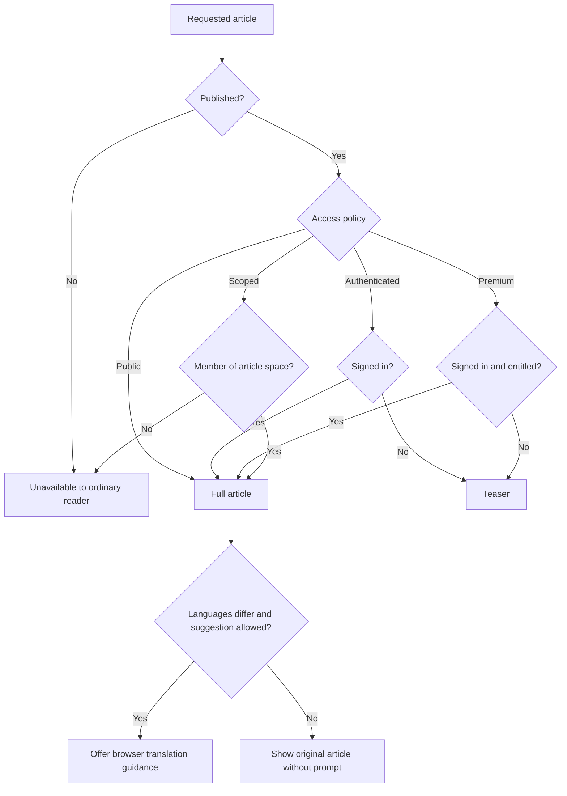

# Knowledge Access and Browser Translation Assistance

Knowledge visibility is evaluated for each visitor and article. An article can be public, signed-in, scoped to a community, premium, draft, archived, or otherwise unavailable.

## Why an article may be unavailable

- You are signed out and the article requires an account.
- The active kingdom or alliance does not match the article's space.
- Your assignments do not include that space.
- A premium boundary applies to the current plan.
- The article is still a draft, is in review, was returned for changes, or is archived.
- A newer revision exists but has not been published, so readers still see the previous published version.

Switch to the intended scope and sign in before asking for a publication change. A manager should not make a scoped article public merely to solve one person's missing assignment.

## Browser Translation Assistance

When the normalized reader preference and article source language differ, the article can offer **Browser Translation Assistance**. `browser_default` follows the normal browser-oriented suggestion, `always_suggest` requests a suggestion whenever valid languages differ, and `never_suggest` suppresses it. Dismissing the prompt for an article also suppresses it for that article during the applicable session.

The prompt provides browser-native guidance. Translation occurs in the browser; Kingshot Events does not create or store a translated article revision. Protected body content is never unlocked by translation because access is resolved before eligible article content is presented.

Return to the source language when a translated term is ambiguous. Treat proper names, troop classes, formulas, coordinates, times, and warnings carefully. Authors should write clear source content instead of relying on browser translation to repair unclear instructions.

*Knowledge reading decision. Publication and access are resolved before translation assistance.*

**Accessible summary:** Unpublished articles are unavailable. Published public, authenticated, premium, and scoped articles follow different full, teaser, or denied branches. Only fully accessible content reaches the optional translation prompt.

## Worked example and recovery

**Starting situation:** A signed-in reader belongs to the correct kingdom but opens a premium article without effective premium access. **Rules:** Published state passes; entitlement fails; community membership does not replace the required feature. **Output:** The reader receives the permitted teaser without protected body blocks. When an eligible plan or accepted grant becomes effective, the same canonical article can resolve to full access. If languages differ and the preference is `always_suggest`, browser guidance appears. When a translated term is unsafe, return to the original and compare names, numbers, times, warnings, and formulas.

## Limitations

Browser availability differs by device, browser, and language. Machine translation can distort structured blocks or Reading Verification instructions. Assistance is not an official reviewed translation and cannot guarantee terminology or numerical accuracy.

<VisualReference title="Knowledge access and translation landmarks">
Read the access state before treating a teaser as a full article.

<template #items>

- Public, signed-in, community-space, or premium access indicator.
- Locked, unavailable, draft, review, or archived message where appropriate.
- Article source language and **Browser translation assistance** prompt.
- Browser-specific guidance, dismiss-for-this-article action, and original content.

</template>
</VisualReference>

For access that should exist, provide the article title, visible space, active scope, and public error message to an authorized manager.

## Purpose, controls, and operating workflow

The mechanism solves two separate reader problems: determining whether an article body is available and, after access succeeds, deciding whether browser-native translation guidance is useful. Reader controls include sign in, active scope where applicable, upgrade or grant path for a permitted teaser, original-language view, browser translation action, preference selection, and dismiss-for-this-article.

The workflow first evaluates Published state. It then resolves public, authenticated, feature-gated, or scope-members-only access. The output is full article, permitted teaser, or unavailable state. Only full content continues to language comparison. If valid source and reader languages differ and the preference allows it, guidance is shown; otherwise the original article appears without a prompt. Changing translation preference never changes article access, revision, scope, or stored content.

**Scoped edge case:** A signed-in reader outside a members-only alliance space receives no teaser, because advertising private scoped content would expose information about that space. Switching to an unrelated alliance does not help. The reader must use an identity with legitimate membership or ask the space manager to verify assignment. Making the article public is not a safe individual recovery.
