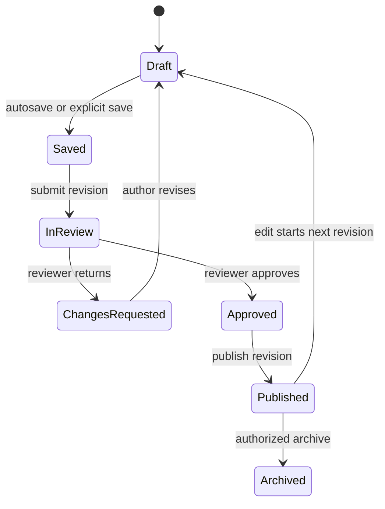

# Knowledge Authoring, Imports, Review, and Publication

Authors work in **Create** or **Studio**. Each article belongs to an intended space and audience and moves through a draft-review-publication lifecycle. Editing a published article creates working changes; readers continue to see the prior published revision until the update is approved and published.

## Create and edit a draft

Choose the correct public, kingdom, or alliance space. Enter a clear title and summary, then build the article from supported blocks. Blocks can include structured headings, paragraphs, lists, callouts, tables, media, references, and other current editor types. Reorder or remove a block deliberately and preview the complete reading flow.

Use the media library for safe assets. Provide meaningful alt text and a caption or source when needed. Do not upload credentials, private rosters, sensitive manager controls, or material without publication rights.

## Imports and writing assistance

Structured import can turn supported source material into proposed blocks. Review every block, link, fact, audience setting, and media reference before applying it to the draft. Writing, research, simulation, or image assistance can prepare suggestions, but assisted output remains draft content until a human accepts and reviews it. Never place private provider keys or confidential orchestration details in the article.

## Save, submit, and review

Save keeps the working draft. Submit for review when the article is complete. Reviewers compare the proposed revision with the published version, including added, removed, modified, and moved blocks. They check factual accuracy, source quality, space and premium boundaries, privacy, accessibility, media, and reader safety.

A reviewer can approve the revision or return it for changes. Publication makes the approved revision visible to its intended readers. Archive removes the article from ordinary discovery while preserving editorial history. A draft or archived article should not be treated as public merely because an author can open it.

<RolePerspective>

### As a Knowledge author

Choose the intended space first, save a complete structured draft, disclose uncertain claims, and respond to review feedback.

### As a reviewer

Use the revision comparison, verify access and media, and block publication when claims or audience boundaries are unsafe.

### What the platform does automatically

It preserves revision states and keeps the last published version available until an approved replacement is published.

</RolePerspective>

<VisualReference title="Knowledge Studio landmarks">
Treat space, draft state, and published state as separate decisions.

<template #items>

- Space and audience selector, title, summary, slug or discovery details.
- Structured block editor, reorder controls, preview, media library, and import action.
- Draft save state, submit-for-review action, reviewer notes, and structured revision comparison.
- Approve, return for changes, Publish, and Archive states with validation feedback.

</template>
</VisualReference>

## Purpose and editorial workflow

Knowledge Studio solves the problem of changing shared guidance without silently altering what readers already relied on. An authorized author chooses the intended global, kingdom, or alliance space and access policy, creates a structured draft from supported blocks, adds safe media, and watches the visible autosave state. Explicit save is used before important transitions. Preview renders the proposed reader experience but does not publish it.

*Knowledge authoring, review, publication, and revision lifecycle. Reader-visible publication is distinct from draft saving and approval.*

**Accessible summary:** Authors save drafts, submit them, respond to requested changes, and publish only after approval; later edits begin a new revision.

## Inputs, decisions, and worked example

Important inputs are title, summary, source language, space, audience policy, premium feature where supported, blocks, media, and revision note. Validation rejects unsupported or unsafe structure, missing required context, and publication states that have not satisfied review. Reviewers judge accuracy, scope, public safety, and reader usability. Structured import and AI assistance may propose blocks or edits, but human author and reviewer remain responsible and the assistance cannot bypass workflow state.

**Worked example:** A published alliance guide needs a new event step. The author opens the article in Studio, starts the next draft revision, adds the step, previews mobile layout, saves, and submits. A reviewer requests a clearer limitation. The author revises and resubmits; approval then permits publication. Readers continue seeing the previous published revision until the new one publishes, after which history identifies both versions.

If autosave conflicts with a newer tab, copy unsaved text, reload the current draft, and reapply the intended edit. Do not retry a stale version repeatedly. Publication is not guaranteed when access, media, structure, or review validation fails; preserve the visible message and revision state for support.

## Limitations and troubleshooting boundary

Studio cannot guarantee that imported or AI-assisted prose is correct, appropriately sourced, safe for its audience, or visually usable. Human review remains mandatory. It cannot recover a draft after retention or an irreversible removal boundary, publish without the required review state, or make a scoped article visible to an unauthorized reader. Troubleshoot at the current revision: record article, space, revision, save indicator, review state, media or block involved, and exact validation message. Never paste private source code, provider credentials, raw permission identifiers, or protected reader data into an article or support request.

Related: [Reading and Finding Knowledge](/kingshot-events/knowledge-hub/reading-and-finding) and [Editorial Policy](/editorial-policy).
