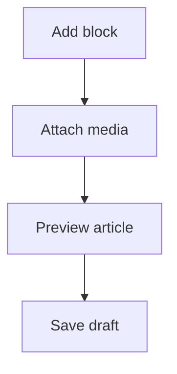

<CategoryHero category="knowledge-hub" icon="book" eyebrow="Knowledge people can trust" title="Blocks, Media, and Structured Content">
Find, author, review, publish, and verify guidance for the communities that need it.
</CategoryHero>

# Blocks, Media, and Structured Content

Blocks, Media, and Structured Content is the focused guide for knowledge authors. It explains the controls you can see, the states that change what you can do, and the confirmation that proves the task finished in the intended scope.

## What this guide helps you decide

The main decision is whether to **build an article that remains readable on small screens**. Start by reading the scope label and the record status. A control can be present but unavailable when your membership, role, plan access, current status, or selected community does not permit the change. That distinction is intentional: visibility helps you understand the workflow, while availability protects shared records.

Use this page when you need to arrange text, callouts, media, and linked entities. It is not a promise that every account sees every action. Public pages, signed-in features, role-restricted controls, subscription-backed capabilities, and intentionally private administration are documented as different availability classes.

## Before you begin

- Confirm the signed-in identity and the player link shown in the account area.
- Read the current kingdom, alliance, or personal scope before changing data.
- Open the record itself instead of relying on a notification or an old browser tab.
- Check whether the status is Editing, Saved, Needs media, or Ready.
- If the action affects other people, agree on the intended outcome before saving or publishing.

## Controls and information you will use

The relevant controls are: **Arrange text, callouts, media, and linked entities**. Labels may be shortened on a narrow screen, but the scope name, status, primary action, and confirmation remain part of the same task. Filters change the current view; they do not silently move or rewrite the underlying record. A save changes a draft or editable record. Apply, approve, publish, restore, or award are separate decisions when the workflow requires review.

<VisualReference title="Recognizing the Blocks, Media, and Structured Content workspace" :items="['scope and identity context', 'current status and availability', 'primary action with confirmation']">
Look first for the category icon and knowledge-hub label, then read the scope line above the working area. The center region presents arrange text, callouts, media, and linked entities. A status treatment identifies editing, saved, needs media, ready, while the final confirmation names the record and community affected.
</VisualReference>

## Complete the task

1. **Add block.** Confirm the page title, signed-in identity, and selected scope before entering or changing anything.
2. **Attach media.** Read existing values and status messages. If information is missing, stop and gather it rather than guessing.
3. **Preview article.** Use the available control and review the preview, comparison, or warning. A disabled control usually points to a missing prerequisite.
4. **Save draft.** Read the success message and reopen the affected record. For shared work, verify that the next responsible role can see the expected state.

## Blocks, Media, and Structured Content workflow

The blocks, media, and structured content map follows the choices visible to knowledge authors and marks the confirmation that prevents work from continuing in the wrong state or scope.

<!-- diagram: ke-knowledge-hub-blocks-and-media -->

**Diagram summary:** Add block, then Attach media, then Preview article, then Save draft. Each step remains visible to the person doing the work, and the final step confirms the outcome.

*Workflow caption: Blocks, Media, and Structured Content from first choice to confirmed outcome.*

## Status and role differences

| Status | What it means to the reader | Sensible next action |
| --- | --- | --- |
| **Editing** | The task is at its starting or neutral state. | Continue with add block. |
| **Saved** | Work has progressed but another check or decision remains. | Continue with attach media. |
| **Needs media** | Work has progressed but another check or decision remains. | Continue with preview article. |
| **Ready** | The workflow reached a final or constrained state. | Verify the outcome and history. |

For blocks, media, and structured content, knowledge authors see the records and outcomes their current responsibility permits. Alliance roles act within their alliance, while granted kingdom roles can coordinate across communities without silently taking ownership of every source record. Plan access can reveal knowledge hub capabilities, but it never replaces the role, status, and scope checks described above. Platform-wide administration remains outside this public handbook.

## Saving, review, and history

While working in blocks, media, and structured content, editable values should show a saved state before you leave. Review keeps attach media separate from the later decision to preview article. Applying or publishing makes the agreed outcome visible to its intended audience. If removal, rollback, or restore is supported here, authorized readers retain enough history to understand the change. Reopen the source record before repeating save draft.

## If the result is not what you expected

- **The blocks, media, and structured content action is missing:** confirm the selected scope, membership, role, and feature availability.
- **The action is disabled:** inspect required fields and the current status; a locked or final record may need a correction or review path.
- **The list looks unchanged:** clear view filters and reopen the source record before submitting again.
- **Another person sees a different result:** compare scope, date window, role, and publication state.
- **You need support:** record the page title, scope name, visible status, time, and safe steps to reproduce. Do not include passwords, payment details, or private screenshots.

## Continue learning

- [Knowledge Hub Guide](/kingshot-events/knowledge-hub/)
- [Revisions and Review](/kingshot-events/knowledge-hub/revisions-and-review)
- [Reading Sessions](/kingshot-events/knowledge-hub/reading-sessions)
