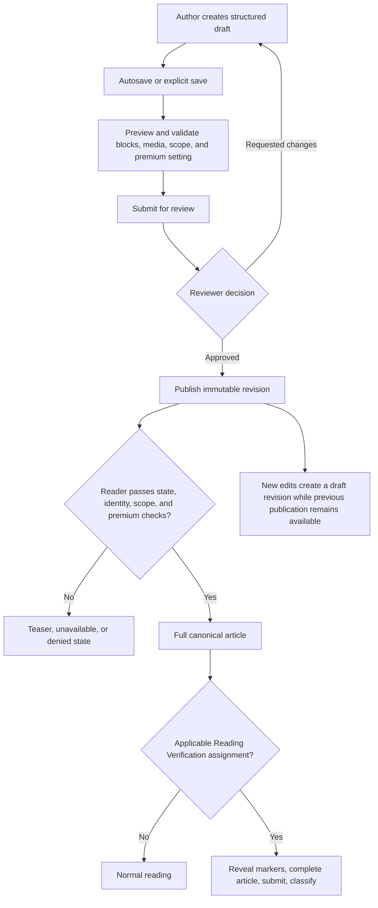

# Knowledge Hub

<CategoryHero category="knowledge-hub" icon="book" eyebrow="One canonical article, controlled access and revisions" title="Knowledge Hub">
Knowledge Hub separates reading access, editorial workflow, and Reading Verification. Publishing a revision changes what eligible readers receive; creating a verification session assigns reading work without creating another article copy.
</CategoryHero>

<ProductFinder default-category="Knowledge Hub" />

## Feature map

*Knowledge lifecycle and reader access. Editorial state precedes viewer access; Reading Verification is an additional assignment flow over the canonical article.*

**Accessible summary:** Authors save and review a draft before publishing a revision. Readers then pass article state, identity, scope, and premium checks. An applicable verification assignment adds marker and submission steps. Editing published content creates a new revision without silently mutating the previous publication.

## Reading and access order

The platform first considers article state: draft and archived material are not ordinary published reading. It then resolves whether the viewer is public or authenticated, whether server, kingdom, or alliance scope matches, and whether premium access is required. A premium teaser can be visible while the full body remains unavailable. Ownership or author status affects editorial controls, not the public meaning of a published revision.

[Reading and finding](/kingshot-events/knowledge-hub/reading-and-finding) explains search and article structure. [Access and translation](/kingshot-events/knowledge-hub/access-and-translation) covers public, authenticated, scoped, premium, teaser, and Browser Translation Assistance behavior.

## Authoring and review

An article draft is made from supported blocks and media. Autosave preserves draft work after its visible save cycle; explicit save remains important before review transitions. Preview shows the proposed reader experience but is not publication. Review can request changes or approve. Publication produces a revision readers can identify. Editing an already published article creates a new draft revision while the previous published revision remains the reader version until the new one is reviewed and published.

Structured import and AI-assisted authoring can propose content, layout, or media work. The author and reviewer remain responsible for accuracy, scope, source quality, and public-information safety. Assisted output must not bypass review or expose private implementation details.

## Reading Verification

A session manager selects the canonical article and permitted audience, creates assignments, monitors progress and signals, reviews submission classification, and closes or archives the session. A reader opens an applicable assignment, reveals collapsed markers while reading, completes the article, and submits the requested evidence. A retry is possible only when the session and classification allow it. A deleted or otherwise non-restorable assignment must not be recreated merely to falsify continuity.

Reports are available to the session creator and authorized tenant management; the documented privileged oversight role may also qualify. Other users are denied. This describes the outcome without publishing private permission keys or endpoints.

## Browser Translation Assistance

The article has a source language and the reader may have a preferred language. The site can allow the browser's native translation suggestion using `browser_default`, request a suggestion using `always_suggest`, or suppress the suggestion using `never_suggest`. Protected content remains protected. The platform does not store a translated article copy, and browser translation can mistranslate game terminology, tables, markers, or structured blocks.

## Worked example

**Starting situation:** A kingdom-scoped premium article is published and a signed-in alliance member opens it without effective premium access. **Rules:** Published state passes; identity and kingdom scope pass; premium access fails. **Branch:** The reader receives the permitted teaser, not the body. **State:** The article remains published and unchanged. **Output reason:** Scope does not substitute for premium entitlement. **Next action:** The reader checks effective access or an accepted grant, then reloads the same canonical article after access changes.

Use [Knowledge access, publication, and Reading Verification](/kingshot-events/knowledge-hub/reading-sessions) for detailed decision tables, reader and manager flows, and recovery boundaries.
