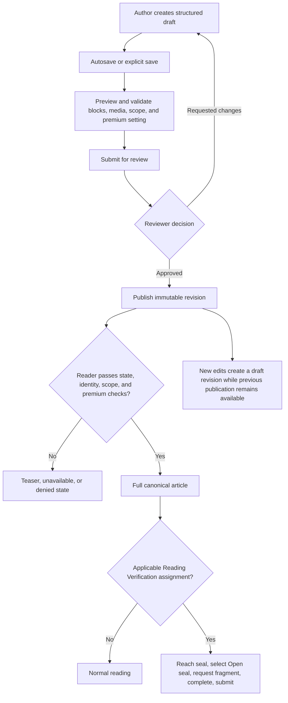

# Knowledge Hub

<CategoryHero category="knowledge-hub" icon="book" eyebrow="One canonical article, controlled access and revisions" title="Knowledge Hub">
Knowledge Hub separates reading access, editorial workflow, and Reading Verification. Publishing a revision changes what eligible readers receive; creating a verification session assigns reading work without creating another article copy.
</CategoryHero>

<ProductFinder default-category="Knowledge Hub" />

## Feature map

*Knowledge lifecycle and reader access. Editorial state precedes viewer access; Reading Verification is an additional assignment flow over the canonical article.*

**Accessible summary:** Authors save and review a draft before publishing a revision. Readers then pass article state, identity, scope, and premium checks. An applicable verification assignment adds marker and submission steps. Editing published content creates a new revision without silently mutating the previous publication.

## Reading and access order

The platform first considers article state: draft and archived material are not ordinary published reading. It then resolves whether the viewer is public or authenticated, whether server, kingdom, or alliance scope matches, and whether premium access is required. A premium teaser can be visible while the full body remains unavailable. Ownership or author status affects editorial controls, not the public meaning of a published revision.

[Reading and finding](/kingshot-events/knowledge-hub/reading-and-finding) explains search and article structure. [Access and translation](/kingshot-events/knowledge-hub/access-and-translation) covers public, authenticated, scoped, premium, teaser, and Browser Translation Assistance behavior.

## Authoring and review

An article draft is made from supported blocks and media. Autosave preserves draft work after its visible save cycle; explicit save remains important before review transitions. Preview shows the proposed reader experience but is not publication. Review can request changes or approve. Publication produces a revision readers can identify. Editing an already published article creates a new draft revision while the previous published revision remains the reader version until the new one is reviewed and published.

Structured import and AI-assisted authoring can propose content, layout, or media work. The author and reviewer remain responsible for accuracy, scope, source quality, and public-information safety. Assisted output must not bypass review or expose private implementation details.

## Reading Verification

A session manager selects the canonical article and permitted audience, creates assignments, monitors progress and signals, reviews submission classification, and closes or archives the session. A reader opens an applicable assignment, reaches the collapsed seal, explicitly selects **Open seal**, receives the fragment only after the platform verifies the assignment and completes the request, finishes the article, and submits the requested evidence. A retry is possible only when the session and classification allow it. A deleted or otherwise non-restorable assignment must not be recreated merely to falsify continuity.

Reports are available to the session creator and authorized tenant management; the documented privileged oversight role may also qualify. Other users are denied. This describes the outcome without publishing private permission keys or endpoints.

## Browser Translation Assistance

The article has a source language and the reader may have a preferred language. The site can allow the browser's native translation suggestion using `browser_default`, request a suggestion using `always_suggest`, or suppress the suggestion using `never_suggest`. Protected content remains protected. The platform does not store a translated article copy, and browser translation can mistranslate game terminology, tables, markers, or structured blocks.

## Why Knowledge Hub exists

Knowledge Hub gives a community one canonical, structured, reviewable body of guidance. It separates discovery from access, drafts from publications, current revisions from history, reusable media from duplicates, and ordinary reading from assigned verification.

Readers need to know they see the current published version. Authors need to improve a draft without prematurely changing the live guide. Reviewers need to compare exactly what changed. Managers need scoped audiences without exposing protected bodies through search. Session managers need evidence of an assigned reading workflow without creating article copies.

## Workspace purpose map

| Surface | Purpose | What it does not do |
| --- | --- | --- |
| Home and directory | Discover permitted published cards and collections | Does not expose protected body content |
| Search | Find eligible articles, entities, and spaces | Does not bypass publication or access projection |
| Article reader | Render the canonical permitted revision | Viewing does not grant editorial control |
| Heroes, events, mechanics | Provide structured entity references | Does not automatically replace reviewed guidance |
| Spaces | Group knowledge for public, kingdom, or alliance audiences | Membership does not make every reader an author |
| Studio | Create, save, preview, validate, and submit drafts | Save and preview are not publication |
| Review queue | Compare and approve, request changes, reject, or publish | Does not alter content without a decision |
| Revisions and archive | Preserve history and remove content from current reading | Archive is not silent permanent deletion |
| Media library | Reuse assets with metadata and alternative text | Upload does not make an asset safe for every audience |
| Homepage editor | Arrange Knowledge landing content | Does not change article access rules |
| Reading Verification | Assign a canonical revision and track progress | Does not reveal a seal on marker encounter |

## Demonstration: publish a scoped guide safely

1. **Choose destination.** Identify collection or scoped space and intended audience.
2. **Create a draft.** Use supported text, list, table, card, question, image, entity, and other structured blocks.
3. **Attach safe media.** Reuse assets, supply alternative text, and check captions and source metadata.
4. **Preview and validate.** Preview shows layout; validation catches incomplete blocks or constraints. Neither changes the live article.
5. **Submit.** The draft enters review.
6. **Review.** A reviewer checks structured changes and full context.
7. **Decide.** Changes return to the author; rejection closes the proposal; approval and publication follow their explicit controls.
8. **Project to readers.** Published state, identity, scope, and premium policy determine full content, teaser, or no surface.
9. **Revise later.** A new draft leaves the prior publication readable until replacement publication.
10. **Archive when authorized.** The guide leaves ordinary reading through an explicit lifecycle.

**Verifiable output:** readers identify the canonical article; authors and reviewers identify the draft and revision that produced it.

## Demonstration: Reading Verification without accidental reveal

A manager selects a published canonical revision and eligible readers, then opens the session. The assignment does not clone the article. An eligible reader reads until reaching a collapsed marker.

Nothing is revealed automatically. The reader explicitly chooses **Open seal**. Only then does the platform verify session and assignment and request the assigned fragment. The reader receives it, completes the article, and submits the requested evidence. The result can be correct, nearly correct, incorrect, retry-eligible, or routed to manual review. The authorized manager uses the dashboard and report, then closes or archives the session.

This keeps reader choice, assignment eligibility, and reporting distinct. Reloading does not justify a new assignment, and fragments should not be exposed outside the permitted session workflow.

## Quality, search, translation, and recovery

Search cards and teasers contain only permitted projection fields. Protected bodies must not be downloaded and hidden client-side. Browser Translation Assistance uses the browser and does not store a translated revision. Assisted import can propose content, but authors and reviewers remain responsible for accuracy, source quality, audience, and confidentiality.

If an article is missing, troubleshoot published state, canonical route, identity, scope, premium access, search terms, and archive state. If publication fails, inspect block validation, media metadata, review status, and authority. If a seal remains collapsed, confirm session and assignment before selecting **Open seal**; if reveal fails, never paste a fragment from another reader.
## Worked example

**Starting situation:** A kingdom-scoped premium article is published and a signed-in alliance member opens it without effective premium access. **Rules:** Published state passes; identity and kingdom scope pass; premium access fails. **Branch:** The reader receives the permitted teaser, not the body. **State:** The article remains published and unchanged. **Output reason:** Scope does not substitute for premium entitlement. **Next action:** The reader checks effective access or an accepted grant, then reloads the same canonical article after access changes.

Use [Knowledge access, publication, and Reading Verification](/kingshot-events/knowledge-hub/reading-sessions) for detailed decision tables, reader and manager flows, and recovery boundaries.
