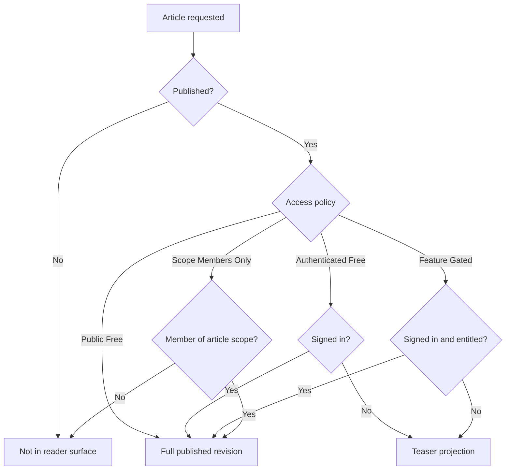
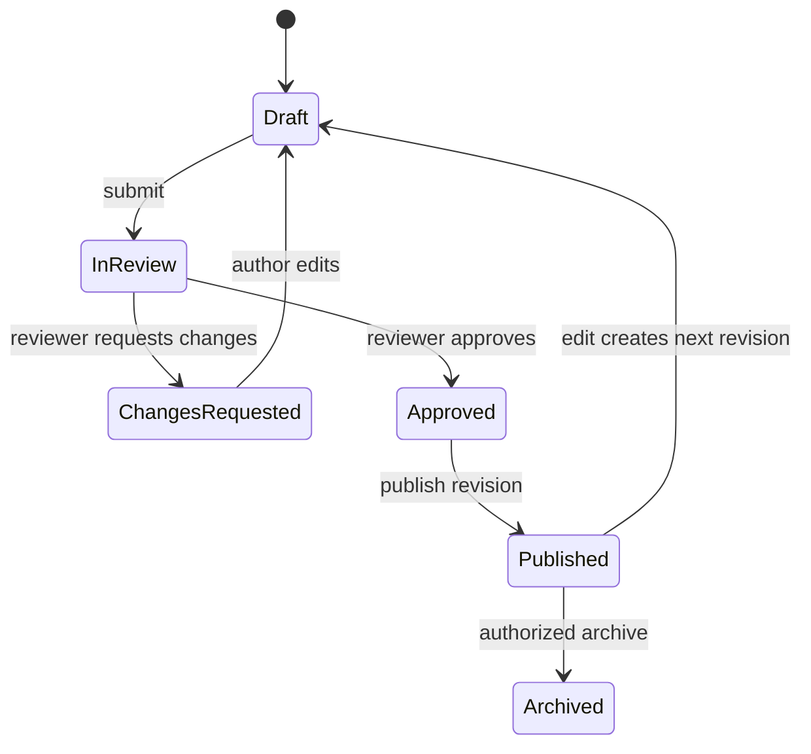
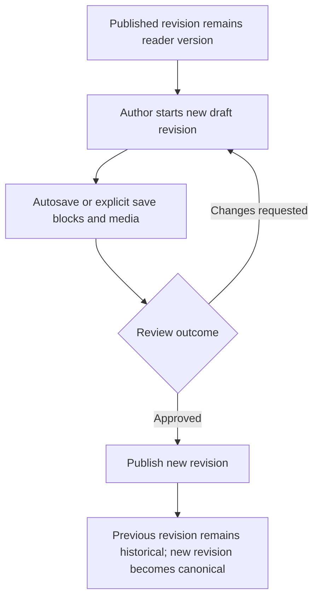

# Knowledge Access, Publication, and Reading Verification

## What a reader receives

Only Published articles enter normal reading and search. Public Free returns the full published blocks. Authenticated Free returns full content to a signed-in reader and a teaser otherwise. Feature Gated requires sign-in plus the named effective subscription feature; otherwise it returns only title, summary, cover, author, publication date, table of contents, limited preview, and upgrade action. Scope Members Only returns full content to a member of the article's kingdom or alliance scope and reveals nothing to an outsider.

**Accessible summary:** Published state and article access policy decide whether a reader receives the full revision, a teaser, or no reader surface.

Search uses published card fields. Public article bodies may contribute to indexing. Protected bodies are not sent and then hidden visually. A kingdom-level assignment can satisfy membership for alliance content in its kingdom; an unrelated or cross-tenant manager cannot.

## Editing and publication

Opening a published article in Studio creates a working revision from the published one when no separate draft exists. The published revision stays live while the draft is edited. Blocks can be added, reordered, previewed, and saved. The working revision moves through Draft, In Review, Changes Requested, Approved, and Published. Review compares the working revision with the published base. Publishing moves the approved revision to the reader surface; it does not mutate the previous published revision in place.

**Worked authoring example:** An author opens the published Rally Basics article, adds a warning block, previews mobile layout, and submits revision 4. Readers continue seeing revision 3. A reviewer requests a clearer source note, the author edits revision 4, and approval followed by Publish makes revision 4 current. Revision 3 remains in history.

## Reading Verification

A session can target only an article with a published revision, and the session pins that exact revision. A reader opens the normal canonical article. When the applicable session resolves, a collapsed seal appears at a safe point in the pinned content. Merely reaching the seal does not request or display the assigned fragment. The reader must explicitly select **Open seal**; only then does the platform verify assignment ownership, request the fragment, and display it. Reaching the article end and submitting the player's name and fragment produces Correct, Almost Correct, Incorrect, Not Submitted, or Manual Review behavior as appropriate.

The manager selects the published article and audience, creates the session, and then watches assignments appear as eligible readers open the article. Progress distinguishes Not Opened, Opened, Fragment Revealed, Article End Reached, and submission outcomes. The session creator and authorized tenant managers can read the report; an ordinary member and a manager from another tenant cannot. Platform-wide oversight exists but is not described as an operational public workflow.

```mermaid
flowchart LR
 A["Manager pins published revision"] --> B["Eligible reader opens canonical article"]
 B --> C["Assignment and progress begin"]
 C --> D["Reader selects Open seal"]
 D --> V["Verify assignment and request fragment"]
 V --> X["Display assigned fragment"]
 X --> E["Reader reaches article end"]
 E --> F["Name and fragment submitted"]
 F --> G["Correct, almost, incorrect, or manual review"]
 G --> H["Authorized report"]
```

**Accessible summary:** A manager pins a revision, an eligible reader explicitly opens the seal and submits assigned evidence, and the result enters the authorized report.

## Browser Translation Assistance

The article keeps its original locale. The reader locale comes from saved preference, server preference, or browser language. `browser_default` and `always_suggest` can show guidance when normalized languages differ; `never_suggest` and an article-specific dismissal suppress it. The platform points to the browser's native translation control and stores no translated article copy. Code-like or explicitly protected content should remain untranslated. Browser translation can mistranslate game terms and does not change verification fragments or the stored source.

**Premium example:** A signed-out reader may see a Feature Gated title and teaser but never the body blocks. Signing in is still insufficient if no active scope supplies the feature. A Scope Members Only alliance article does not appear at all to a member of another kingdom.

## Limitations and recovery

A teaser never implies that the hidden blocks are authorized. If access changes mid-session, reload the canonical article so identity, scope, entitlement, and pinned revision are resolved again. Browser translation is outside platform control and may alter terminology. Reading Verification establishes what the session recorded; it cannot prove attention beyond the visible marker, article-end, and submitted fragment signals. Manual Review requires an authorized manager rather than an automatic retry.

## Article revision and review maps

### Knowledge article review lifecycle

*Knowledge article lifecycle. Review decisions act on a draft revision; editing published content starts the next draft.*

**Accessible summary:** Drafts enter review, may return for changes, publish after approval, and later edits create another draft while published history remains identifiable.

### Editing an already published article

*Published-article revision. Draft work does not silently replace the currently published reader version.*

**Accessible summary:** A new draft is saved and reviewed while the old publication remains live; approval and publication switch the canonical reader revision.
