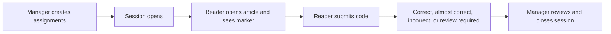

# Reading Verification

A Reading Verification session assigns each reader a small code marker inside a published article. The reader finds and submits that code. The result records interaction with the article; it is not a test of comprehension or proof that every paragraph was understood.

## As a reader

1. Open the assigned reading route while signed in as the intended account.
2. Read the ordinary article and locate the reader-specific marker.
3. Enter the characters in the verification form at the end.
4. Submit and read the result before retrying.

**Correct** means the submitted code matched. **Almost Correct** means it was close enough to require careful review or another attempt. **Incorrect** means it did not match. **Review Required** means a session manager must inspect the case. A paused, closed, archived, expired, or unavailable session can block submission even when the article remains readable.

Do not share another reader's code. Markers are assignment-specific. If the marker is missing, confirm the exact assigned route, account, and open session rather than copying a code from someone else.

## As a session manager

Create a session from the intended published article, give it a clear name, select the audience, and verify the assignment list before opening it. Share the generated reader route. Session states support **Open**, **Pause**, **Close**, and then **Archive**.

The dashboard shows **Article Opens**, **Marker Seen**, **Correct**, **Almost Correct**, and **Incorrect** metrics. Search by player name or filter **All Statuses**, **Correct**, **Almost Correct**, **Incorrect**, **Needs Review**, or **Not Opened**. Rows show expected and submitted player, protected assigned code, submitted value, code status, attempts, marker seen, and submission time.

Reveal an assigned code only for a legitimate review; the action is audited. **Reset attempts** lets that reader submit again after confirmation. CSV export can omit assigned codes, and revealing them in an export requires an explicit confirmation. Closing or archiving a session preserves its recorded outcomes but stops ordinary participation.

<VisualReference title="Reading Verification landmarks">
Reader and manager views expose different controls.

<template #items>

- Reader assignment route, in-article marker, submission field, attempts, and result message.
- Manager session name, article, state, Open, Pause, Close, and Archive controls.
- Metrics, player search, status filter, and per-reader result table.
- Audited reveal-code action, reset attempts, and CSV export confirmation.

</template>
</VisualReference>

If an assignment cannot be restored or reopened, create a new authorized session rather than altering a closed historical result.
