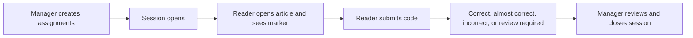
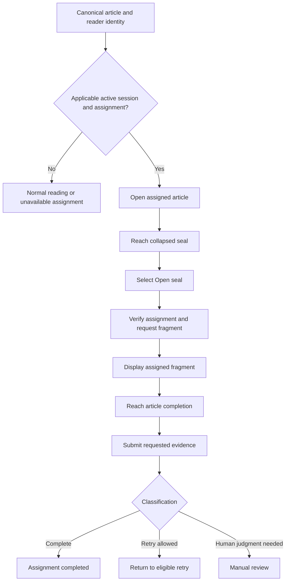

# Reading Verification

A Reading Verification session assigns each reader a small code marker inside a published article. The reader finds and submits that code. The result records interaction with the article; it is not a test of comprehension or proof that every paragraph was understood.

## As a reader

1. Open the assigned reading route while signed in as the intended account.
2. Read the ordinary article and locate the reader-specific marker.
3. Enter the characters in the verification form at the end.
4. Submit and read the result before retrying.

**Correct** means the submitted code matched. **Almost Correct** means it was close enough to require careful review or another attempt. **Incorrect** means it did not match. **Review Required** means a session manager must inspect the case. A paused, closed, archived, expired, or unavailable session can block submission even when the article remains readable.

Do not share another reader's code. Markers are assignment-specific. If the marker is missing, confirm the exact assigned route, account, and open session rather than copying a code from someone else.

## As a session manager

Create a session from the intended published article, give it a clear name, select the audience, and verify the assignment list before opening it. Share the generated reader route. Session states support **Open**, **Pause**, **Close**, and then **Archive**.

The dashboard shows **Article Opens**, **Marker Seen**, **Correct**, **Almost Correct**, and **Incorrect** metrics. Search by player name or filter **All Statuses**, **Correct**, **Almost Correct**, **Incorrect**, **Needs Review**, or **Not Opened**. Rows show expected and submitted player, protected assigned code, submitted value, code status, attempts, marker seen, and submission time.

Reveal an assigned code only for a legitimate review; the action is audited. **Reset attempts** lets that reader submit again after confirmation. CSV export can omit assigned codes, and revealing them in an export requires an explicit confirmation. Closing or archiving a session preserves its recorded outcomes but stops ordinary participation.

**Accessible summary:** The manager creates assignments and opens the session, readers submit evidence, and the manager reviews classifications before closing.

<VisualReference title="Reading Verification landmarks">
Reader and manager views expose different controls.

<template #items>

- Reader assignment route, in-article marker, submission field, attempts, and result message.
- Manager session name, article, state, Open, Pause, Close, and Archive controls.
- Metrics, player search, status filter, and per-reader result table.
- Audited reveal-code action, reset attempts, and CSV export confirmation.

</template>
</VisualReference>

## Reader decision workflow

A reader starts from one canonical published article and an applicable active assignment. The session pins the article context used for verification. The reader opens the assignment and reaches a collapsed seal in the article. Arrival alone does not reveal anything: the reader explicitly selects **Open seal**, after which the platform verifies ownership, requests the assigned fragment, and displays it. The reader then reaches article completion and submits the requested evidence. The platform classifies the supported signals and submission into completion, retry, or manual-review outcomes. Opening an article or merely reaching the seal is not completion, and knowing a reading code does not bypass article access or audience scope.

*Reading Verification reader flow. Session applicability precedes marker, completion, submission, and classification states.*

**Accessible summary:** Applicable readers reach a collapsed seal, explicitly open it, receive the fragment only after the request succeeds, finish the article, submit, and receive complete, retry, or manual-review outcomes.

## Scope, manager decisions, and worked example

The manager selects a canonical article and permitted audience, creates assignments, opens the session, observes progress and signals, reviews submissions requiring judgment, then closes and archives the session. Report access follows creator and authorized tenant-management relationships, with documented privileged oversight where applicable; unrelated users are denied.

**Worked example:** A reader reveals every assigned marker and reaches the article end, but the submitted fragment is classified for manual review. The assignment remains review-required rather than automatically failed. The session manager compares the supported signals and submission, records a completion or retry outcome, and preserves the reason in the report. If the session closes first, the reader cannot manufacture a new assignment to change history. Recovery requires an authorized manager and the existing session.

Browser translation can alter displayed wording but not canonical marker identity. Reading Verification records the visible workflow signals; it cannot prove attention or comprehension beyond them. Include article, session, assignment state, and exact public message when troubleshooting, never another reader's response.

If an assignment cannot be restored or reopened, create a new authorized session rather than altering a closed historical result.
