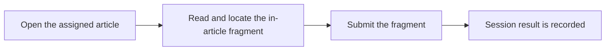

# Reading Verification
A Reading Verification session asks each reader to locate a small assigned fragment inside the ordinary article and submit it at the end.

<RolePerspective>

### As a reader

Read the article normally, locate your small fragment, and submit it in the session area.

### As a session manager

Open a session, define its intended audience, share the reading route, and review completion states.

### What the platform does automatically

It assigns a reader-specific fragment and records the submitted verification result without changing the article body for other readers.

</RolePerspective>

A failed submission may mean the fragment was copied incorrectly or the session is no longer active.
<VisualReference title="Reading Verification orientation">
Use the current page labels and confirm context before acting.

<template #items>

- Active scope or profile.
- Primary input and review area.
- Visible save, submit, result, or status feedback.

</template>
</VisualReference>

## Related guides

- [authoring and publication](/kingshot-events/knowledge-hub/authoring-and-publication)
- [knowledge problems](/kingshot-events/troubleshooting/knowledge-problems)
