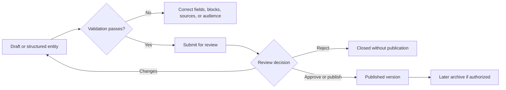

# Knowledge Studio Workspaces

Knowledge Studio is a collection of authoring and management workspaces. Article editing, review, archive, media, homepage composition, scoped spaces, and structured game entities have different records and permissions.

## Workspace map

| Workspace | Purpose | Completion evidence |
| --- | --- | --- |
| Studio | Create or edit an article draft | Saved revision or submitted review |
| Review queue | Compare structured changes or full content | Approved, changes requested, rejected, or published decision |
| Archive | Find archived guides and use permitted recovery actions | Updated archive or restored record state |
| Media | Upload, find, and select reusable assets | Asset appears with correct metadata |
| Homepage editor | Arrange the Knowledge landing content | Saved homepage configuration |
| Space management | Configure a scoped knowledge space | Correct audience and visible space state |
| Entity editors | Maintain hero, event, or mechanic records | Saved entity version |

The block picker includes structured content types such as text, lists, data tables, cards, questions, images, hero or event content, and other supported blocks. Preview shows final appearance; empty fields still need valid content after insertion. Media should have meaningful alternative text and a safe audience.

**Accessible summary:** Validate a draft, submit it, respond to review, publish an approved version, and archive only through the separate lifecycle action.

**Example:** A reviewer sees a changed data table. They use structured changes to identify modified cells, switch to full content to verify context, then request changes with a reason. They do not publish based on the diff alone.

If a block cannot publish, inspect its required fields and source metadata. If an asset is missing, verify it in Media rather than pasting a new duplicate. If a space article is invisible, check article state, space audience, and reader access separately.

## Limits and troubleshooting

Saving a draft does not publish it, approval does not necessarily replace the explicit publish action, and archive is not deletion. Preview cannot guarantee access for every reader because final projection still considers publication state and audience. If a revision conflict appears, stop editing, compare the latest version, and reapply only intended changes. If review controls are absent, verify reviewer permission and article state rather than cloning the article into a new draft.

## Organize a guide without duplicating it

An article can be placed in several relevant categories. Use category and section management to organize discovery while keeping one article and its review history. Archiving a category hides it from readers; deleting a category unlinks its articles rather than deleting those articles.

The block picker includes **Tool / Simulator Widget** for supported interactive content. Preview the widget, surrounding explanation, and article audience before submitting. Hero and Master database authoring supports more structured entries than a plain text description alone.

## Work with a scoped editorial team

Space and contributor management let permitted managers organize who can contribute to a kingdom or alliance library. A role in one community does not imply editorial control in another. Confirm the named space, audience, and available action before changing contributors or content.

Keep draft saving, review, and publication separate. Review notifications help the right person find pending work, but reading one does not approve a revision. See [Notifications](/kingshot-events/lifecycles/notifications-and-reports) for the difference between new information and an unresolved action.
