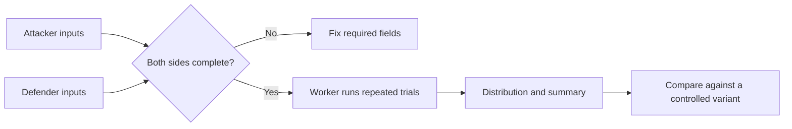

# Battle Simulator

The Battle Simulator runs a configured attacker and defender through repeated model trials in a worker. Repetition describes variation inside the model. It does not reproduce latency, execution mistakes, undocumented live mechanics, or an official combat log.

## Configure both sides symmetrically

For attacker and defender, verify troop counts and types, formation, bonuses, heroes, skills, and supported context. Use the same data version and equivalent assumptions. Then choose the exposed run controls and repeat count.

**Accessible summary:** Complete both sides, run repeated trials, interpret the distribution, and compare only equivalent scenarios.

## Interpret the output

Prefer the distribution, range, or percentiles exposed by the result over a single favorable trial. A higher repeat count can stabilize the modeled distribution but cannot repair wrong inputs or an incomplete formula. If comparing two builds, duplicate the first scenario and change only the tested variable.

| Bad comparison | Better comparison |
| --- | --- |
| Different troops, heroes, and bonuses | One hero change with every other input fixed |
| One run versus many runs | Same repeat count and data version |
| Result total without inputs | Input summary plus distribution |
| Modeled win treated as guarantee | Modeled tendency with limitations |

**Example:** Build B wins more trials than Build A. Before acting, the user notices that B also had a different troop count. They equalize counts and rerun; only then is the hero change interpretable.

If a run fails, reduce no inputs blindly. Check validation, numerical ranges, both formations, and browser worker errors. Preserve the profile, data version, repeat count, and scenario inputs when reporting a reproducibility problem.

## Limits and troubleshooting

Monte Carlo output cannot guarantee a live outcome and does not discover mechanics omitted from the model. More trials reduce sampling noise inside the configured model only. If the worker stops, keep the scenario and retry once after checking browser resources; do not change inputs during the retry. A zero or extreme result should trigger validation of counts, percentages, side assignment, and supported ranges before it is treated as a strategic conclusion.
