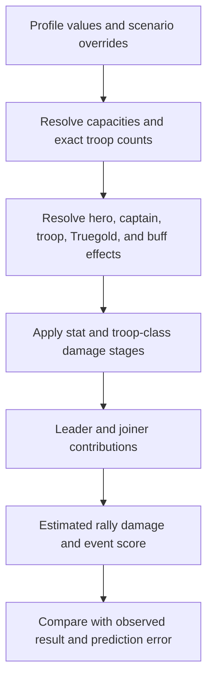

# Bear Trap Calculation and Result Anatomy

Bear scenarios distinguish the rally leader's march from joiner marches. Inputs include troop counts and classes, actual troop tier, Truegold level, march and rally capacities, leader heroes, joiner captains and active skill slots, account combat stats, temporary buffs, and optional observed damage. Profile values can prefill a scenario; typed scenario overrides do not change the profile.

The calculation first validates capacities and formation totals. It then resolves the newest hero generation, troop tier actually sent, Truegold state, stat source, included progression layers, and temporary effects. Active hero skills are limited to the slots that actually apply to the march role. Troop intrinsic effects and Truegold effects carry evidence labels. Unsupported higher-tier effects are not silently invented.

For the verified formation helper, each troop class receives a coefficient from attack and lethality; archers also receive the verified Bear ranged multiplier. Recommended shares are proportional to squared coefficients, then a configured minimum-infantry floor is enforced and the remaining capacity is redistributed. Damage for an explicit formation uses troop count, a capped sent-count term, catalog base attack for tier and Truegold, attack and lethality multipliers, and the verified archer factor. The interface separates catalog or verified values from community-observed, derived, estimated, and unresolved mechanics.

**Worked formation example:** A 100,000-capacity march has a 10,000 minimum-infantry floor. The user's Archer coefficient is strongest. The unconstrained share would place fewer than 10,000 Infantry, so the floor reserves 10,000 first; Cavalry and Archer divide the remaining 90,000 according to their relative squared coefficients. The result is an input recommendation, not a claim that every unmodeled in-game effect is absent.

Leader contribution includes the leader march and leader-scoped effects. Joiner contribution uses each joiner's actual captain, active skill slots, troop composition, and capacity. Total rally damage combines modeled contributions; event score is the corresponding displayed result. Deterministic effects produce the same value for the same inputs. Probabilistic or unresolved effects must be represented as estimates or omitted, not disguised as certainty.

When an observed result is entered, prediction error is the difference between observed and estimated output, shown with the scenario's engine and dataset versions. A large error suggests a wrong stat reading, tier, Truegold state, captain skill, formation, capacity, temporary buff, or an unresolved mechanic. Calibration compares examples; it does not rewrite saved player history or prove validation from one match.

## Limitations

The engine can explain modeled stages and evidence sources, but it cannot guarantee an optimal rally or exact live damage. In-game rounding, undocumented effects, timing, and incomplete observations remain uncertainty. Record the actual formation and source state before changing assumptions to fit an outcome.
