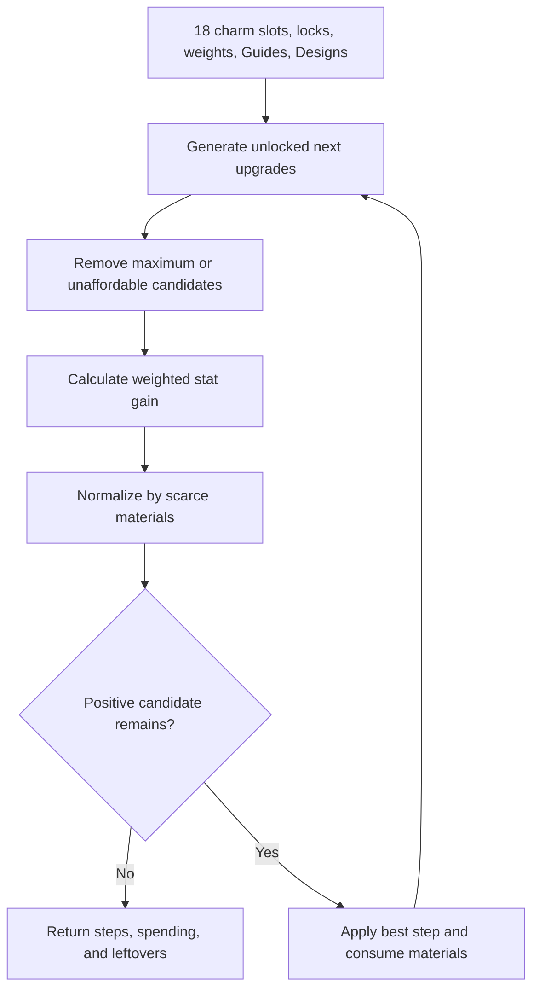

# Charm Optimization Logic

Charm planning considers six slots for each of Infantry, Cavalry, and Archer. Inputs are current levels, Charm Guides, Charm Designs, troop and stat weights, and locked slots. For each unlocked slot below the catalog maximum, the engine generates the next upgrade and removes it when either required material is unavailable.

Each remaining candidate receives weighted stat gain and cost normalized against the starting Guide and Design inventory. The best positive ratio is selected, materials are consumed, the level and combat stats advance, and the comparison repeats. The output is an ordered sequence rather than a target-only answer because early steps change what remains affordable.

## Decision and resource flow

Start condition → the 18 current Charm levels and both material balances are loaded → each eligible slot proposes one next catalog level → locked, maximum, and unaffordable steps are removed → troop and stat priorities value each delta → Guide and Design scarcity normalizes cost → the best positive candidate consumes materials → levels and remaining balances update → comparison repeats → the plan returns before/after levels, steps, spending, and leftovers.

Starting inventory is the normalization reference for the whole run. The comparison therefore recognizes which material was scarce at the start while the affordability gate still uses the live remaining balance on every iteration. A step can disappear after another choice spends its last required Design.

**Accessible summary:** The optimizer filters next charm upgrades, compares their weighted gain against scarce materials, applies the best positive step, and repeats until no valid candidate remains.

**Example:** Two Archer slots have equal stat gain, but one consumes a larger share of the limited Designs. The lower normalized cost can win. After it consumes Guides, a Cavalry candidate may become the best remaining option. Changing troop priorities can change the sequence without changing the catalog costs.

## Limitations and recovery

The plan is deterministic and constrained by the entered inventory, weights, locks, and catalog. It cannot account for an unentered purchase, incorrect level, future balance change, or an objective not represented by the chosen weights. The iterative result does not guarantee the globally best long-horizon sequence. If a troop class never appears, verify its locks and priorities and confirm that at least one next step is affordable and has positive weighted gain. Compare the before/after grid and leftovers before using the result.

## Purpose, controls, roles, and scope

Charm planning solves the choice among 18 next-slot upgrades when Guides and Designs are shared across Infantry, Cavalry, and Archer priorities. The controls are active Lab profile, each current Charm level, both material balances, troop and stat weights, strategy, and locks. They are personal scenario inputs. Alliance or kingdom selection does not change the cost catalog, and no leadership role gives authority over another user's saved profile or in-game inventory.

The engine generates only the next valid catalog level for each unlocked non-maxed slot. It compares candidates, consumes live remaining materials, updates the chosen level and stats, and repeats. The ordered output names slot, step, gain, Guides and Designs spent, before and after levels, and leftovers. A target is reachable only through these sequential levels; the engine cannot skip an intermediate cost.

**Worked scarcity edge case:** Two candidates each need one Design, but only one Design remains. The first selection uses it. Every next step that requires a Design becomes unaffordable even when Guides remain, so the optimizer may choose a Guide-only step or stop. The output reason is material exhaustion after an earlier decision. Correcting the inventory and rerunning is safe; manually inserting an impossible target is not.

Charm planning is greedy and iterative rather than exhaustive. Determinism means identical inputs repeat, not that the plan is globally optimal.

Before Run, verify every current-level field, the Guide and Design inventory inputs, each lock control, troop-class priority, stat weight, and strategy selector. After Run, inspect the ordered steps and both leftover materials, not only the final weighted gain. These controls belong to the profile owner; alliance and kingdom roles do not add authority or change catalog costs. To test a preference, save a separate scenario, change one weight or lock, rerun, and compare which branch consumed the scarce Design. This isolates the cause without editing the original saved assumptions.

## Choose an Optimization Goal before comparing results

The **Optimization Goal** controls how the charm optimizer ranks competing candidate upgrades:

- **Maximum stats:** Flat weights (1.0 across all stats and troop classes). Selects upgrades that purchase the largest total stat gain per Guide or Design, without considering troop priorities.
- **Combat power:** Offense-first ranking with a 20% defensive retention factor (Defense and Health weights are scaled to 0.20). Uses the Lanchester combat model to prioritize stats where the account suffers diminishing returns.
- **Balanced troops:** Advances all troop types together. It balances each troop's aggregate weight up to match the highest-priority troop while preserving the relative stat mix within each troop class.
- **My build:** Uses your saved profile troop and stat weights without modification.

### Account stats and Bonus Overview

For the **Combat power** goal, enter the four percentages per troop (Attack %, Defense %, Lethality %, and Health %) directly from the in-game Bonus Overview. The optimizer uses these percentages to favor upgrades in the specific attributes where your current account is weakest.

Current item and inventory inputs can be reviewed in [Ascension Path](/kingshot-events/lab/ascension-path) alongside the other progression systems. A forecast does not mean the account has already bought or equipped its proposed upgrades.
