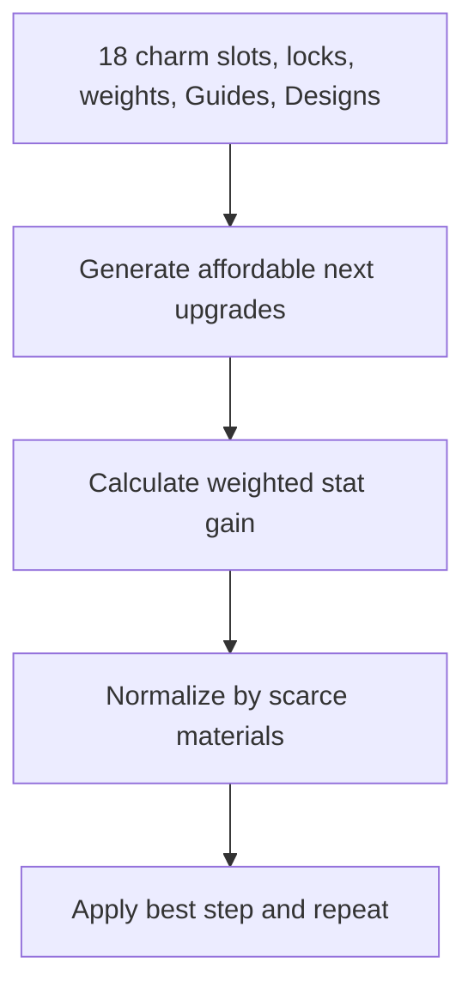

# Charm Optimization Logic

Charm planning considers six slots for each of Infantry, Cavalry, and Archer. Inputs are current levels, Charm Guides, Charm Designs, troop and stat weights, and locked slots. For each unlocked slot below the catalog maximum, the engine generates the next upgrade and removes it when either required material is unavailable.

Each remaining candidate receives weighted stat gain and cost normalized against the starting Guide and Design inventory. The best positive ratio is selected, materials are consumed, the level and combat stats advance, and the comparison repeats. The output is an ordered sequence rather than a target-only answer because early steps change what remains affordable.

## Decision and resource flow

Start condition → the 18 current Charm levels and both material balances are loaded → each eligible slot proposes one next catalog level → locked, maximum, and unaffordable steps are removed → troop and stat priorities value each delta → Guide and Design scarcity normalizes cost → the best positive candidate consumes materials → levels and remaining balances update → comparison repeats → the plan returns before/after levels, steps, spending, and leftovers.

Starting inventory is the normalization reference for the whole run. The comparison therefore recognizes which material was scarce at the start while the affordability gate still uses the live remaining balance on every iteration. A step can disappear after another choice spends its last required Design.

**Example:** Two Archer slots have equal stat gain, but one consumes a larger share of the limited Designs. The lower normalized cost can win. After it consumes Guides, a Cavalry candidate may become the best remaining option. Changing troop priorities can change the sequence without changing the catalog costs.

## Limitations and recovery

The plan is deterministic and constrained by the entered inventory, weights, locks, and catalog. It cannot account for an unentered purchase, incorrect level, future balance change, or an objective not represented by the chosen weights. The iterative result does not guarantee the globally best long-horizon sequence. If a troop class never appears, verify its locks and priorities and confirm that at least one next step is affordable and has positive weighted gain. Compare the before/after grid and leftovers before using the result.
