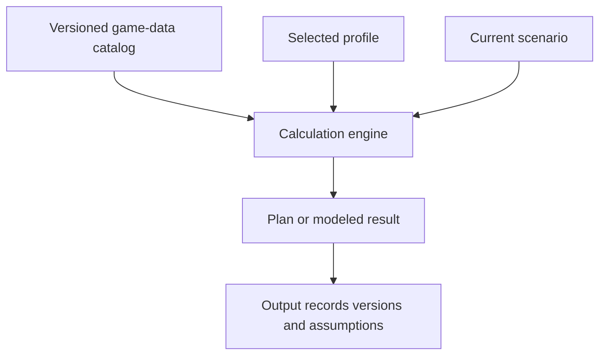

# Game Data and Calculation Inputs

The Game Data reference exposes upgrade-cost and stat tables used by Lab tools. Search and filters help locate a level or entity. The reference is read-only for ordinary users and is distinct from a personal profile.

## Three input layers

1. **Catalog data** supplies versioned costs, levels, stats, and supported entity definitions.
2. **Profile data** describes the selected account's current gear, materials, stats, and saved choices.
3. **Scenario data** contains temporary assumptions for the current optimizer or simulator run.

**Accessible summary:** A result combines catalog, profile, and scenario inputs. All three must be known to reproduce it.

When checking a cost, identify the system, item, starting level, destination level, and any tier or quality dimension. Do not copy the cost for one transition into another. When a tool and reference appear to disagree, first confirm that they use the same catalog version and that the optimizer is not summing multiple transitions.

**Example:** A user expects the cost shown for level 4 → 5, but their plan upgrades level 3 → 5. The optimizer correctly includes both transitions. The user verifies each row in the reference instead of overwriting the profile materials.

If an entity uses fallback artwork, use its label and key rather than guessing identity from art. If a data row is absent, record the system, level, filters, and visible data version. Do not treat community estimates or scenario overrides as catalog truth.

## Dataset version 1.0.1 and Hero Gear tables

The Spend Optimizer relies on **dataset version 1.0.1**. This version replaces older checkpoint interpolation with an exact 201-row per-level table for Hero Enhancement XP from level +0 through +200:

- **Cumulative XP total:** Reaching level +200 requires exactly 575,320 Enhancement XP, correcting an earlier 574,370 estimate derived from linear checkpoint ramps.
- **Zero-XP milestones:** Level 101 (Red gear ascension) requires two Mythic gear pieces and materials, but zero Enhancement XP. Subsequent imbuement milestones at levels 120, 140, 160, 180, and 200 similarly charge material costs rather than Enhancement XP.
- **Mastery enhancement caps:** Equipment level progression is gated by Mastery Forging. Mastery below 10 caps gear enhancement at level 100. Mastery 10 caps at level 119; Mastery 11 at level 139; Mastery 12 at level 159; Mastery 13 at level 179; Mastery 14 at level 199; and Mastery 15 or higher unlocks the maximum level 200.

These specific milestones determine how reforge budgets and upgrade sequences are evaluated.

## Roles, controls, workflow, and recovery

Every Lab user can read the exposed reference according to module availability; management roles and community scope do not change catalog costs. Use search, system filters, entity filters, and level selectors to locate a row. Record the visible version before opening an optimizer. The workflow is read-only: select the same system and transition used by the scenario, compare each required step, then return to the tool without editing profile values.

If filters return no result, clear them one at a time and verify spelling, entity key, starting level, destination level, tier, and quality. If a row appears wrong, report the catalog version and exact transition for review. Do not invent a replacement row, change community scope, or alter personal inventory to make the calculation pass.

## Limits and troubleshooting

The reference does not guarantee that every live-game value is known or unchanged. A catalog update can make an older saved result non-reproducible unless its version was preserved. Clear search and filters before concluding that a row is absent. When reporting a discrepancy, provide the system, entity key, transition, displayed cost or stat, expected value, and catalog version; do not edit a personal profile to compensate for suspected catalog data.
