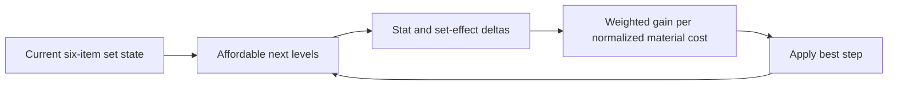

# Governor Gear Optimization Logic

Governor Gear planning reads two slots for each troop class, their current catalog levels, Satin, Gilded Thread, and Artisan Vision inventory, combat-stat priorities, and locked slots. Every loop generates one next-level candidate for each unlocked non-maxed slot. A candidate is removed if the inventory cannot cover all required materials.

The engine calculates the candidate's stat change, including set-state changes caused by the new level. It divides weighted gain by cost normalized against the starting inventory. The best positive candidate is applied, its materials are consumed, set state is refreshed, and all remaining candidates are recalculated. This matters because one upgrade can change the value of the next set-completing upgrade.

## Decision and resource flow

Start condition → six current item states and three material balances are loaded → one next level is generated per eligible slot → locks, maximum levels, and unaffordable costs remove candidates → direct and set-effect deltas are valued with the configured troop and stat weights → the best positive normalized value consumes materials → set state changes → comparison repeats → the plan returns steps, before/after state, spent resources, and leftovers.

Set effects are evaluated as deltas from the current set, not as permanent bonuses awarded to every candidate. Consequently, an item that completes a threshold can become valuable in one iteration, while the next upgrade on that same item may fall behind after the threshold has already been gained.

**Example:** A Cavalry piece is individually efficient, but an Infantry upgrade completes a configured set threshold. The candidate comparison includes that set delta. After selection, the remaining Satin and the new set state determine the next step. A locked piece cannot be selected even when it would complete the set.

## Limitations and recovery

The plan does not know future game releases, missing catalog levels, or personal priorities that were not entered. Its iterative choice is not a proof that no alternative sequence could produce a better distant outcome. Treat unspent materials and ordered steps as a scenario to review, not an instruction to spend automatically. If a set-completing step is absent, inspect locks, exact current levels, all three balances, selected strategy, and whether its weighted delta is positive.

## Purpose, controls, roles, and scope

Governor Gear planning solves the resource-allocation problem of choosing among six competing next item levels when direct stats, set thresholds, locks, and three inventories interact. The user selects an active Lab profile and controls current item catalog levels, Satin, Gilded Thread, Artisan Vision, troop and stat weights, strategy, and locked pieces. These are personal scenario inputs. Kingdom or alliance scope and management role do not alter upgrade costs, and the result never changes a live game account.

The target state is not typed independently: it emerges from repeated valid next-level choices until no affordable positive candidate remains. Each output step identifies the slot, old and new level, direct or set delta, and consumed materials. Before and after set state explains why a threshold mattered; leftovers explain why planning stopped.

**Worked inventory edge case:** A set-completing Infantry level needs Satin and Artisan Vision. A Cavalry step uses only the remaining Satin. If the Cavalry ratio wins first, it can exhaust Satin and remove the set completion on the next iteration. The engine reports the actual order and unused Artisan Vision. Changing the lock or weights creates a new scenario; it does not prove the earlier result was wrong.

This is a greedy iterative comparison with set-aware deltas, not an exhaustive search. Review the sequence before acting in game.

Before Run, confirm each item-level field, lock control, troop and stat weight, strategy selector, and all three inventory inputs. After Run, inspect the step list rather than only the final total: it reveals when a set threshold entered the candidate delta and which field exhausted a material. A player uses these controls for personal planning; an alliance leader or kingdom manager has no extra optimizer authority. For sensitivity review, duplicate the scenario, change one lock or weight, and compare ordered output, spending, set state, and leftovers.
