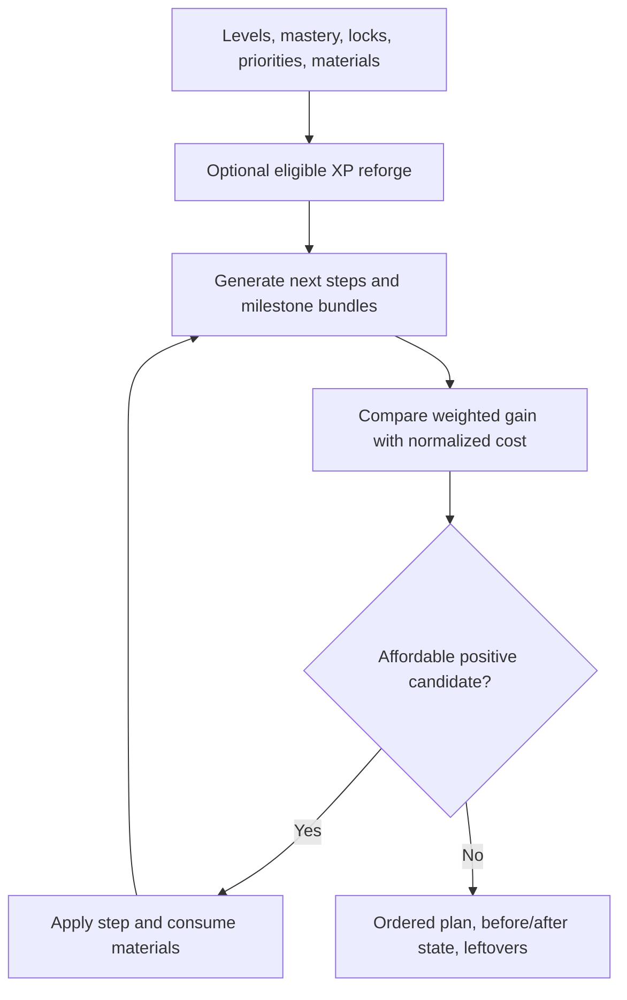

# Hero Gear Optimization Logic

The optimizer starts from four Hero Gear slots for Infantry, Cavalry, and Archer, including enhancement and mastery levels. It combines those states with XP, Forge Hammers, Mythic Gear, Mithril, combat-stat priorities, locked slots, strategy, and the versioned cost catalog.

For every unlocked slot it generates the next valid enhancement or mastery step. At milestone boundaries it can compare a combined mastery-plus-enhancement bundle rather than pretending the enhancement is reachable alone. Each candidate receives weighted stat value and a normalized resource cost. Irreversible materials receive a stronger cost penalty than reusable XP. The highest positive value-to-cost candidate that the inventory covers is applied; inventory, stats, and item level update; then candidates are regenerated. The process ends when no valid positive step remains.

Optional reforge runs before planning. It can pull recoverable XP from eligible unlocked enhancement levels, adjust the current stats, and add the XP back to inventory. It never reforges a locked slot and does not promise that every material is recoverable.

## Decision and resource flow

Start condition → current gear and inventory are loaded → optional reforge is evaluated → locked, maximum, unreachable, and unaffordable steps are removed → enhancement, mastery, and milestone bundles are compared → the best positive candidate consumes resources → item state and combat baseline change → candidates are regenerated → the ordered plan stops when none remains.

The before state explains what the engine believed; each step names the affected slot and consumed resources; the after state shows accumulated effects; leftovers explain why a later candidate could not run. A missing step therefore does not mean the item has no value: a lock, catalog boundary, non-positive configured weight, or insufficient material may have removed it.

**Accessible summary:** The optimizer optionally recovers eligible XP, compares valid upgrade and milestone candidates, applies one affordable positive step at a time, and returns plan and leftovers.

**Example:** An Archer lethality slot and an Infantry health slot are both affordable. Archer lethality has the higher configured weight, but crossing its milestone also needs Mithril. The engine compares the full bundle cost with the Infantry step, chooses the current best ratio, subtracts those materials, and reevaluates. Locking the Archer slot removes it entirely.

## Limitations and recovery

The output is deterministic for the same engine, dataset, and inputs. It is a planning estimate, not a guaranteed best build: the iterative choice does not search every possible future sequence. Verify current levels, locks, material counts, dataset version, and reforge choice before applying steps in game. If the result unexpectedly pulls a slot down, cancel the scenario and confirm that optional reforge is disabled or that the slot is locked.

## Controls, scope, and output review

The main controls are active profile, current enhancement and mastery per troop-class slot, resource inventory, combat-stat weights, strategy, slot locks, and optional reforge. These values belong to the user's saved Lab profile and scenario; alliance or kingdom scope does not change game catalog costs and no manager role can spend resources for another player. The current state is the baseline, the target is the ordered reachable state produced by the run, and the result lists each chosen slot, upgrade kind, material cost, before and after effect, total spending, and leftovers.

**Worked exhaustion case:** The first two steps consume all Mithril while XP and Forge Hammers remain. Candidate generation repeats, but every remaining milestone that needs Mithril is now unaffordable. An ordinary enhancement can continue only if its full next-step cost is covered and its weighted gain stays positive. Otherwise the plan stops and leaves the other materials unspent. The correct interpretation is constrained exhaustion, not optimizer failure. Correct profile counts and rerun if the inventory was wrong.

The engine is greedy with milestone bundles and optional staged reforge, not exhaustive. It compares valid next choices repeatedly and makes no unsupported optimality claim.

Each input field should be confirmed against the game-displayed state before Run: enhancement, mastery, lock, weight, XP, Forge Hammers, Mythic Gear, and Mithril. The result controls let the user inspect the ordered plan and copy assumptions, but not mutate the game. If one field is uncertain, save a separate scenario, change only that value, and compare outputs. This sensitivity check reveals whether the recommendation depends on the uncertain inventory or milestone without pretending the alternative is authoritative.
