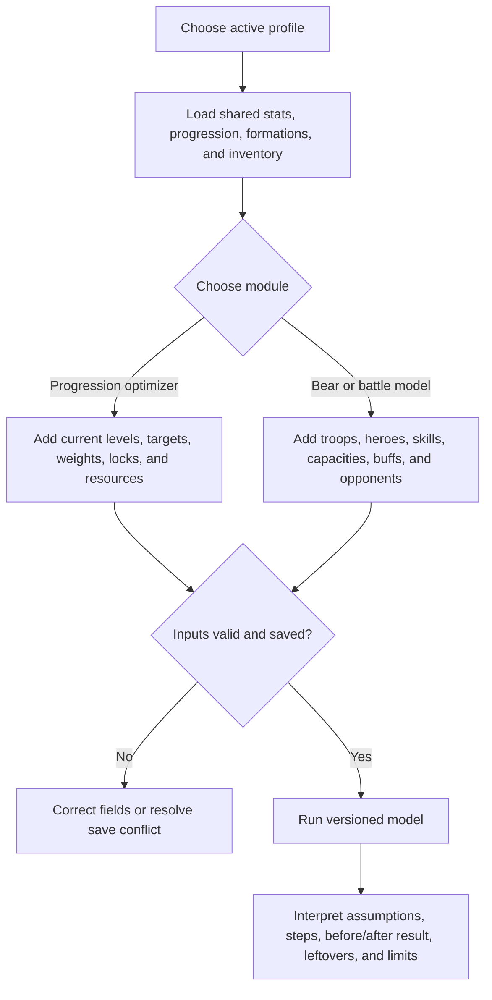

<CategoryHero category="lab" icon="flask" eyebrow="Explore before committing resources" title="Lab Overview and Profiles">
Save account assumptions, compare upgrade paths, and interpret every result as a scenario rather than a guaranteed outcome.
</CategoryHero>

<ProductFinder default-category="Simulations and Optimizations" />

# Lab Overview and Profiles

The **Lab** contains profiles, progression planners, optimizers, combat simulators, and supporting game data. Module cards show whether a tool is public, requires sign-in, is beta, or is currently unavailable.

## Profiles and saved inputs

A profile stores reusable supported inputs such as account stats, troop bonuses, formations, Hero Gear, Governor Gear, Charms, heroes, widgets, and owned resources. It is not a live connection to the game account. Update it after every relevant in-game change.

Visitors can use a device-saved profile. Clearing site data, changing browsers, or using private browsing can remove or isolate it. Signed-in users can create and select saved profiles where cloud persistence is available. Always check the active profile name before editing or running a module.

Some tools can apply an accepted plan back to the selected Lab profile. Applying changes the stored planning state, not the game account. Review the target levels and consumed resources before confirming.

## Choose a module

- **Hero Gear Optimizer**, **Governor Gear Optimizer**, and **Charm Optimizer** plan progression with current slots and inventory.
- **Bear Trap Simulator** models a rally against the Bear with captain, joiners, formation, and stats.
- **Rally Simulator** compares supported captain, joiner, formation, and stacking choices.
- **Battle Simulator** runs a configured attacker and defender scenario.

<VisualReference title="Lab and profile landmarks">
Select the profile before the module and review persistence feedback after saving.

<template #items>

- Module cards with public, sign-in, beta, premium, or unavailable state.
- Active profile selector, create, rename, duplicate, save, or delete actions where available.
- Profile sections for account stats, troops, equipment, heroes, widgets, formations, and inventory.
- Freshness or missing-input feedback and links to each compatible optimizer or simulator.

</template>
</VisualReference>

All Lab outputs are modeled guidance. Continue with [Interpreting Results and Limitations](/kingshot-events/lab/interpreting-results).

## How profiles and modules relate

The active profile supplies shared account assumptions. Module-specific fields then describe a progression or combat scenario. Debounced autosave shows pending, saved, failed, or conflict state; switching profiles must not let an older pending response overwrite the newly active profile. Running a module uses the resolved saved and typed inputs at that moment. The output belongs to the scenario and never changes a live game account.

*Lab feature map. A profile supplies shared inputs; each module adds controls and produces a versioned scenario result only after validation.*

**Accessible summary:** Users select a profile, add progression or combat inputs, resolve invalid or unsaved state, run the model, and interpret its output and limitations.

## Decision mechanisms

Hero Gear, Governor Gear, and Charm planning generate valid next candidates, remove locked, maximum, unaffordable, or out-of-scope choices, compare weighted gain with normalized cost, apply the best positive candidate, update resources, and repeat. The behavior is greedy and iterative, with system-specific staging such as Hero Gear milestone bundles and reforge or Governor Gear set deltas. It is not an exhaustive proof of global optimality.

Bear Trap resolves the rally leader separately from joiners, validates capacity and formation, applies supported troop, Truegold, hero, captain, skill, stat, and temporary-buff effects, and distinguishes deterministic, probabilistic, estimated, and unresolved mechanics. Prediction error requires an observed result and helps diagnose assumptions; it does not validate every mechanic.

## Worked example and common mistakes

**Starting situation:** A Charm plan leaves Guides unused after Designs reach zero. **Rules:** Every candidate must cover all required materials. **Branch:** Design-requiring candidates are removed; a Guide-only positive candidate may continue, otherwise the plan stops. **Output:** Ordered steps and leftovers explain the stop. **Next action:** Correct the inventory only if it was entered incorrectly, then rerun from the same profile.

Avoid running from the wrong profile, leaving an autosave pending, mixing game-displayed and estimated values, treating a modeled target as an in-game save, or claiming global optimality. If output surprises you, compare one controlled input change in a copied scenario.

## Why the Lab exists

The Lab turns a vague question such as “what should I upgrade?” or “why did this rally behave differently?” into a reproducible scenario. Its purpose is not one impressive number. Its purpose is to expose assumptions, constraints, candidate choices, resource use, and uncertainty so alternatives can be compared.

The Lab is useful when a decision has interacting inputs: shared resources, locks, set thresholds, troop priorities, leader and joiner roles, formation capacity, stacking rules, or repeated battle variation. Outputs keep ordered steps, before-and-after state, leftovers, rejected effects, distributions, and limitations close to the scenario.

## Module purpose and output map

| Module | Question it answers | Important inputs | Output to inspect |
| --- | --- | --- | --- |
| Profiles | Which account assumptions should every tool reuse? | Gear, stats, materials, formations, heroes, widgets | Active profile, saved state, freshness, version |
| Hero Gear | Which valid enhancement or mastery step offers the best current value? | Levels, mastery, locks, weights, materials, optional reforge | Ordered steps, milestone bundles, spending, leftovers |
| Governor Gear | How do six pieces compete when set effects and three inventories interact? | Item levels, locks, weights, Satin, Thread, Vision | Direct and set deltas, before/after set state |
| Charms | Which next levels best use Guides and Designs across troop priorities? | Eighteen slots, locks, weights, Guides, Designs | Slot upgrades, weighted gains, leftovers |
| Bear Trap | How do leader and joiner inputs resolve into modeled contribution and damage? | Troops, tier, Truegold, capacities, heroes, skills, buffs | Formation guidance, contributions, estimate, observed error |
| Rally | Which configured effects apply, fail, add, or multiply? | Leader, joiners, formation, skills, widgets, stats | Accepted and rejected effect stack |
| Battle | How do attacker and defender results vary across trials? | Both sides, formations, bonuses, heroes, repeat count | Distribution and comparable scenario result |
| Game Data | Which versioned costs and stats feed calculations? | System, entity, level transition, filters | Read-only catalog row and data version |

## Demonstration: one profile, three questions

Assume Nia''s profile contains current gear, troop stats, a 100,000 march capacity, materials, and heroes.

1. In **Hero Gear**, the optimizer generates next steps, removes locked and unaffordable candidates, values gain against normalized cost, applies one step, consumes resources, and recalculates. The answer is an ordered plan, not a target typed in advance.
2. In **Rally**, the same profile supplies base assumptions, but Nia configures a leader and joiners for one scenario. The tool separates roles and classifies effects. It does not spend profile materials.
3. In **Battle**, Nia configures both sides and a repeat count. The tool reports modeled variation. It does not update Rally and does not claim the most favorable trial will occur live.

Shared profiles reduce re-entry, while scenario fields keep unrelated experiments separate.

## Input ownership and safe application

Profile values, scenario overrides, catalog values, and observed outcomes are different evidence classes. An override should not silently rewrite a profile. A catalog correction should not be simulated by falsifying material balance. An observed Bear result can measure prediction error but must not mutate event history.

When a plan can be applied to a profile, confirmation should identify target profile, new levels, and consumed resources. It updates planning state only. The user still performs any real upgrade in game and refreshes the profile from the actual result.

## Failure diagnosis by module

- **No candidate:** check locks, maximum levels, complete costs, positive weights, and every required material.
- **Sequence stops early:** inspect leftovers and the first exhausted resource.
- **Rally effect rejected:** check role, active slot, prerequisite, and stacking category.
- **Battle distribution extreme:** verify both side assignments, counts, percentages, repeat count, and data version.
- **Different user result:** compare profile, overrides, catalog and engine versions, and every control.
- **Save conflict:** preserve values, reload the newer version, and reapply only intended changes.

The Lab cannot guarantee global optimality or live results. Its value is a transparent, repeatable comparison whose limitations remain attached.
## Detailed Lab feature catalog

### Hub states and module availability

The Lab landing page distinguishes loading, unavailable, empty, ready, and error states. Availability can depend on rollout, access, or configuration; an absent module is not evidence that a saved profile was deleted. Each module card should identify its question, required inputs, output type, and limitations before a user starts changing values.

### Profile library and persistence

The profile library is the reusable source of planning inputs. Users can create, select, rename, duplicate, update, and remove profiles within their permitted scope. Autosave reduces repetitive work, but version checks prevent an older browser tab from silently overwriting newer data. A conflict should preserve local values long enough to compare and reapply the intended change.

### What a profile contains

A complete profile can preserve:

- identity and server or kingdom context;
- march capacities and troop counts;
- troop tier and Truegold-related values;
- selected heroes, skill levels, active slots, and supported widgets;
- combat-stat snapshots with source labels;
- layered bonuses and effective combat values;
- hero gear, governor gear, charms, and upgrade state;
- shared resource balances used by optimization modules.

Missing values remain missing. The Lab must not replace an unknown troop count, level, or source with a plausible-looking default and then present the result as verified.

### Stat snapshots, sources, and layers

A snapshot records the values used by a scenario at a point in time. Source labels distinguish profile values, catalog values, explicit scenario overrides, and observed outcomes. Layer views explain how base values and bonuses combine. This makes two runs comparable and prevents a later profile edit from changing the meaning of an earlier result.

### Hero Gear planning and reforge

Hero Gear supports objective-driven comparisons rather than a single unexplained score. A user selects eligible gear, locks items that must not change, supplies resource balances, chooses weights or an optimization objective, and reviews the proposed upgrade sequence. Reforge planning uses its own controls and cost constraints. Results should show consumed materials, leftovers, stat changes, stopping reason, and whether the plan can be applied back to the selected profile.

### Governor Gear

Governor Gear compares upgrade candidates against shared material limits and the selected objective. It should expose prerequisites, item state, costs, proposed order, and remaining resources. The recommended sequence is a plan for the represented data version; it is not proof that every future catalog or game balance will produce the same order.

### Charms

Charm planning evaluates current levels, eligible next levels, complete cost data, locks, and available materials. A candidate can disappear because it is already at maximum, lacks a valid next level, violates a lock, or needs a missing resource. The result must explain both selected upgrades and the first reason optimization stopped.

### Bear Trap: simulate and contribute

Bear tools have two intentionally different modes. **Simulate** uses profile and scenario inputs to estimate formation or contribution outcomes and keeps the assumptions visible. **Share Your Bear Experience** records an observed result as contribution evidence when the signed-in flow permits it. Observed evidence can measure prediction error, but it must not silently rewrite the simulation profile or event history.

### Rally setup and effect resolution

Rally planning separates leader and joiner contributions, active hero slots, troop composition, march capacity, role-specific effects, prerequisites, and stacking categories. Warnings identify invalid assignments or unsupported combinations. The effect breakdown should show accepted and rejected effects, widget or passive contributions, and the resulting multipliers so users can explain the final comparison.

### Battle simulation

Battle simulation compares two explicitly configured sides using a worker-backed repeated model. Users review formations, heroes, counts, tiers, statistics, controls, repeat count, seed or repeatability information when available, and catalog or engine version. The output is a distribution across repeated runs; not a guaranteed live outcome; and should include enough controls to reproduce or challenge the comparison.

### Game Data

Game Data is the reference surface for supported catalogs used by Lab modules. Search and category navigation help users locate heroes, skills, troops, gear, costs, and related records. Version and source labels matter: artwork, catalog completeness, and simulation support can have different statuses, so visual presence alone does not prove that a record participates in every engine.

### Result trust labels

| Label | Meaning |
| --- | --- |
| Profile input | Persisted user-controlled planning value |
| Scenario override | Temporary value for the current comparison |
| Catalog input | Versioned application reference data |
| Derived result | Calculated from declared inputs and engine rules |
| Observed contribution | User-submitted real outcome with its own context |
| Warning | A limitation, missing prerequisite, unsupported combination, or uncertainty |
| Applied plan | Confirmed planning-state update; never an in-game action |

A trustworthy Lab result always lets the reader answer: which profile, which overrides, which catalog version, which controls, which engine assumptions, and which warnings produced this output.
## Recommended reading order

Begin with [Profiles, Autosave, and Optimization Order](/kingshot-events/lab/profiles-and-autosave), then choose [Hero Gear](/kingshot-events/lab/hero-gear), [Governor Gear](/kingshot-events/lab/governor-gear), [Charms](/kingshot-events/lab/charms), or [Bear Trap](/kingshot-events/lab/bear-trap). Finish with [Interpreting Results](/kingshot-events/lab/interpreting-results) and [Simulator Problems](/kingshot-events/troubleshooting/simulator-problems).
