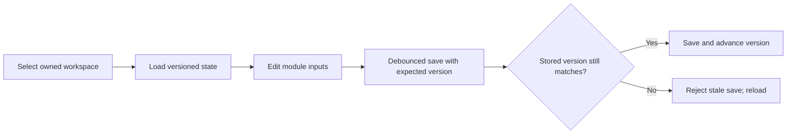
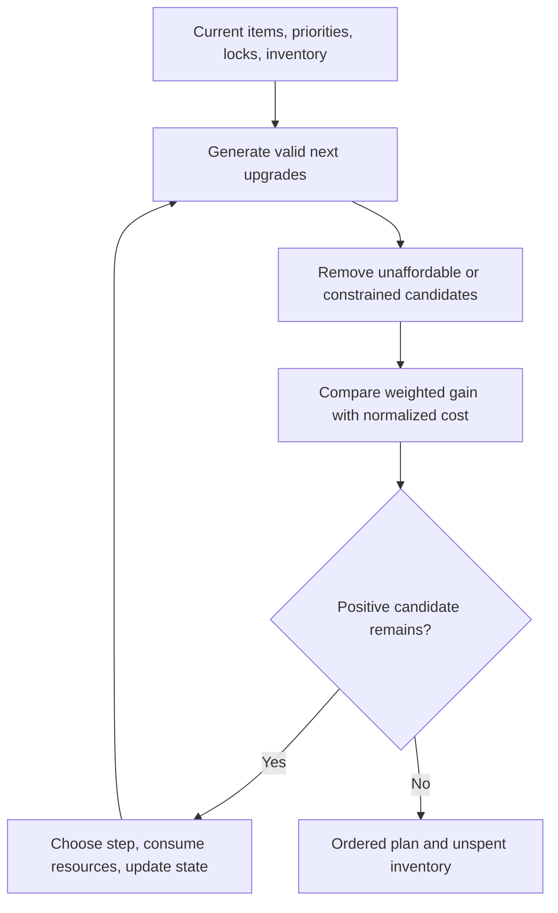

# Lab Profiles, Autosave, and Optimization Order

A visitor profile is saved in the current browser on that device. Signed-in users can use cloud profiles associated with their account when that capability is available.

A signed-in Lab workspace is owned by one account, optionally linked to a player, and stores validated gear, combat stats, priorities, inventory, budget, strategy, optimizer locks, and module overrides. A user can keep up to 50 workspaces per tool. Duplicating creates a separate state snapshot. Switching workspaces must load the selected identity before edits continue.

Each save carries the last known concurrency version. If another tab or a delayed save changed the workspace first, the stale save is rejected with **This workspace was modified elsewhere. Reload and try again.** This prevents a slower autosave from overwriting newer work. Debouncing reduces save frequency but does not change that conflict rule. Module scenario overrides can sit above profile values; switching profile clears Bear scenario overrides so values from one player do not leak into another scenario.

**Accessible summary:** A versioned workspace loads into the selected profile; valid saves advance its version, while a stale tab must reload instead of overwriting newer work.

## Optimizer decision loop

Hero Gear, Governor Gear, and Charms share a verified iterative pattern:

1. Read current item levels, combat-stat baseline, troop and stat weights, resource inventory, strategy, and locked slots.
2. Generate every valid next upgrade in the selected tool. Remove locked, maximum-level, unaffordable, and out-of-scope candidates.
3. Calculate the candidate's weighted stat gain. For additive mode, this is the sum of configured weight times stat delta. Combat mode values marginal improvement relative to the current baseline.
4. Normalize cost against the starting available inventory. Hero Gear applies stronger penalties to irreversible materials and can bundle enhancement with mastery to cross a milestone. Governor Gear accounts for set changes. Charms evaluate six slots per troop class.
5. Select the candidate with the best positive gain-to-normalized-cost value, consume its resources, update levels and stats, and repeat.
6. Stop when no valid positive candidate remains. Return the ordered steps, before and after state, resources consumed, and inventory left.

**Accessible summary:** Each optimizer filters next upgrades, chooses one positive cost-normalized candidate, consumes resources, and repeats until it returns the plan and leftovers.

**Worked small example:** A user has materials for either one Governor Gear upgrade or two Charm steps and weights Archer lethality above other stats. The engine does not choose by item rarity alone. It evaluates every affordable next step, applies the configured weights and cost normalization, selects the current best candidate, subtracts its materials, then recalculates the remaining set. The second choice may change after the first consumes a shared material or activates a set effect.

Hero Gear may optionally reforge eligible unlocked enhancement levels to recover XP before planning. Locked items are never pulled down. Enhancement, mastery, milestone, rarity, and resource costs come from the versioned catalog.

## Limitations and conflict recovery

The plan is deterministic for the same inputs and dataset, but it is not a proof of the globally best in-game build. Wrong inventory, weights, catalog assumptions, or temporary buffs produce a precise answer to the wrong scenario. On a stale-save conflict, copy any unsaved values, reload the newer workspace version, and reapply only the intended changes. Do not keep retrying the stale tab: its version cannot overwrite the newer save.

## Purpose, roles, and profile boundaries

Profiles solve the problem of re-entering shared progression and combat inputs for every Lab module. Any eligible Lab user can create and switch personal profiles; sharing or management roles do not turn a profile into an alliance record. The active profile supplies shared values, while each module adds its own gear, charm, rally, or scenario controls. A visible pending state means the debounce has not completed; saved confirms the current version; failed requires correction or retry; conflict means another tab or newer save won. Switching profiles changes the source for later module runs and must cancel or isolate an older pending write so it cannot overwrite the newly active profile.

**Worked profile switch:** A user edits troop bonuses in Profile A and immediately opens Profile B. The pending A save remains associated with A. Profile B loads its own values and save version. When the older response returns, stale-write protection prevents it from replacing B. The next optimizer output therefore names Profile B and its module inputs. If the label or values disagree, stop, copy unsaved edits, reload, and verify the active profile before running again.
