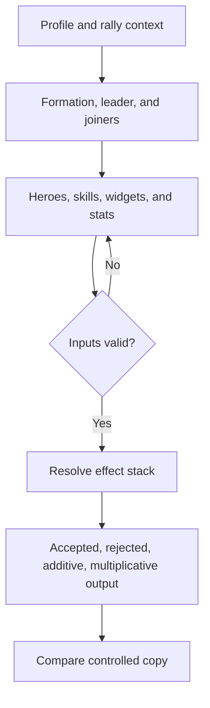

# Rally Simulator

The Rally Simulator explains how configured rally effects combine. It distinguishes leader and joiner context and reports effects as accepted, rejected, additive, or multiplicative. It is a model, not an official battle result.

## Build a comparable scenario

1. Select the intended Lab profile and verify its saved scope and update time.
2. Configure the rally context, leader, joiners, formation, capacities, heroes, skills, widgets, and supported stats.
3. Resolve every required-input warning before running.
4. Inspect rejected or ignored effects before interpreting the total.
5. Duplicate the scenario and change one variable for a controlled comparison.

**Accessible summary:** Complete the scenario, validate it, inspect how effects were classified, and compare a one-change copy.

An effect can be rejected because its role, slot, stacking rule, or prerequisite does not apply. Do not re-enter the same effect under another label merely to force it into the total. Additive and multiplicative groups must remain visible when comparing runs because equal-looking percentages can combine differently.

**Example:** A joiner skill is listed as rejected in one scenario. The user verifies the joiner's role and skill slot, corrects the configuration, and reruns. The resulting change is attributed to that correction only because all other inputs were preserved.

If output is implausible, check profile, formation totals, capacity, leader versus joiner placement, active skills, widget selection, and data version. Share the input summary with any result; a bare total cannot be reproduced.

## Limits and troubleshooting

The model cannot guarantee live rally damage or undocumented stacking behavior. Community-observed mechanics and estimated values must remain labeled as such. A disabled run control means required input or validation is unresolved; it is not repaired by refreshing repeatedly. If two users obtain different output, compare data version, active profile, scenario mode, formation totals, participant roles, skill slots, and every override before reporting an engine inconsistency.
