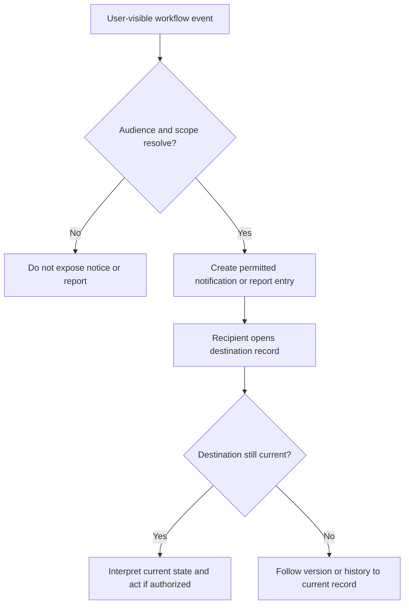

# Notifications and Reports

Notifications tell a recipient that a user-visible workflow changed. Reports summarize a scoped workflow for an eligible viewer. Neither is the authoritative editing surface: follow the notice or report back to its player, event batch, Castle schedule, Knowledge session, subscription, or restore request.

## Decision flow

*Notification and report resolution. Audience checks precede delivery, and the destination record remains authoritative.*

**Accessible summary:** A workflow event produces a notice or report only for an eligible audience. The recipient opens the source, then uses current state or history if the original destination was superseded.

## What can produce output

Castle publication and later schedule changes can notify affected participants. Knowledge review decisions and Reading Verification assignments can create author, reader, or manager-facing updates. Subscription grants, requests, warnings, and quota or limited-mode changes can require attention. Restore requests and decisions can update the requester or reviewer. User-visible audit information may show actor, time, state transition, source, or version where the product exposes it.

A notification is not proof that the action completed exactly as expected. Verify the destination status. A report is read-only output and may be bounded by session, creator relationship, tenant management, scope, date, or current access. Export availability can be narrower than on-screen viewing.

## Worked example

**Starting situation:** A participant receives a Castle schedule-change notice. **Input:** A manager produced a validated change from a published schedule. **Rules:** The recipient qualifies for the participant-facing update; the prior version remains historical. **State change:** A new schedule version becomes authoritative. **Output:** The notice links to the current appointment. **Next action:** The participant checks position and time in the latest published version, not the text of an older message. If the destination is unavailable, report cycle, schedule version, visible appointment, and notice time to the kingdom organizer.

## Limits and recovery

Delivery timing and external email behavior can vary, so the in-product destination and visible history are safer than assuming silence means no change. A recipient cannot use a notice to gain access to a source outside their scope. Duplicate notices do not imply duplicate records. If information conflicts, record the notice type and time, destination identity, visible version or status, active scope, and expected outcome. Never include private exports, credentials, or another user's protected report details.
