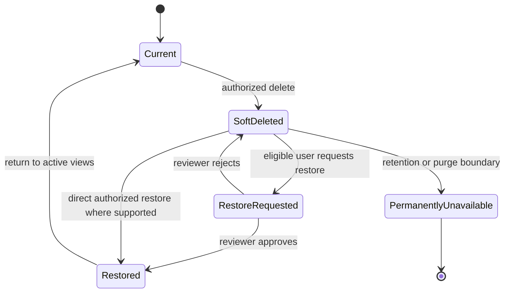

# Recycle Bin and Restore Requests

Soft deletion removes an eligible record from normal active views while preserving enough history for review and possible restoration during its retention window. It is different from Kick, rollback, archive, and permanent removal.

## Lifecycle

*Soft-delete and restoration. A request can be approved or rejected; retention can end recovery availability.*

**Accessible summary:** Current records can be soft-deleted, restored directly or through an approved request, remain deleted after rejection, or eventually become permanently unavailable.

## Choose the correct recovery mechanism

Use **Kick** when a player leaves an alliance but the identity and kingdom history should remain. Use **Delete** when an eligible record should leave current views. Use **rollback** when applied import records must be reversed through their source batch. Use **archive** for workflows such as Knowledge or Reading Verification that intentionally leave active views while preserving historical state. Use **restore** only for a supported soft-deleted entity.

The recycle bin is scope-aware. A user must be able to view the relevant removed record and have the supported recovery relationship or role. A restore request records intent for a reviewer; it does not make the record current immediately. Approval restores the eligible entity without inventing a replacement identity. Rejection leaves it deleted. Permanent unavailability means the visible restoration mechanism can no longer recover it.

## Worked example

**Starting situation:** A roster manager cannot find player Sol after an accidental Delete. **Checks:** Confirm active kingdom and alliance, clear directory filters, then open the recycle bin and inspect Sol's external ID and deletion state. **Rules:** The record remains inside retention and the manager can request but not approve restore. **Branch:** A restore request is submitted and reviewed by an authorized manager. **State changes:** Soft-deleted to restore requested to restored. **Output:** Sol returns to supported current views with history intact. **Next action:** Verify membership because restoration does not necessarily recreate every former alliance-standing value.

## Failures, limits, and support evidence

A record may be absent because of filters, scope, Kick, archive, rollback, or an expired retention window rather than deletion. Do not create a duplicate before checking those states. Restoration cannot guarantee recovery of separately removed source files, reverse later dependent changes, or bypass permanent unavailability. If recovery fails, include entity type and visible identifier, former scope, deletion time if known, recycle-bin state, restore-request status, exact error, and expected destination. Never include credentials or private internal identifiers.

## Controls and complete recovery workflow

The visible controls depend on entity and role: open Recycle Bin, filter by supported type or scope, inspect deletion information, request restore, approve or reject a request, and verify the restored destination. A requester records recovery intent but cannot assume approval. A reviewer confirms identity, scope, retention eligibility, historical dependencies, and whether restoration would conflict with a current record. Approval changes the state to restored; rejection preserves soft deletion and its reason.

For a player, verify stable external ID and nickname history before restoring so the action does not create a current-name collision. For an import, distinguish the artifact from results previously applied through it. For a report or workflow item, confirm whether its documented lifecycle uses archive rather than deletion. After restore, reopen the normal destination and check which membership, assignment, lock, publication, or derived state recalculates and which values remain intentionally historical.

**Conflict example:** A deleted local player and a newer current player now present the same normalized name. The reviewer must use external ID and history rather than approving blindly. If identity is the same, the current record may need correction before restore; if identities differ, the name conflict requires an authorized resolution. The output is either a safely restored original or a rejected request with an actionable reason. Restore is not a merge tool.

Soft deletion preserves a recovery opportunity, not a guarantee. Retention can expire, dependent changes can block reversal, and a removed source file may no longer exist. Troubleshoot with the visible record and request states, not private storage or database details.
