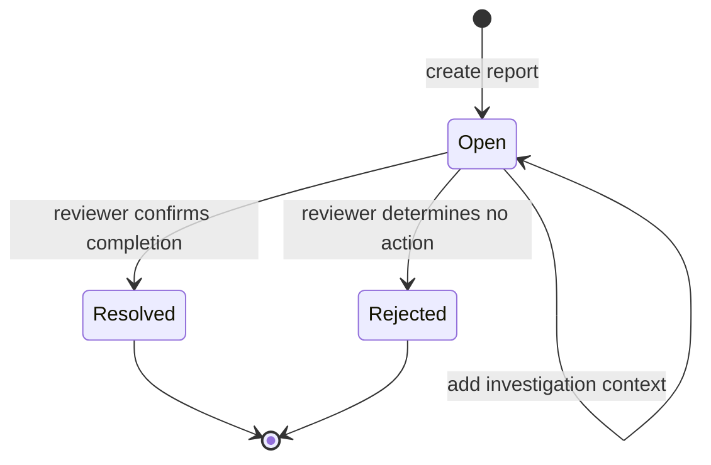

# Reports and Scoped Issue Tracking

Reports track user-raised issues inside a permitted scope. Restore requests ask for recovery of removed information. They may appear near each other, but resolving a report does not restore an entity and approving a restore request does not automatically close a report.

## Create a useful report

Open **Reports → New report**, select the correct scope and subject available to you, and describe the observed result, expected result, record identity, time, and safe reproduction steps. Choose priority for impact, not frustration. Do not attach credentials, private exports, or another user's protected information.

Reviewers can filter by priority, scope, or status and sort the queue. The list exposes scope, title, priority, status, creator, and creation time. Open the detail before deciding. The visible quick actions to **Resolve** or **Reject** appear only to accounts with report-resolution permission and only while the report is open.

**Accessible summary:** Reports begin open. A permitted reviewer investigates the detail and then resolves or rejects; investigation notes do not themselves change state.

## Worked example

A member reports that an imported event row displays the wrong player. The report includes the import and row identifiers, expected player, visible player, and scope. The reviewer corrects the import through its owning workflow, verifies the resulting record, then resolves the report. They do not edit data inside the report itself.

If a report is missing, clear filters and confirm the scope. If **Resolve** and **Reject** are absent, the account lacks the required permission or the report is no longer open. If the issue concerns deleted data, use [Recycle Bin and Restore Requests](/kingshot-events/lifecycles/recycle-bin-and-restore-requests) and cross-reference the report rather than duplicating recovery attempts.

## Limits and troubleshooting

Report status does not guarantee that every downstream effect completed, so reviewers should verify the owning record before resolution. Rejection means the report will not proceed through this queue; it must include enough context for the reporter to understand the outcome. If filters show no rows, clear status, priority, and scope independently. If an update fails, reload the detail before retrying so a successful first decision is not submitted twice.
