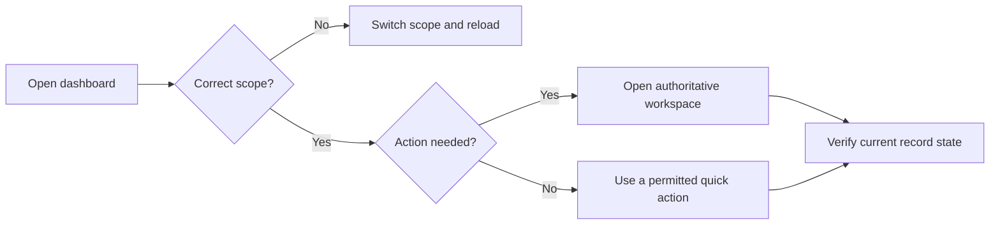

# Dashboard, Alerts, and Quick Actions

The dashboard is a scoped launch surface, not a separate source of truth. Start by reading the displayed kingdom or alliance context. Its cards, alerts, imports, and analytics use that selected context and the permissions of the signed-in account.

## Read the dashboard in order

1. Confirm the scope heading before opening or changing records.
2. Review **Action Needed**. Each item links to the workspace where the decision belongs.
3. Use **Quick Actions** only after checking that the destination matches the intended scope.
4. Treat recent imports and alert counts as pointers. Open the record to see its current status.
5. Open full analytics before making a decision that needs filters, dates, or an auditable breakdown.

**Accessible summary:** Confirm scope, follow an alert or quick action to its owning workspace, and verify the current record there.

## What the cards mean

**Action Needed** can surface approval or review work such as account requests, restore requests, imports that need attention, reports, or preparation tasks. Visibility is permission-dependent. **Recent Imports** shows status and opens the import review. **Support & Plans** links to request history and configured external support options. **Kingdom Pulse** is shown only when the current access permits the corresponding aggregate; otherwise the dashboard explains that the view is alliance-scoped.

Quick actions can include importing screenshots, reviewing players, opening events, event settings, and approval queues. A missing action usually means the permission, scope, module availability, or account state does not permit it.

## Example and recovery

**Example:** An import alert says review is required. Opening the alert reveals several rows awaiting decisions. The alert itself did not apply data; the reviewer resolves the rows, applies the import, and then checks the resulting batch.

If a count looks stale, refresh the dashboard and then the destination page. If a destination is denied, record the current scope label, the action label, and the denial message. Do not infer authority from seeing a summary card.

## A dedicated inbox for follow-up

The bell and **Notifications** menu lead to a paginated inbox with unread, urgent, and action-needed views. Sidebar dots are explained by **What's new here** in the relevant section. Reading information clears its unread state, while actual decisions remain pending until completed in their owning workspace.

This makes it possible to read everything without accidentally approving anything. See [Notifications and Reports](/kingshot-events/lifecycles/notifications-and-reports) for examples and recovery steps.
