# Ralyvora Assistant

Ralyvora Assistant is an intelligent control and discovery layer for Kingshot Events. It can interpret requests with the configured external AI model, execute registered Ralyvora tools, and explain structured results. It does not replace the dashboard, forms, tables, Strategy Lab, Castle Positions, Knowledge Hub, or administration pages.

The same unified Assistant interface serves visitors and authenticated members, with capabilities dynamically resolved based on identity and effective permissions.

## Access model and conceptual states

The Assistant operates across three conceptual access tiers:

1. **Guest (Public Access):** Non-authenticated visitors. No sign-in is required merely to open the Assistant. The launcher is available on public landing, documentation, and product pages. Guests have access to a strictly reduced, public-safe capability and tool set.
2. **Authenticated User:** Signed-in members. Unlocks personal Strategy Profiles, personal optimization workflows, saved durable runs, event tracking, and account-scoped features.
3. **Privileged / Scoped User:** Members with specific roles within an alliance or kingdom (e.g., King, Minister of Justice, Castle manager) or Supreme Administrators with system-wide governance authority.

```mermaid
flowchart TD
  Visitor["Visitor arrives at Ralyvora"] --> Launcher["Open Assistant Launcher"]
  Launcher --> StateCheck{"Signed in?"}
  StateCheck -- "No (Guest)" --> GuestMode["Guest Mode<br/>• Public Tools Only<br/>• Knowledge Hub (Public)<br/>• Safe Role Education<br/>• Contextual Recommendations"]
  StateCheck -- "Yes" --> AuthMode["Authenticated Mode<br/>• Strategy Profiles<br/>• Optimization Runs<br/>• Scoped Analytics<br/>• Personalized Guidance"]
  GuestMode -- "Sign In / Register" --> AuthTransition["Refresh Capabilities<br/>& Restore Intent"]
  AuthTransition --> AuthMode
  AuthMode -- "Sign Out" --> LogoutReset["Purge Private State<br/>& Reset Session"]
  LogoutReset --> GuestMode
```

## Guest capabilities and public safety

Guests can safely explore Ralyvora without an account:

- **Basic conversation and greetings:** Immediate, deterministic responses for common introductory queries.
- **Feature discovery:** Explaining what Ralyvora is, what tools exist, and how different game systems are modeled.
- **Public Knowledge Hub search:** Search and read published, global, non-restricted articles (`public_free` policy).
- **Public simulator explanations:** Guidance on how the Bear Trap, Hero Gear, Governor Gear, and Charms calculators operate.
- **Public navigation:** Opening registered public feature and documentation routes.
- **Safe role education:** Explaining leadership roles (such as King, Minister of Justice, or Castle Positions) from public capability metadata without disclosing kingdom or alliance data.

### Strict private data isolation

Guests are strictly isolated from private and scoped data. Guests cannot access:
- Strategy Profiles, player directories, and custom battle stats.
- Alliance or kingdom analytics, member rosters, and attendance records.
- Championship Warboard workspaces and opponent intel.
- Screenshot and spreadsheet imports.
- Private, draft, alliance-scoped, or kingdom-scoped Knowledge Hub articles.
- Castle Position appointment schedules and pending candidate applications.
- Background durable runs and execution logs.
- Operations Console and Supreme Admin Center.

Server-side tool filtering ensures that the model and runtime expose **only** `GUEST_SAFE_TOOLS` (`capability.list`, `capability.explain`, `capability.search`, `navigation.open`, `role.explain`, `recommendation.list`, `knowledge.search`, `knowledge.article`). Even if an unauthenticated caller attempts to forge a tool call or guess an internal ID, the server denies execution authoritatively.

## AI consent, privacy, and cost protection

### Guest AI consent
Authenticated users store their versioned AI consent in their account settings. Guests do not have an account row and are never stored as fake database users. Guest consent is managed in browser `localStorage` (`ralyvora_assistant_guest_ai_consent`).

Before external AI processing, visitors receive a clear disclosure:
- The message is processed by the configured external AI provider (Gemini or OpenAI).
- Only the context necessary for the request is sent.
- No account or private Ralyvora data is included because the visitor is not signed in.
- Deterministic mode remains available without enabling AI.

### Deterministic guest mode
Even without external AI consent, visitors can use deterministic greetings, public feature discovery, safe role explanations, and navigation.

### Abuse and cost protection
- Anonymous traffic is protected by IP-based and session-level rate limiting (`publicRequestLimit`).
- Tool execution for guests is strictly capped at a maximum of 2 calls per interaction.
- Anonymous mutation tools are completely disabled.
- Guest conversations are ephemeral and never persisted to the database.

## Guest conversion and feature promotion

Ralyvora Assistant acts as a natural product discovery and registration surface for visitors, adhering to the **value first, CTA second** principle:

1. **Answer first:** The Assistant provides immediate, helpful public guidance before suggesting an account.
2. **Contextual recommendations:** The promotion engine analyzes the guest's intent to highlight relevant account-based features:
   - *Hero Gear queries:* Recommends creating a free account to save Strategy Profiles and calculate upgrade paths using real gear, mastery, and materials.
   - *Bear Trap queries:* Recommends saving profiles and comparing formations using actual march capacities and battle stats.
   - *Event queries:* Highlights the Event Tracker and alliance participation analytics.
   - *Castle queries:* Explains Castle appointment management and role-specific workflows.
3. **Free Account vs. Premium distinction:** The Assistant clearly distinguishes what a free account unlocks (saving profiles, reusing configurations, personal history) from features requiring a Premium entitlement (Deep Optimization with Knapsack/Pareto compute).
4. **Anti-spam controls:** Promotional cards are suppressed on low-intent messages ("hi", "thanks", "ok") and can be dismissed for the duration of the session. Signed-in users never receive registration prompts.

## Login-aware handoff and intent preservation

When a guest requests a feature that requires an account (e.g., "Show my Profile" or "Run deep optimizer"):
- The Assistant responds with an `auth_required` explanation and provides `[Sign in]` and `[Create free account]` actions instead of raw error codes.
- The guest's query intent is saved in `sessionStorage` (`ralyvora_assistant_pending_intent`).
- After completing sign-in or registration, the Assistant automatically refreshes its capabilities, clears guest restrictions, and continues the conversation with the user's authenticated context.
- Mutations are never executed automatically upon login; read and action intent are re-evaluated against the newly authenticated actor.

### Logout safety
When an authenticated user signs out:
- Cached capabilities and tools are immediately invalidated.
- All private structured state (selected profile ID, player ID, alliance ID, kingdom ID, run ID, and private tool cards) is cleared from the Assistant.
- The Assistant session is reset cleanly to prevent leaking private data in shared browser environments.

## Administrative governance and Generative Mode control

Supreme Administrators can manage the assistant's operational state dynamically through the Admin Center (`/admin/assistant-settings`):

- **Runtime Generative AI Toggle:** Generative mode can be activated or deactivated with a single switch. Changes take effect immediately without requiring service restarts or configuration redeployments.
- **Deterministic Mode Guarantee:** When generative mode is disabled - or if the upstream AI provider experiences an outage - the assistant automatically falls back to deterministic rule-based guidance. Users can continue to explore capabilities, inspect compact profiles, check optimization runs, and open safe application routes.
- **Strict Authorization Boundary:** Assistant settings and provider toggles are restricted exclusively to Supreme Administrators. Role labels alone cannot authorize changes to AI operational mode.

## Permissions and authority

Assistant context is a hint, not authority. The server resolves effective permissions again for every request and every tool action. Naming another kingdom, workspace, Profile, or run cannot grant access to it. Custom permissions are honored; role labels alone are not authorization.

The hierarchy remains: backend permissions and state, Ralyvora calculation engines, scoped product data, capability metadata, then model explanation. The model cannot run SQL, select arbitrary services, invent routes, publish Castle schedules, change roles, apply imports, delete records, or replace optimizer mathematics.

An unavailable capability may still be explained when its existence is safe to disclose. For example, Castle Schedule Planning can describe its benefits and kingdom-leadership requirement while remaining non-executable for a player without that permission.

## Good starting questions

### For Guests
- What is Ralyvora and what tools are available?
- How does the Bear Trap Simulator calculate damage?
- What are the gear progression milestones in Hero Gear?
- What can a King or Minister of Justice do?
- Why should I create a free Ralyvora account?

### For Authenticated Members
- What can Ralyvora do with my current access?
- List my Strategy Profiles and tell me what is incomplete.
- How reliable is the intel in this Championship workspace?
- Show my recent deep optimizations.
- Can I manage Castle appointments in this kingdom?
