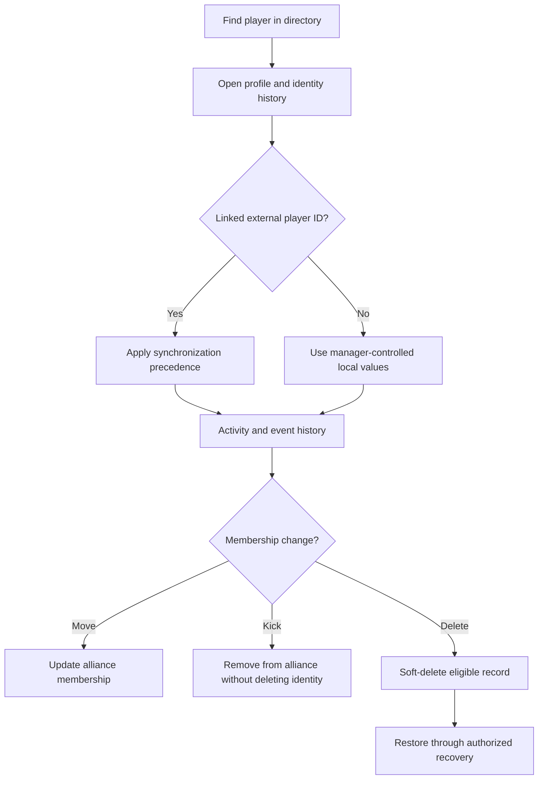

# Players

<CategoryHero category="players" icon="people" eyebrow="One person can have several identity layers" title="Players">
Player documentation separates the platform account, the alliance-local player record, and the linked game profile so that synchronization and lifecycle actions are predictable.
</CategoryHero>

<ProductFinder default-category="Players" />

## Feature map

*Player information and lifecycle. Linking controls synchronization; Kick, Delete, and Restore are separate branches.*

**Accessible summary:** A player is found and identified before link precedence and history are interpreted. Membership changes, kick, soft deletion, and restoration have different effects.

## What each guide answers

- [Directory and profiles](/kingshot-events/players/directory-and-profiles) covers filters, columns, duplicate names, opening a profile, and interpreting empty results.
- [Profile, identity, activity, and history](/kingshot-events/players/profile-and-history) is the deep reference for account, local record, game profile, external ID, nickname history, activity calculation, and lifecycle states.
- [Player linking and synchronization](/kingshot-events/players/linking-and-sync) explains which values can synchronize, which remain manual, and how conflicts are reviewed.
- [Adding and updating players](/kingshot-events/players/manage-players) covers field validation, alliance context, new records, and safe correction.
- [Activity, attributes, removal, and restore](/kingshot-events/players/lifecycle) distinguishes calculated state, manual override, Kick, Delete, and recovery.

## Decision order

Identify a player by stable external ID when it exists; names are display values and may collide or change. Resolve synchronized fields from the verified game profile, preserve locally controlled fields and approved overrides, then calculate derived views from saved history. A manual activity override takes precedence while present. Removing it returns control to automatic calculation; the documentation does not invent numeric thresholds that the current product does not expose.

Kick affects alliance membership. Delete is a soft-delete path for an eligible record and removes it from normal active views. Restore returns an eligible deleted record while preserving user-visible history. A manager should not create a replacement player simply because the old record is hidden or has a former nickname.

## Worked example

**Starting situation:** Two players display the nickname "Nova." One has a linked external ID and recent event history; the other is an unlinked local record. **Input:** A screenshot row named Nova. **Rules:** Name equality alone is not sufficient when candidates are ambiguous. **Branch:** Automatic matching stops for human review. **State:** The import row remains unresolved rather than updating either player. **Output:** A reviewer selects the correct player using alliance context, external ID where available, and history. **Next action:** Apply the reviewed row; do not merge identities only because their nicknames match.

## Common mistakes

- Creating a second player after a nickname change fragments history.
- Treating Kick as Delete hides the membership problem and may affect downstream expectations.
- Editing a synchronized value without checking its source can make the next refresh appear to "undo" work.
- Interpreting missing activity data as Inactive is unsafe; use the documented missing-data state and history.
- Moving a player does not rewrite historical event scope. Review reports using the event and alliance context in which records were saved.

For recovery, record the player display name, external ID if visible, active alliance, operation attempted, resulting state, and source record or import involved. Do not include private credentials.
