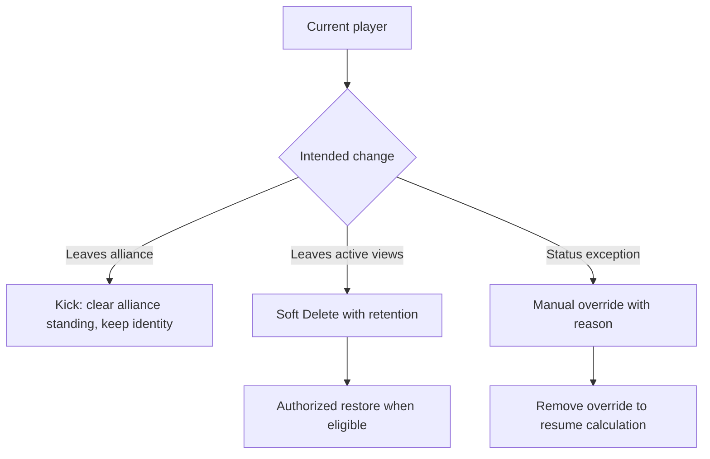

# Activity, Attributes, Removal, and Restore

A player can leave an alliance without leaving the kingdom, and can be hidden without erasing historical event records. Choose the action that matches the real-world change.

## Statuses and attributes

The directory's primary status can be **active**, **semi-active**, **inactive**, **unknown**, or another enabled status label. It is calculated from eligible analytics rules unless an authorized manager sets a manual override. Participation, missed events, internal points, and available rule configuration can affect the displayed state.

The profile lists the primary status plus additional calculated or manually assigned attributes. Managers with attribute access can **Assign manual attribute** with a reason, remove a manual attribute, or select **No manual override** to return primary status control to automatic calculation. An override badge indicates that the visible primary status was set manually.

Use overrides for a known exception, record a useful reason, and remove the override when automatic evaluation should resume. Recalculation does not clear a valid manual override by itself.

## Kick from alliance

Choose **Kick from alliance** when the player left only the current alliance. The confirmation states that the kingdom identity and history remain intact. After confirmation, the alliance roster no longer includes the player, but managers can still find the kingdom player and later assign a new alliance.

## Delete player

Choose **Delete player** only when the kingdom identity itself should be removed from ordinary use. Deletion is soft: the row disappears from normal lists, remains available through **Show deleted** to authorized managers, and preserves historical references.

If the player has historical data, the interface requires the exact player name before the dangerous delete proceeds and reminds the manager to use Kick for an alliance departure. This safeguard prevents an easy roster action from hiding a record with history.

## Restore

Enable **Show deleted**, locate the marked row, and choose **Restore**. Restoration makes the same player identity active in ordinary lists again; it does not create a copy. Review its alliance, profile ID, link, and current details after restoration because the real player may have moved while the record was deleted.

## Role differences

Readers can see lifecycle indicators but not change them. Alliance managers can kick or edit within their assigned alliance when allowed. Delete, restore, attribute, and override actions appear only to viewers with the corresponding management access.

<VisualReference title="Player lifecycle actions">
Use row actions for roster changes and the profile for status details.

<template #items>

- Primary status badge and attribute badges, including an override indicator.
- Profile controls for manual attribute, reason, status override, and removing an override.
- Directory actions **Kick from alliance**, **Delete player**, and the exact-name confirmation for a player with history.
- **Show deleted** filter and **Restore** action on a deleted row.

</template>
</VisualReference>

## Avoid duplicates after a move

Search all visible alliances, deleted records, old nicknames, and profile IDs. Restore or update the existing kingdom identity. Create a new player only when the identity is genuinely different.

## Purpose, workflow, and worked recovery

The lifecycle keeps identity and history intact while activity, overrides, attributes, membership, and visibility change. A manager identifies the player by stable ID and history, confirms active scope, inspects calculated activity and override, then chooses membership update, Kick, soft Delete, or Restore. Each produces a different state.

*Player lifecycle decisions. Membership, status, deletion, and restoration remain separate.*

**Accessible summary:** Kick preserves identity, Delete starts retention, an override temporarily wins calculation, and Restore returns an eligible record.

**Worked example:** Sol moves alliances. Kick clears old alliance standing but preserves history; a permitted manager later claims Sol into the new alliance. Delete would hide the record, while recreating Sol would split history. Limits include retention expiry, name conflicts, the alliance member cap, and role-bound claim scope. Report player ID, before and after alliance, action, state, and time for recovery.
