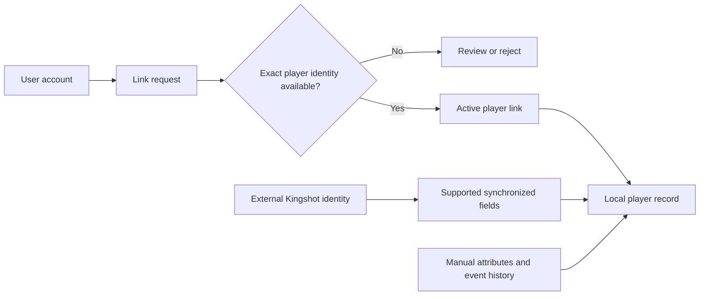
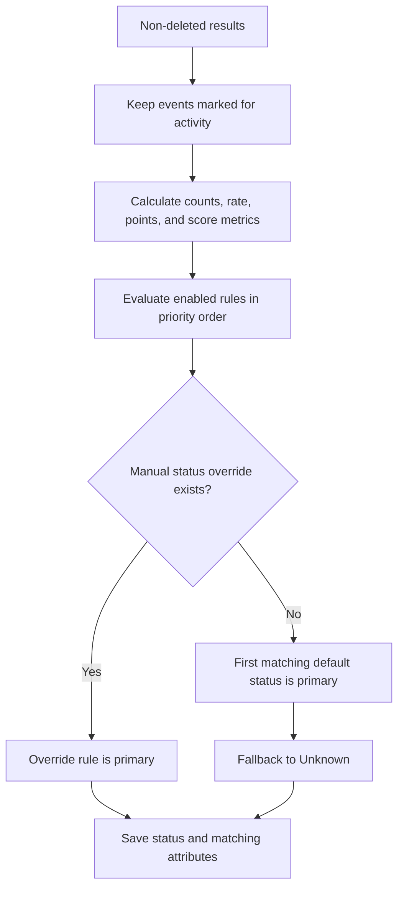

<CategoryHero category="players" icon="people" eyebrow="A dependable roster" title="Profile, Identity, Activity, and History">
One account can identify a person using the platform, while the player record preserves the in-game identity, alliance history, event results, and calculated status.
</CategoryHero>

# Profile, Identity, Activity, and History

## Four identity layers

1. **User account:** sign-in identity, preferences, and role assignments.
2. **Local player:** the roster record used by events, imports, rewards, and Castle Positions.
3. **Player link:** the verified relationship between an account and a local player.
4. **External Kingshot identity:** an optional normalized in-game identifier used for synchronization.

Linking does not replace the local player. It connects the account to it. Synchronization may update fields supported by the external source, while manual attributes, review notes, event results, and local membership history remain controlled by Kingshot Events.

**Diagram summary:** Linking selects the local record owned by the account. Synchronization contributes supported external values; it does not erase locally maintained history.

## Duplicate and name rules

Current players are checked for a normalized name collision **inside the same kingdom**. Alliance membership does not make two identical normalized names distinct. A nonblank external player ID is trimmed, normalized, and also checked within the kingdom. Soft-deleted players are excluded from the current-name duplicate check but remain recoverable during their retention window.

Nickname history helps imports match an older name to the same player. A nickname match is evidence for review, not permission to create a second record. Two genuinely different players with similar display names should be distinguished with their external identity and profile history.

**Example:** A screenshot contains `CRON`, but that player was renamed `Horus`. The importer finds `CRON` in Horus's nickname history and stages the row against Horus. It does not create a new CRON player. If another current player in the kingdom already owns the same external ID, the link must be resolved before saving.

## Activity-status calculation

Only results whose event setting says **Counts toward activity status** enter the calculation. For those non-deleted results, the platform counts `active`, `inactive`, and `unknown` rows; sums configured participation and score points; calculates participation rate as active rows divided by all tracked rows; counts inactive rows as missed events; and calculates score totals and averages from rows that contain a score.

Enabled attribute rules are loaded in priority order from global, kingdom, and alliance scope. A rule matches only when every configured boundary it declares is satisfied, such as minimum or maximum internal points, participation rate, tracked-event count, missed-event count, average score, or total score. The primary automatic status is the first matching default rule among Active, Semi-active, Inactive, and Unknown. Thresholds are configurable, so this handbook does not invent fixed percentages.

A manual status override has first precedence. When present, its referenced rule becomes primary even if the calculated metrics would select another default. Clearing the override does not select a replacement manually; the next recalculation returns control to the first matching automatic rule. Custom attributes can match alongside the primary status and may be manually assigned with an expiry, but they are not the activity status unless explicitly selected as the override.

**Worked example:** Nia has four tracked results: three Active and one Inactive. Participation is 75%, the missed-event count is one, and score metrics use only scored rows. Which label appears depends on the enabled scoped rules. If a manager temporarily overrides Nia to Semi-active with a reason, that label wins. Clearing it causes the next recalculation to evaluate the 75% metrics again.

## Kick, Delete, and restore

**Kick** removes the player from the alliance and clears alliance-standing fields such as role, rank, level, power, and alliance status. The player and kingdom history remain. **Delete** soft-deletes the player. Players with event results, import-review rows, reward records, nickname history, memberships, sync jobs, snapshots, or an external profile are treated as having history worth preserving. A dangerous kingdom-level deletion requires explicit confirmation using the exact player name. Deleted players are retained for seven days before becoming eligible for permanent purge.

**Example:** Kicking Sol from Aster is appropriate when Sol changes alliance: the event history remains and Sol can later be claimed into another permitted alliance. Deleting Sol is appropriate only when the player record itself should leave current views. Recreating Sol would split the history; restore should be used while available.

## Limits and recovery

An alliance supports at most 100 current members. An alliance-scoped manager may claim an outside or unassigned player only into their own alliance. If synchronization appears stale, verify the external ID and latest sync state before manually overwriting supported fields. If an activity label seems wrong, inspect which events count, missing or unknown rows, the calculated time, and any visible override reason.
