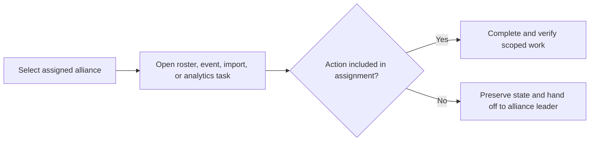

# Co-leader

A co-leader works inside an assigned alliance using the actions included in that assignment. The role can support roster maintenance, event entry, import review, Analytics, rewards, or other alliance tasks without necessarily carrying every alliance-leader action.

## Your recurring journey

1. Confirm the signed-in account, linked player, and active alliance.
2. Open the assignment-sensitive feature from current navigation. A missing action is an access outcome, not a cue to change URL or scope manually.
3. Verify the event, date, player, batch, or other source record before saving.
4. Complete only the review or correction state your controls permit.
5. Verify the result in history or the downstream read-only view, and leave a precise handoff when leader action is required.

*Co-leader boundary. Delegated work proceeds in the assigned alliance; unavailable decisions are handed off with evidence.*

**Accessible summary:** A co-leader selects the assigned alliance, opens a task, performs it when authorized, or preserves the current state and hands it to the alliance leader.

## Worked example

**Starting situation:** You review a screenshot batch with nine ready rows and one conflict against an existing result. **Inputs:** Correct alliance, event, date, source image, and current batch. **Rules:** Ready rows can be accepted; the conflicting identity needs an explicit supported correction decision. **Branch:** Your assignment allows review but not overwrite. **State change:** Nine rows become accepted; the conflict stays unresolved. **Output:** The leader receives the batch, row, old and incoming values, lock state, and visible message. **Next action:** After the leader resolves and applies the batch, verify event history and Alliance Analytics.

## Limits and recovery

A co-leader assignment does not expand when another scope is selected, and premium access does not add write permission. Never create a second player, event, or batch to bypass a missing decision. If a save fails, remain in the source workflow and identify whether work is unsaved, reviewed, accepted, applied, locked, or corrected. Ask the alliance leader to verify the assignment when a normal recurring action is absent.

Continue to [scope resolution](/kingshot-events/scopes-and-communities/hierarchy-and-switching), [player management](/kingshot-events/players/manage-players), [manual entry](/kingshot-events/events/manual-entry), and [import reconciliation](/kingshot-events/imports/row-statuses-and-decisions).

