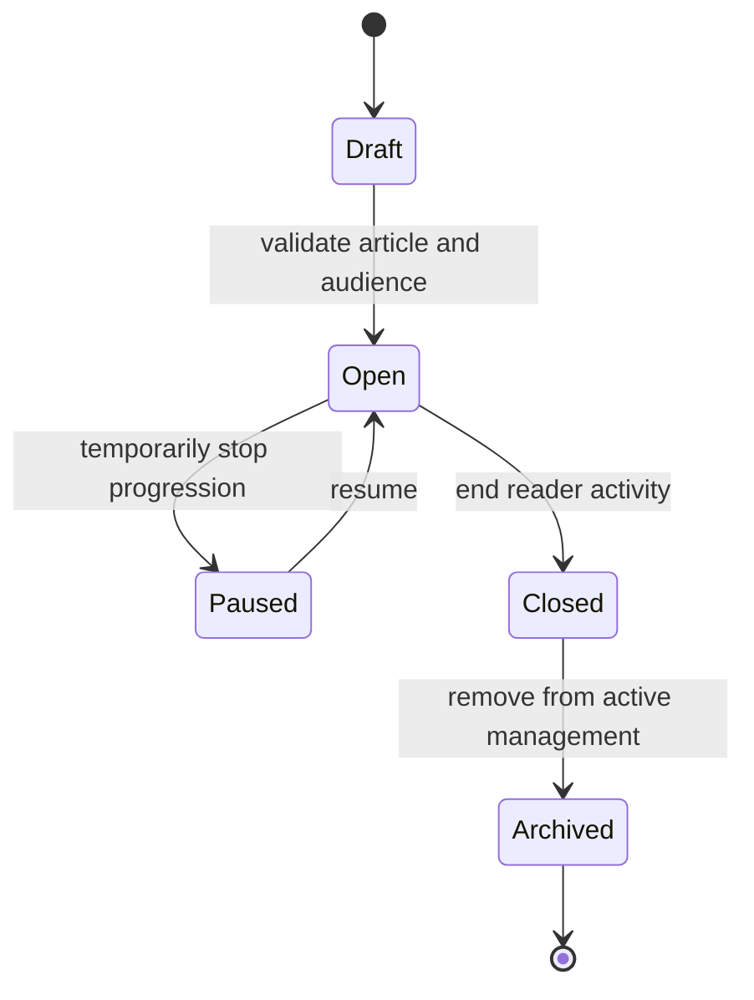

# Reading-session Manager

A Reading-session Manager turns one canonical published article into an assigned reading workflow. The session adds audience, progress, signals, submissions, classification, review, reporting, close, and archive states; it does not clone or rewrite the article.

## Your recurring journey

1. Open the canonical article and confirm its published revision, space, and intended audience.
2. Create a session only for a scope you are authorized to manage. Define the audience and applicable assignment behavior.
3. Open the session and share the user-facing entry path or code through an approved channel.
4. Monitor assignment progress and signals without treating an opened article as a completed submission.
5. Review submissions requiring human judgment, apply the supported classification or retry outcome, and preserve the reason.
6. Close the session when new reader activity should stop; archive it when it should leave active management views while its permitted report remains historical.

*Manager lifecycle. Pause is reversible; close ends active reading; archive moves the closed session out of active management.*

**Accessible summary:** A manager prepares a draft session, opens it, may pause and resume it, closes active reading, and finally archives the historical session.

## Worked example

**Starting situation:** One reader submits after revealing the assigned markers, but the classification requests manual review. **Inputs:** Canonical article revision, active assignment, progress signals, and submission. **Rules:** Applicable session and assignment must be active; automated signals support but do not replace the manager decision. **Branch:** The manager reviews the evidence and marks the supported completion or retry outcome. **State change:** The submission leaves review-required state; assignment progress updates. **Output:** The report shows the classification and current assignment result. **Next action:** Notify the reader only through the supported workflow, then close the session when the audience window ends.

## Report access and limits

The session creator and authorized tenant management can receive the permitted report; documented privileged oversight can also qualify. Other users are denied. Manager access does not reveal another tenant's session and does not make draft or premium article content public. Closed, archived, or non-restorable assignment states cannot be recreated merely to change history. If access fails, include the article, session, scope, creator relationship, visible state, and exact message, never another reader's private response.

Read [Knowledge access, publication, and Reading Verification](/kingshot-events/knowledge-hub/reading-sessions) for the reader flow, manager decisions, and report boundaries.
