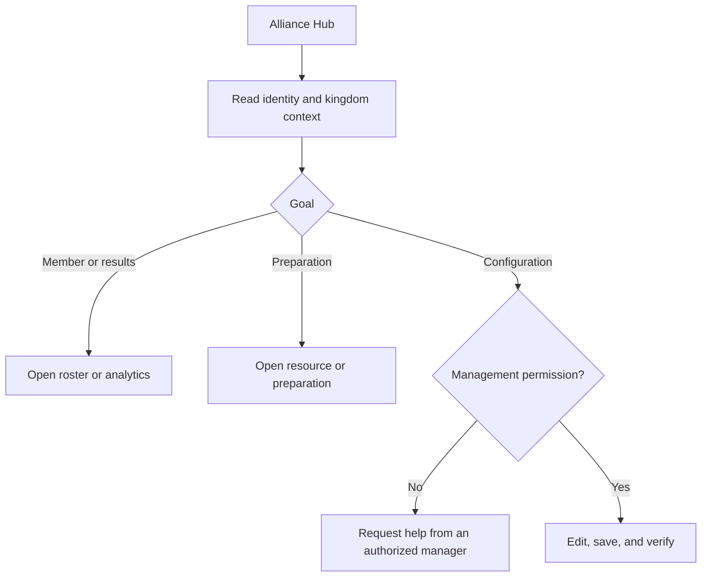

# Alliance Hub and Management

The Alliance Hub gathers the current alliance's member, event, preparation, resource, and announcement context. It does not turn alliance access into kingdom-wide authority. The hierarchy remains Server → Kingdom → Alliance → Player.

## Member view and manager view

Members can use the hub to read the alliance identity, current roster or activity summaries, tracked result counts, announcements, and available resources. Managers with the required permission can open the alliance management workspace. Management controls remain bound to the alliance identifier in the route and to the user's active assignments.

Before changing anything, compare the alliance name or tag, kingdom identifier, and active scope. If they disagree, return to the scope switcher. Never use a familiar player name as proof that the correct alliance is selected.

## Common workflows

| Goal | Start in | Verify before leaving |
| --- | --- | --- |
| Review membership | Member list | Correct alliance, player identity, current membership state |
| Investigate weak participation | Alliance analytics | Date range, included events, missing-data markers |
| Share preparation material | Resources or preparation | Audience, link destination, current version |
| Change alliance configuration | Management workspace | Permission, target alliance, saved confirmation |
| Publish an announcement | Manager control | Audience, wording, resulting visible entry |

**Accessible summary:** Verify the alliance, choose the owning workspace, and require explicit manager authority for changes.

## Example and recovery

**Example:** A co-leader sees a low participation summary. They open alliance analytics, confirm the date range and tracked events, then inspect the affected players. They do not edit player activity from the dashboard statistic.

If the hub is empty, check membership and scope before assuming data was deleted. If management controls are absent, capture the alliance identity and intended action and ask a permitted manager. For stale announcements or resources, reload and verify the current record rather than creating a duplicate.

## Limits and troubleshooting

The hub does not guarantee kingdom-wide analytics, permission to edit every member, or delivery of an announcement through an external channel. Counts may lag while their source workflow is still being reviewed. If a roster and analytics count differ, compare their date, status, and inclusion rules. If a management save fails, keep the entered values, copy the safe validation message, refresh once, and confirm whether the server accepted the first request before submitting again.
