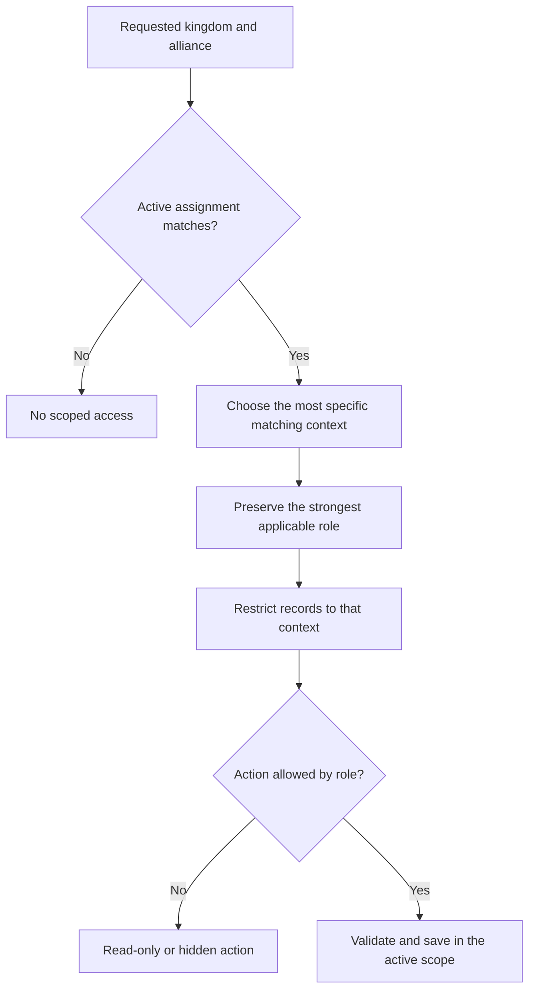
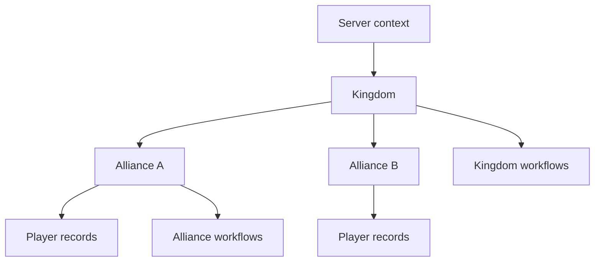
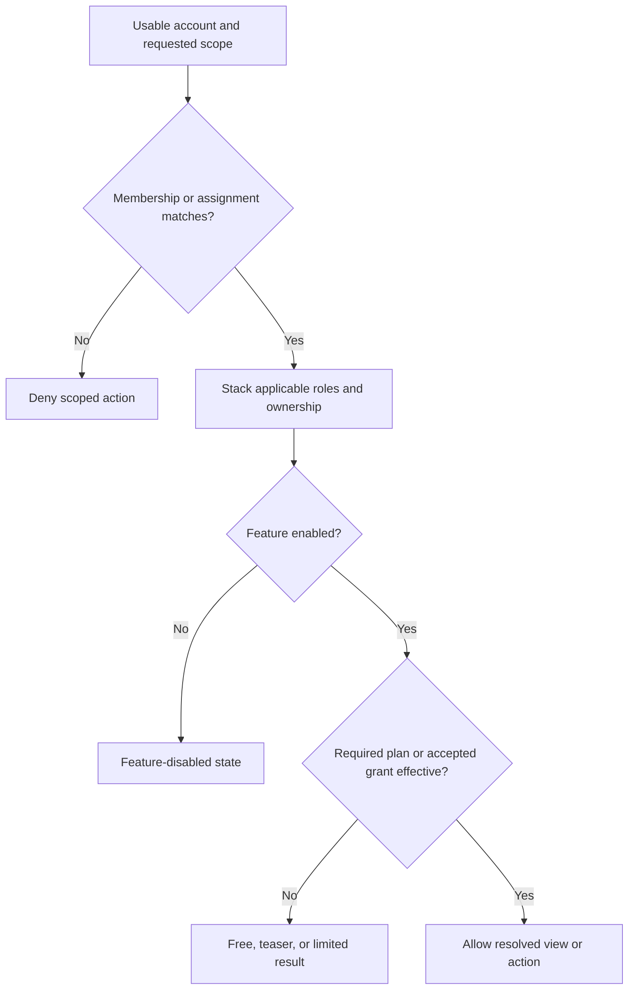

<CategoryHero category="scopes-and-communities" icon="network" eyebrow="Work in the right community" title="Hierarchy and Scope Switching">
Scope decides which community owns a record. Role decides what you may do inside that scope. Analytics grants can add read-only visibility without adding management access.
</CategoryHero>

# Hierarchy and Scope Switching

Scope switching changes the active context used by scoped lists, actions, and summaries; it does not move records between levels.

Kingshot Events treats **server** and **kingdom** as distinct levels. A server contains one or more kingdoms, a kingdom contains its **alliances**, and an alliance is the current home of its **players**. A user account can hold several active assignments. Each assignment names a role and a scope within that hierarchy. The active scope is resolved from the server, kingdom, and alliance when required, as selected in the interface, not merely from the strongest role on the account.

Do not substitute “server” for “kingdom” when reporting a scope problem. Include both identifiers when they are visible: the server establishes the outer context, while the kingdom determines the community container used by kingdom-scoped records and assignments.

## Scope resolution order

When a page requests scoped data, the platform follows this order:

1. Read the requested kingdom and alliance from the current page or scope selector.
2. Compare that request with every active assignment on the signed-in account.
3. Accept the most specific matching assignment. An alliance request must belong to the requested kingdom.
4. Preserve a stronger applicable role when roles stack. A kingdom role is not narrowed merely because the same user also has an alliance assignment.
5. Reject the request when no active assignment covers it. The page may disappear from navigation or return an access message.
6. Apply the resolved kingdom and alliance to record queries and write validation.

**Diagram summary:** The selected community must match an active assignment. The resulting context restricts the records first; permissions are evaluated after that context is known.

## Membership, management, ownership, and sharing

These concepts are deliberately separate:

| Concept | What it grants | What it does not grant |
| --- | --- | --- |
| Membership | Access to member-facing records in that community | Leader controls or access to another alliance |
| Management role | The actions assigned to that role inside its kingdom or alliance | Ownership of records in a different scope |
| Record ownership | The community and source attached when the record was created | Authority based only on being able to see the record |
| Analytics sharing | Aggregate or member-level analytics permitted by policy | Player editing, imports, event settings, or roster management |
| Subscription grant | Eligible premium features for the granted alliance | A role, membership, or management permission |

Cross-alliance analytics requires more than a visible kingdom. A viewer must be an alliance leader or co-leader in the viewing alliance, the kingdom must enable granted-alliance analytics, both alliances must have current accepted grants carrying the analytics feature, and both must be in the same kingdom. The result is read-only analytics visibility. It does not make the viewer a manager of the target alliance.

## Worked examples

**Alliance leader in their own alliance.** Mira has an active leader assignment for alliance Aster in kingdom 1625. Selecting 1625 and Aster resolves alliance scope. Mira can manage Aster records allowed by her role. Selecting alliance Brim does not succeed just because Brim appears in a kingdom comparison.

**King viewing kingdom analytics.** Rowan has a kingdom-level assignment for 1625 with no alliance attached. Selecting kingdom 1625 resolves kingdom scope. The kingdom analytics view may combine Aster and Brim. A correction still belongs to the source result and alliance context; Rowan should follow the drill-down rather than editing an aggregate.

**Granted read-only comparison.** Aster and Brim both accepted an eligible kingdom grant, and the king enabled granted-alliance analytics. Aster's leader can view the permitted Brim analytics. The Players and Imports actions remain scoped to Aster because sharing did not create a Brim management assignment.

**Member without management.** Kai belongs to Aster as an ordinary member. Membership exposes member pages and Kai's linked-player information. It does not satisfy a management action, even when the same page is visible.

## Failure and recovery paths

- If a selector is empty, confirm that the account has an active assignment for that level.
- If a page disappears after switching alliance, the new assignment may not carry the required role or feature.
- If analytics is visible but editing is not, check whether access comes from sharing rather than management.
- If a record appears missing, clear filters and return to its owning scope. Never recreate it in a different alliance to bypass scope checks.

## Limitations

The public interface explains the effective outcome, not raw permission identifiers. Some pages select the best available subscription-bearing context when no explicit scope is supplied, but writes still require an explicit valid tenant context. Platform-wide administration is outside this handbook.

## Connected decision maps

### Server, kingdom, alliance, and player hierarchy

*Community hierarchy. Kingdom and alliance workflows read records from their matching branch.*

**Accessible summary:** A kingdom contains alliances and their player records, with separate kingdom-wide and alliance workflows.

### Role, scope, feature, and plan resolution

*Role and access resolution. Scope, role, availability, and entitlement are separate gates.*

**Accessible summary:** A matching assignment is followed by role stacking, feature availability, and premium checks before an action is allowed or limited.
