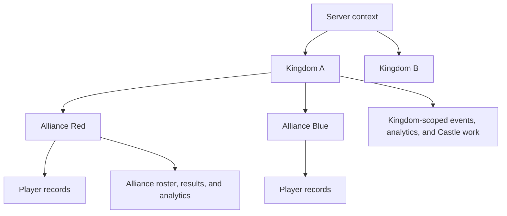

# Scopes and Communities

<CategoryHero category="scopes-and-communities" icon="network" eyebrow="Every record has a community context" title="Scopes and Communities">
Scopes keep one kingdom or alliance from accidentally reading or changing another community's records. The active scope is a working context, not a new permission.
</CategoryHero>

<ProductFinder default-category="Scopes and Communities" />

## Feature map

*Community hierarchy. Player and alliance records remain attached to their kingdom lineage while kingdom-wide workflows can aggregate permitted child data.*

**Accessible summary:** A server contains kingdoms, kingdoms contain alliances, and alliances contain player records. Some workflows are kingdom-scoped while others remain alliance-scoped.

The user-facing term **server** may be used as an alias for a game kingdom in conversation, but the product's scope labels are authoritative on each page. **Alliance** is the community membership layer. **Active scope** is the currently selected kingdom or alliance. **Assignment** describes authorized management. **Membership** describes belonging. Neither should be substituted for the other.

## How the mechanisms relate

The scope switcher offers contexts derived from the signed-in identity and its current memberships, assignments, and permitted roles. Selecting one changes the records queried and the actions evaluated. It does not move players, modify roles, accept grants, or copy records. A player moving alliances is a lifecycle operation; a manager viewing a different alliance is a context change.

Kingdom-level Analytics can aggregate eligible results from child alliances. Alliance Analytics remains bounded to its alliance. A shared Analytics grant can expose a read-only kingdom view to another eligible user without making every underlying result editable. Castle Position cycles are kingdom workflows. Knowledge articles can be public, authenticated, kingdom-scoped, alliance-scoped, or premium, so both article state and viewer scope matter.

## Main workflows and reading order

1. Read [Hierarchy and Scope Switching](/kingshot-events/scopes-and-communities/hierarchy-and-switching) for the complete resolution order and examples.
2. Use [Membership and Management](/kingshot-events/scopes-and-communities/membership-and-management) to distinguish belonging, delegated work, and ownership.
3. Use [Cross-Scope Visibility](/kingshot-events/scopes-and-communities/cross-scope-visibility) before interpreting kingdom totals, grants, or shared content.
4. Continue to [Working Inside an Alliance](/kingshot-events/kingdoms-and-alliances/alliance-work) or [Working Inside a Kingdom](/kingshot-events/kingdoms-and-alliances/kingdom-work).

## Worked example

**Starting situation:** Talia belongs to Alliance Red and has a kingdom role used for Castle scheduling. **Input:** She selects Alliance Red. **Rules:** Alliance membership permits member views; the active alliance bounds roster and event records; her kingdom responsibility remains on the account but applies only on qualifying kingdom workflows. **Output:** Alliance records appear, while the Castle planner asks for or returns to kingdom context. **Next action:** She switches to the kingdom before reviewing applicants. No player membership changes.

## Common mistakes and recovery

- If data looks empty, confirm the scope label, filters, date boundary, and whether source records exist in that same scope.
- If an action disappears after switching, the new scope may not match the assignment even though the page remains visible.
- If a player changes alliance, use the player-management lifecycle instead of creating a duplicate record.
- If shared data is read-only, correct the source in its owning scope or contact that scope's authorized manager.

Scope history and selection cannot guarantee that a user understands the organizational meaning of a record. Before any save, verify the visible kingdom or alliance label and the affected entity.
