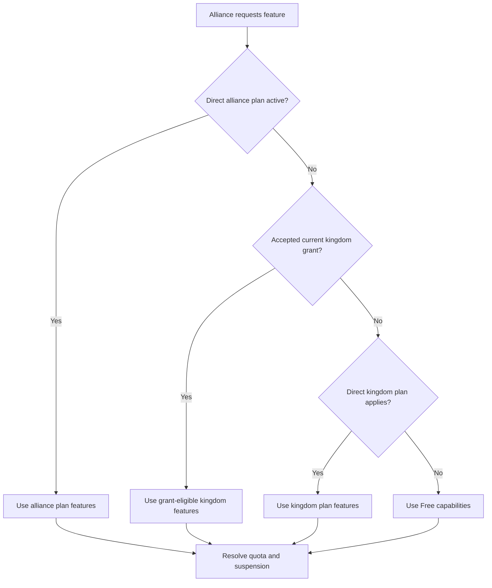

# Plans, Grants, Quotas, and Effective Access

For an alliance, effective plan source follows fixed precedence: **direct alliance plan**, then **accepted kingdom grant**, then **direct kingdom plan**, then **Free**. A pending grant unlocks nothing. An accepted grant exposes only features marked eligible for grants, not every feature on the kingdom plan. Free capabilities remain available because they are not premium-gated.

An allocation is the granted alliance's per-resource share of a kingdom quota. Allocations may be made only to granted alliances, and their sum cannot exceed the kingdom limit. Accepting a grant changes entitlement source; it does not assign management roles. Analytics sharing likewise grants no edit access.

Quota percentage is used only when a positive hard limit is enabled: below 80% is Normal, 80% is Warning, 95% is Critical, and 100% is Exceeded. A granted alliance uses its allocation for that resource. A disabled or zero hard limit does not create an exceeded state. Limited mode preserves permitted read and cleanup behavior while blocking quota-consuming writes. Suspension can further restrict effective access even when a plan exists.

**Worked example:** Kingdom 1625 has a plan with grant-eligible premium processing and a player limit. It offers Aster a grant. Before Aster accepts, Aster remains on its direct alliance plan or Free. After acceptance, and only if no stronger direct alliance plan exists, the grant becomes effective. Aster receives the eligible features and its assigned player allocation. At 80% it sees a warning; at 100% a new quota-consuming write is blocked, while existing records and allowed cleanup remain accessible.

## Questions answered

- A direct alliance plan controls the alliance before any kingdom grant.
- A kingdom grant has no effect until accepted and current.
- Exhausted allocation limits that resource for the alliance; unused kingdom capacity is not silently borrowed.
- Analytics sharing does not grant management access.
- Limited mode does not mean all data disappears; the interface identifies the remaining safe actions.
- A plan label alone is insufficient: source, feature eligibility, allocation, current usage, and suspension all contribute to the visible result.

If access appears wrong, compare the selected alliance, source label, grant status and dates, allocation, usage percentage, and suspension message before submitting another request.

## Limitations and recovery

An effective-plan label does not override role or scope checks, and a quota warning does not itself identify which operation consumed usage. If a write is blocked, confirm the resource named in the message, current allocation, accepted-grant dates, and suspension state. Cleanup may reduce usage, but it does not reactivate an expired plan or grant management rights.
