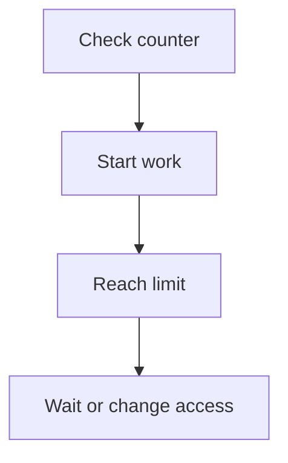

<CategoryHero category="subscriptions" icon="layers" eyebrow="Know what access means" title="Quotas and Limited Mode">
Distinguish plans, grants, allocations, quotas, requests, payments, and limited mode.
</CategoryHero>

# Quotas and Limited Mode

Quotas and Limited Mode is the focused guide for all users of limited features. It explains the controls you can see, the states that change what you can do, and the confirmation that proves the task finished in the intended scope.

## What this guide helps you decide

The main decision is whether to **finish or defer work safely when a limit is reached**. Start by reading the scope label and the record status. A control can be present but unavailable when your membership, role, plan access, current status, or selected community does not permit the change. That distinction is intentional: visibility helps you understand the workflow, while availability protects shared records.

Use this page when you need to read usage counters, reset periods, and limited-mode messages. It is not a promise that every account sees every action. Public pages, signed-in features, role-restricted controls, subscription-backed capabilities, and intentionally private administration are documented as different availability classes.

## Before you begin

- Confirm the signed-in identity and the player link shown in the account area.
- Read the current kingdom, alliance, or personal scope before changing data.
- Open the record itself instead of relying on a notification or an old browser tab.
- Check whether the status is Available, Near limit, Limited, or Reset.
- If the action affects other people, agree on the intended outcome before saving or publishing.

## Controls and information you will use

The relevant controls are: **Read usage counters, reset periods, and limited-mode messages**. Labels may be shortened on a narrow screen, but the scope name, status, primary action, and confirmation remain part of the same task. Filters change the current view; they do not silently move or rewrite the underlying record. A save changes a draft or editable record. Apply, approve, publish, restore, or award are separate decisions when the workflow requires review.

<VisualReference title="Recognizing the Quotas and Limited Mode workspace" :items="['scope and identity context', 'current status and availability', 'primary action with confirmation']">
Look first for the category icon and subscriptions label, then read the scope line above the working area. The center region presents read usage counters, reset periods, and limited-mode messages. A status treatment identifies available, near limit, limited, reset, while the final confirmation names the record and community affected.
</VisualReference>

## Complete the task

1. **Check counter.** Confirm the page title, signed-in identity, and selected scope before entering or changing anything.
2. **Start work.** Read existing values and status messages. If information is missing, stop and gather it rather than guessing.
3. **Reach limit.** Use the available control and review the preview, comparison, or warning. A disabled control usually points to a missing prerequisite.
4. **Wait or change access.** Read the success message and reopen the affected record. For shared work, verify that the next responsible role can see the expected state.

## Quotas and Limited Mode workflow

The quotas and limited mode map follows the choices visible to all users of limited features and marks the confirmation that prevents work from continuing in the wrong state or scope.

<!-- diagram: ke-subscriptions-and-usage-quotas-and-limited-mode -->

**Diagram summary:** Check counter, then Start work, then Reach limit, then Wait or change access. Each step remains visible to the person doing the work, and the final step confirms the outcome.

*Workflow caption: Quotas and Limited Mode from first choice to confirmed outcome.*

## Status and role differences

| Status | What it means to the reader | Sensible next action |
| --- | --- | --- |
| **Available** | The task is at its starting or neutral state. | Continue with check counter. |
| **Near limit** | Work has progressed but another check or decision remains. | Continue with start work. |
| **Limited** | Work has progressed but another check or decision remains. | Continue with reach limit. |
| **Reset** | The workflow reached a final or constrained state. | Verify the outcome and history. |

For quotas and limited mode, all users of limited features see the records and outcomes their current responsibility permits. Alliance roles act within their alliance, while granted kingdom roles can coordinate across communities without silently taking ownership of every source record. Plan access can reveal subscriptions and usage capabilities, but it never replaces the role, status, and scope checks described above. Platform-wide administration remains outside this public handbook.

## Saving, review, and history

While working in quotas and limited mode, editable values should show a saved state before you leave. Review keeps start work separate from the later decision to reach limit. Applying or publishing makes the agreed outcome visible to its intended audience. If removal, rollback, or restore is supported here, authorized readers retain enough history to understand the change. Reopen the source record before repeating wait or change access.

## If the result is not what you expected

- **The quotas and limited mode action is missing:** confirm the selected scope, membership, role, and feature availability.
- **The action is disabled:** inspect required fields and the current status; a locked or final record may need a correction or review path.
- **The list looks unchanged:** clear view filters and reopen the source record before submitting again.
- **Another person sees a different result:** compare scope, date window, role, and publication state.
- **You need support:** record the page title, scope name, visible status, time, and safe steps to reproduce. Do not include passwords, payment details, or private screenshots.

## Continue learning

- [Plans and Effective Access](/kingshot-events/subscriptions/plans-and-effective-access)
- [Grants and Allocations](/kingshot-events/subscriptions/grants-and-allocations)
- [Requests and Payment States](/kingshot-events/subscriptions/requests-and-payment)
