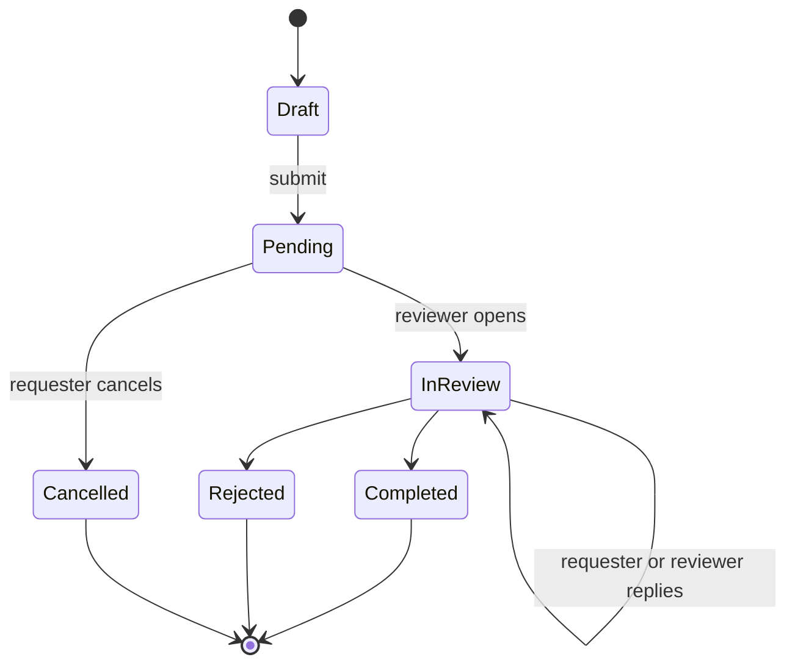

# Subscription and Support Requests

The Support & Subscriptions workspace combines plan discovery, manual subscription requests, configured support links, and request history. Submitting a request does not activate a plan.

## Submit a request

Choose the subject type and an active requestable plan. Then select the target kingdom and, for an alliance request, the target alliance. Choose the request type, provide a safe contact method such as email, Discord, or in-game name where appropriate, and explain expected usage.

**Accessible summary:** A submitted request is pending, can be discussed while under review, and ends completed, rejected, or cancelled. Only pending requests expose requester cancellation.

## Verify before submitting

- The plan is active and available in the selector.
- Subject type matches kingdom or alliance ownership.
- Target entity is correct.
- The request type and expected usage are clear.
- Contact information is appropriate to share with reviewers.

Open **My Requests** to inspect status, detail, and conversation. Do not submit a duplicate to add information; reply on the existing request while its state accepts replies.

**Example:** An alliance owner selects an alliance plan but targets the wrong alliance. They correct the target before submission. After submitting, they add a usage clarification through the request detail instead of creating another request.

If no plan is selectable, no active requestable plan may be available or creation access may be limited. If cancellation is absent, the request is no longer pending. Plan activation and quota behavior are explained in [Plans, Grants, Quotas, and Effective Access](/kingshot-events/subscriptions/plans-and-effective-access).

## Limits and troubleshooting

A completed support conversation does not guarantee access unless the effective plan or grant is visible on the target scope. External payment or donation links are configured channels, not automatic proof of entitlement. If submission is disabled, verify required subject, plan, target, request type, and creation access. If a reply fails, reload the same detail and check whether it was recorded before sending again.

## Personal purchase requests

The community request workflow above remains separate from buying for yourself. Start an account-only purchase from **Personal subscription**, where the target is your own account. Follow its existing private request for payment instructions and activation; do not select a kingdom or alliance as a workaround.

See [Free and Premium Personal Plans](/kingshot-events/subscriptions/personal-plans) for pricing availability, billing periods, expiry, and the no-automatic-renewal workflow.
