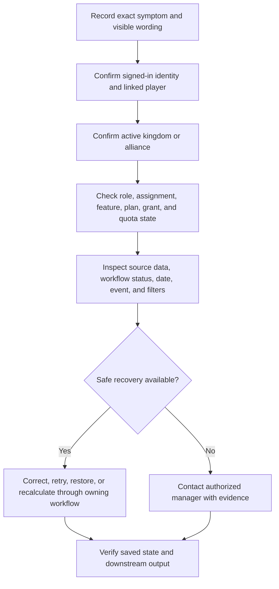

# Troubleshooting

<CategoryHero category="troubleshooting" icon="cycle" eyebrow="Start with what you see" title="Troubleshooting">
A useful diagnosis names the symptom, identifies the current identity and scope, traces the owning source record, and chooses a recovery path that preserves history.
</CategoryHero>

<ProductFinder />

## Safe diagnostic order

*Troubleshooting decision path. Access checks precede data changes; correction occurs in the workflow that owns the information.*

**Accessible summary:** Record the symptom, verify identity and scope, check access conditions, inspect source and state, then use a safe recovery or contact an authorized manager with evidence.

## Find the symptom

| What you see | What it usually means | Start here |
| --- | --- | --- |
| A page or action is missing | Scope, assignment, feature availability, effective plan, or quota does not qualify | [Access problems](/kingshot-events/troubleshooting/access-problems) |
| Player missing, wrong name, or duplicate governor | Filter, alliance context, sync precedence, soft deletion, or ambiguous identity | [Data and save problems](/kingshot-events/troubleshooting/data-and-save-problems) |
| Same date, locked event, or result appears twice | Event-instance identity, duplicate result, batch overlap, or correction state | [Event problems](/kingshot-events/troubleshooting/event-problems) |
| Duplicate screenshot, unmatched name, or partial extraction | Reconciliation row requires review or the batch already exists | [Import problems](/kingshot-events/troubleshooting/import-problems) |
| Reward not eligible or Analytics is empty | Source record, eligibility, filters, date boundary, scope, or recalculation | [Analytics sharing and troubleshooting](/kingshot-events/analytics/sharing-and-troubleshooting) |
| Castle standby, full row, or planner conflict | Candidate eligibility, time compatibility, lock, capacity, or draft state | [Castle Position problems](/kingshot-events/troubleshooting/castle-position-problems) |
| Reading code fails or article is locked | Session applicability, assignment state, article access, or editorial state | [Knowledge problems](/kingshot-events/troubleshooting/knowledge-problems) |
| Profile autosave is pending or optimizer result surprises you | Save state, profile switch, incomplete inputs, constraints, or model limits | [Simulator problems](/kingshot-events/troubleshooting/simulator-problems) |
| Grant quota or limited mode appears | Grant acceptance, allocation, effective plan, usage warning, or exhausted quota | [Subscription troubleshooting](/kingshot-events/subscriptions/troubleshooting) |

## Worked example: Analytics is empty

**Starting situation:** An alliance leader opens Alliance Analytics and sees no rows after results were imported. **Safe checks:** She records the selected alliance, event, and date range; confirms the import rows were applied rather than merely accepted; opens event history; and checks that the results belong to the same alliance and boundary. **Branch:** The batch is still in reviewed state and was never applied. **Recovery:** She returns to the authorized import workflow, applies eligible rows, then reloads Analytics. **Output:** Totals appear after normal recalculation. **Reason:** Reviewed import proposals are not Analytics inputs until application creates the supported result records.

## When to contact an authorized manager

Escalate when the recovery action requires a role you do not hold, a lock or immutable published state prevents the change, a restore request needs review, or the visible result remains inconsistent after the source and filters are verified. Include the page title, approximate time, active scope, event or record name, relevant date, visible status, exact error wording, safe screenshot with private information removed, expected outcome, and checks already performed. Never include passwords, security tokens, private endpoints, or internal recovery details.

## Recovery principles

Correct a result in its event or record batch, a player in its profile and lifecycle, a schedule in its draft and publication workflow, an article through a new revision, and a Lab result by fixing the saved profile and rerunning. Avoid duplicate records as a workaround. Restore only through visible authorized recovery. Treat published revisions, closed sessions, locks, and applied batches according to their stated mutability rather than assuming every state can be edited in place.
