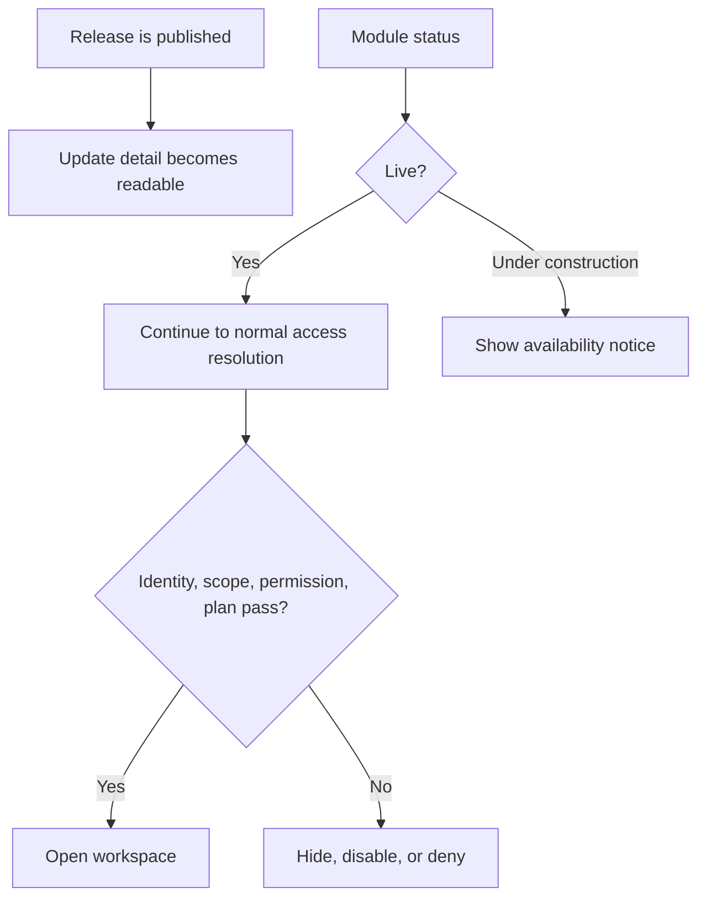

# Updates and Module Availability

Platform Updates communicates published changes. Module availability controls whether a product area is live or under construction. A release note does not override access checks, and an under-construction page does not prove that user data was removed.

## User-facing update records

The Updates list opens a release detail, and a release can expose individual change items. Read the publication date, affected area, and specific change. A global update banner is a pointer to that record; dismissing or missing the banner does not change the release.

## Availability states

Administrators can manage product-facing module groups through the availability settings workspace. The catalog covers major surfaces such as Knowledge, Lab, dashboard, analytics, events, Castle Positions, players, imports, reports, rewards, preparation, Alliance Hub, subscriptions, and privacy. Authentication and essential policy surfaces remain outside this switchable catalog.

**Accessible summary:** Release communication and module status are separate. A live module still performs normal access checks.

**Example:** Events is marked under construction during maintenance. Users see the module notice even though their event permissions remain assigned. When the module returns live, normal permission and scope checks resume.

If a module is unexpectedly unavailable, record its visible label, status message, time, and current scope. Do not create replacement records in another module. Administrators should change only the intended catalog entry and verify both the under-construction notice and the restored live path.

## Limits and troubleshooting

Module status does not guarantee account authorization, data freshness, or feature entitlement. Release notes describe intended user-facing changes but are not a substitute for the current interface and effective access. If a release link fails, return to the Updates list and verify that the item remains published. If only one account cannot open a live module, troubleshoot identity, scope, permission, and plan rather than toggling availability for everyone.

Keep the release identity and affected module label when asking support to investigate.
