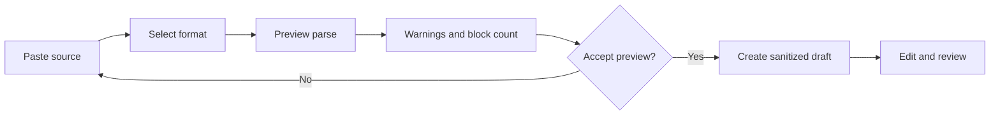
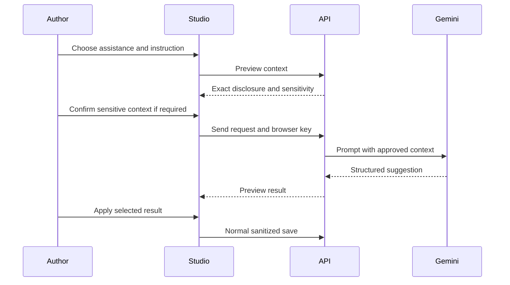

# Knowledge Assets, Imports, and AI

Knowledge Studio includes three authoring helpers. Each helper returns material to the normal draft and review workflow. None can bypass publication permissions.

## Asset library

The library records:

- public asset URL;
- type and title;
- alternative text;
- width and height when known;
- related game entity and display name;
- tags and metadata;
- usage count.

The seed process adds the existing Kingshot hero portrait catalog as reusable Knowledge assets.

### Choose an image

1. Add or edit an image block.
2. Open **Choose an image**.
3. Start with **Recommended** to see context-matched assets.
4. Use **Search library** to search manually or filter by asset type.
5. Select the asset.
6. Check the alternative text and caption in the article.

Recommendations are deterministic. They compare the article title, summary, type, tags, related entities, and existing blocks with asset metadata. The reason shown on each recommendation explains the match.

## Import content

Studio can preview supported text or structured formats before creating an article.

Import guarantees:

- the preview does not publish;
- unsupported or unsafe content is reported or dropped;
- the created article starts as a draft;
- server authorization decides the available target spaces;
- the normal sanitizer runs before storage.

Always inspect imported headings, tables, image URLs, and premium boundaries.

## Gemini writing assistant

The assistant can help draft, improve, summarize, or restructure Knowledge content.

### Key handling

The Gemini API key is supplied by the browser for the selected request. The application does not persist it in the Knowledge database.

Do not use a shared provider key on a public device. Provider usage and cost remain tied to the key owner.

### Context preview

Before calling Gemini, the assistant builds a context preview that can include:

- article metadata;
- current blocks;
- space type and scope;
- selected related entities;
- relevant game-data facts;
- review notes when requested.

Private Kingdom or Alliance content, unpublished premium material, and review notes are marked sensitive. The provider call requires explicit confirmation when that material is present.

### Apply flow

The model response is a suggestion. It does not write to the document until the author applies it, and the resulting blocks still use the normal save, sanitizer, permissions, and review lifecycle.

## Safety checklist

- preview the provider context every time the article scope changes;
- do not send secrets, player private messages, private review evidence, or API keys as article content;
- verify game values and Hero skill statements against the current catalog;
- check generated links and image references;
- treat generated strategy claims as drafts until a human verifies them;
- submit the final revision for review.

