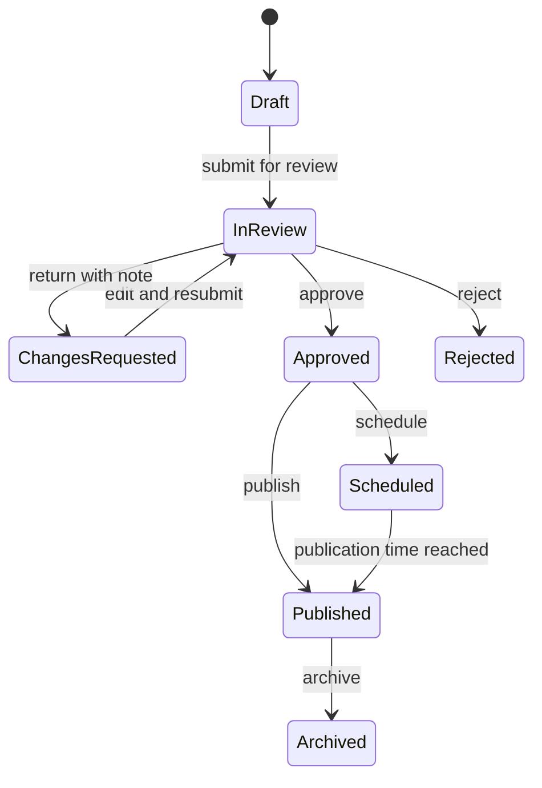

# Knowledge Authoring and Review

Use the Knowledge **Studio** at `/knowledge/studio` to create and edit guides. The spaces shown in Studio are resolved from your effective permissions and active scope assignments.

## Scope rules

| Action | Required authority |
|---|---|
| Create or submit in an Alliance space | Permission from a direct assignment in that Alliance |
| Review or publish in an Alliance space | Review or publish permission from that Alliance assignment |
| Create or publish in a Kingdom space | Permission from an active Kingdom-level assignment |
| Create in Global | Explicit Global Knowledge management authority |
| Publish in Global | Explicit Global publication authority |

A Kingdom assignment does not automatically permit editing an Alliance's content. A scoped publication request does not publish content globally.

## Create a draft

1. Open **Knowledge** and select **Create**.
2. Enter the article title.
3. Choose one of the spaces offered to you.
4. Select **Create draft**.
5. Complete the metadata and add content blocks.
6. Save the working revision.

The title is required. Feature-gated content also requires a valid premium feature key.

## Edit content

The editor saves a sanitized block document. Use the asset picker for images so public URLs and alternative text are carried into the block.

Good authoring practice:

- use headings in a logical order;
- use a warning only for a real risk or irreversible consequence;
- add alternative text to every useful image;
- link Heroes, Events, and Mechanics through reference blocks;
- place the premium boundary exactly where the public preview should stop;
- verify Kingdom or Alliance details before requesting review.

## Revision behavior

Every save creates or advances a working revision. Publishing records the exact revision that readers receive.

If an author changes a published article:

- the published revision remains available to readers;
- the new working revision stays separate;
- the update must follow the allowed review and publication path.

This prevents an unfinished editor save from changing live content.

## Review lifecycle

The reviewer:

1. opens `/knowledge/review`;
2. selects an in-review article from a space they may review;
3. checks accuracy, access policy, scope, images, and references;
4. approves, requests changes, or rejects with a note.

Only an in-review article can receive a review decision.

## Global publication requests

A publisher in a Kingdom or Alliance space can request promotion to Global.

That request:

- records the need for Global review;
- does not move or publish the article automatically;
- still requires a user with Global publication authority.

## Reader safety checklist

Before publication, confirm:

- the selected space is correct;
- the access policy is no broader than intended;
- the title, summary, slug, and category are accurate;
- the source and game terminology are verified;
- tables and steps render correctly;
- no API key, private note, personal message, or unpublished premium content appears in public blocks;
- image URLs are public resolver URLs, not local filesystem paths.

## Related

- [Knowledge Hub Overview](overview.md)
- [Knowledge Assets, Imports, and AI](assets-imports-and-ai.md)

