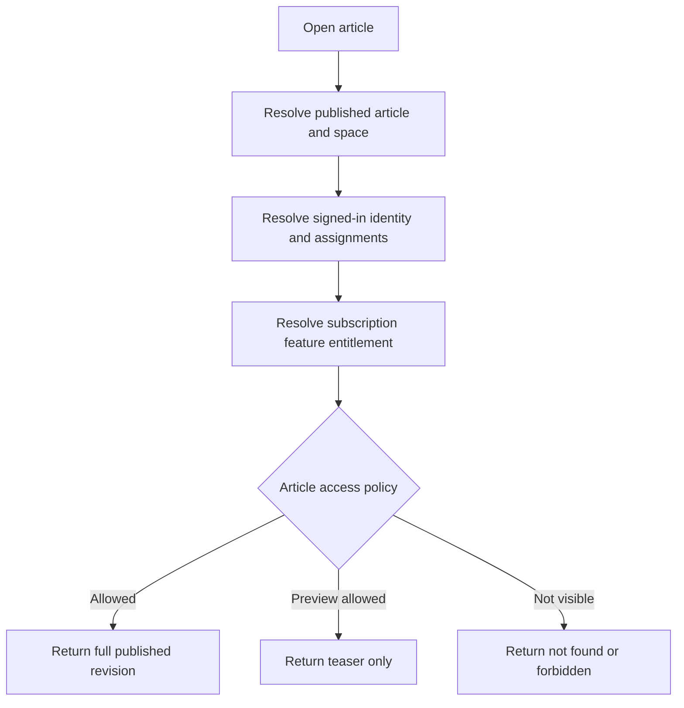

# Knowledge Hub Overview

The **Kingshot Knowledge Hub** is a separate reading and publishing area inside Kingshot Events. Open `/knowledge` to browse guides, search the library, or open the Heroes, Events, and Mechanics databases.

## What you can find

- public strategy and beginner guides;
- hero guides linked to the game-data catalog;
- new and permanent event guides;
- game mechanic explanations;
- Kingdom announcements and guides;
- Alliance-only instructions;
- premium guides with a safe preview.

## Spaces

| Space | Who can read | Typical content |
|---|---|---|
| Global | Public, signed-in, or entitled readers according to each article | General guides and game database content |
| Kingdom | Members of the matching Kingdom when membership is required | Kingdom rules, schedules, and strategy |
| Alliance | Members of the matching Alliance when membership is required | Alliance procedures and event instructions |

Membership and premium access are checked by the server. Hiding a button in the browser is not the access boundary.

## Read outcomes

An article can produce one of three results:

- **Full:** all published blocks are returned.
- **Teaser:** title, summary, and permitted preview blocks are returned, followed by the access explanation.
- **Forbidden:** the article is not disclosed to the viewer.

Article policies are:

- public free;
- authenticated free;
- feature gated;
- scope members only.

## Browse and search

The Knowledge shell includes:

- **Home:** featured, recent, and premium content;
- **All guides:** published Global guides;
- **Heroes:** portraits, troop type, generation, and related guides;
- **Events:** mechanics, scoring, rewards, and related guides;
- **Mechanics:** structured game concepts and related guides;
- **Search:** guides and game-data entries;
- **Scoped spaces:** Kingdom and Alliance libraries available to your assignments.

Published articles include structured metadata for search engines. The Knowledge sitemap lists public, indexable content.

## Article structure

Articles are built from safe typed blocks:

- headings and paragraphs;
- quotes, tips, and warnings;
- steps and checklists;
- tables;
- images and galleries;
- Hero, Event, and Mechanic references;
- related-article links;
- a premium-content boundary.

Raw HTML is not stored as article content. Unknown blocks, unsafe URLs, scripts, markup, and control characters are removed by the server sanitizer.

## Access flow

## For authors and reviewers

If your active permissions allow content work, the Knowledge header shows:

- **Create** for the Studio;
- **Review** for the review queue.

Read [Knowledge Authoring and Review](authoring-and-review.md) before publishing. Asset, import, and AI tools are covered in [Knowledge Assets, Imports, and AI](assets-imports-and-ai.md).

