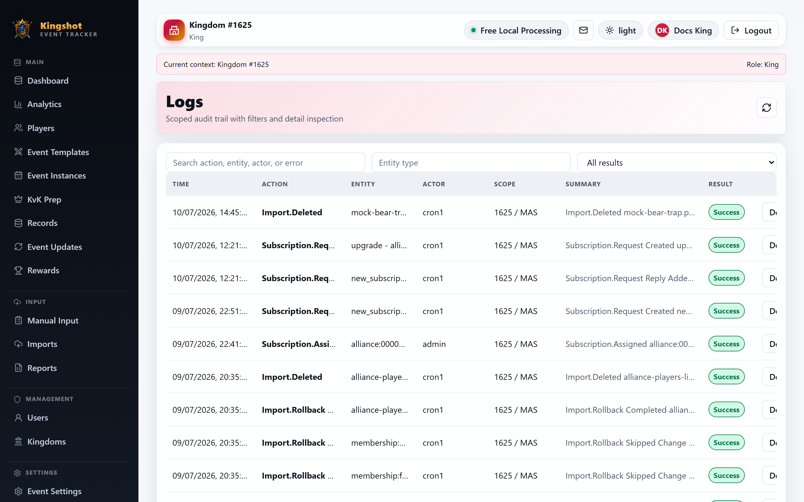

# Read the Audit Logs

This guide is for senior read-only review of the audit trail. It is useful for `Supreme Admin`, `King`, and `Alliance Leader` users who can open the logs page.

## What the audit log is for

The audit log answers questions like:

- who changed this
- what action happened
- when it happened
- what was hidden or redacted

## How to read one entry

Each log entry should be read as a small story:

- **actor**: who did it
- **action**: what they did
- **timestamp**: when it happened
- **entity**: what record it affected
- **details**: what changed, including any safe redaction

Do not read the action label alone. The actor, target, and time are what turn it into something meaningful.

## Redacted fields

Some sensitive values are intentionally hidden or reduced in the audit log. That is expected behavior, not missing data.

The goal is accountability without exposing secrets.

## How to use the logs well

- start with the time range you care about
- look for the actor and target together
- compare suspicious changes with related pages like users, plans, imports, or suspensions

## Related

- [Safety Rules You'll Run Into](../roles/protection-rules.md)
- [File & Track Reports](../how-to/reports.md)
