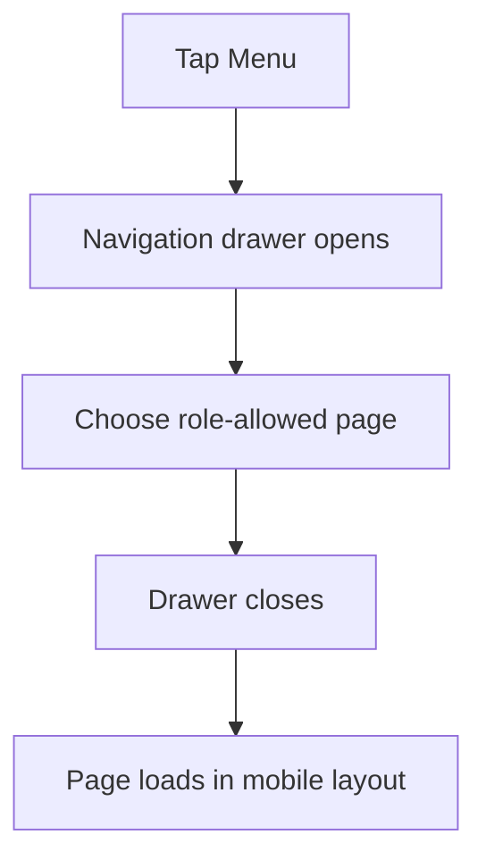
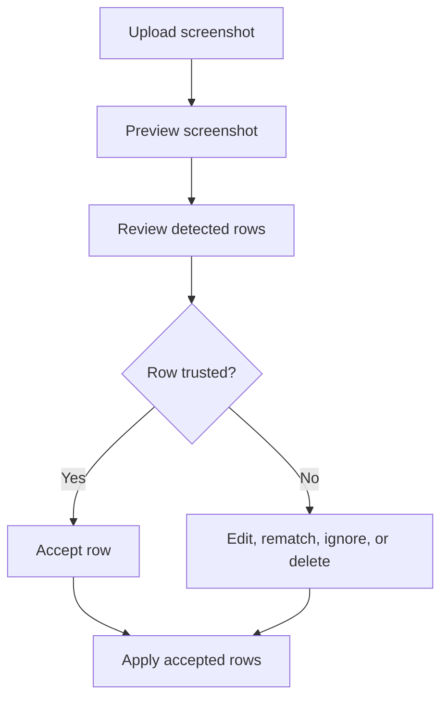
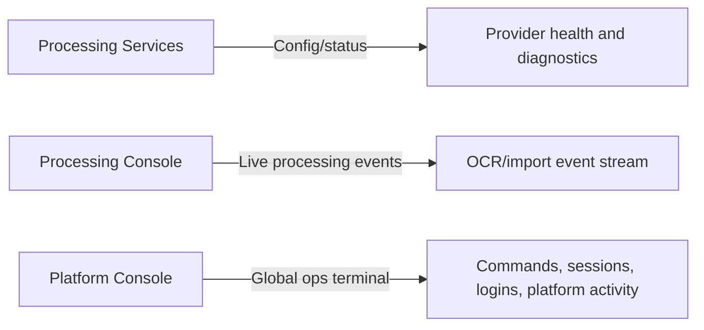

# Mobile & Tablet Guide

> **Current feature · Updated 2026-07-13**

Kingshot Event Tracker now includes a responsive web pass for phones, tablets, and desktop. The app keeps the same visual identity, but dense screens adapt with a drawer menu, stacked cards, scrollable tables, touch-friendly forms, and collapsible analytics sections.

## Supported viewport groups

| Viewport | Expected behavior |
|---|---|
| Small mobile, 360-430px | Drawer navigation, single-column forms/cards, horizontally scrollable dense tables, full-width modal/bottom-sheet behavior. |
| Large mobile, 431-767px | Same as small mobile with slightly roomier cards and toolbar controls. |
| Tablet portrait, 768-900px | Drawer/compact navigation, one or two-column cards, readable scrollable tables. |
| Tablet landscape, 901-1199px | Multi-column cards where safe, wider admin layouts, charts in two columns. |
| Desktop, 1200px+ | Full dashboard layout with sidebar and dense tables. |

## Navigation on mobile

Phones and tablets use a **Menu** button. It opens a left-side drawer with the same role-aware navigation as desktop.

The drawer preserves role-based visibility. Supreme Admin pages, subscriptions, consoles, settings, restore requests, users, roles, and permissions remain available when the account has access.

## Dense tables

Large tables remain tables, but on mobile they show a clear horizontal-scroll affordance. This protects important columns instead of silently hiding them.

Best practice:

- swipe horizontally when the table hints it can scroll;
- use filters before scrolling very large tables;
- prefer tablet/desktop for bulk admin work when possible.

## Forms and modals

Forms collapse to one column on phones. Buttons and fields use touch-friendly height where possible. Large modals behave like full-width panels or bottom sheets so Save/Cancel and danger actions remain reachable.

## Imports on mobile

Import review is designed to remain review-first:

On phones, the screenshot preview and review rows stack. On tablets, they may sit side-by-side when there is enough room.

## Analytics on mobile/tablet

Analytics pages use stacked KPI cards, scrollable tabs, collapsible large sections, and responsive chart grids. Premium analytics modules stay in the same analytics experience and collapse where the screen is tight.

## Admin pages

Admin pages are usable on mobile/tablet, but some heavy workflows remain easier on a larger screen:

- Users: full-width management page, filter toolbar, pagination, readable table widths.
- Permissions: searchable matrix with horizontal scroll.
- Restore Requests: tabs, filters, pagination, and clear review actions.
- Processing Services: stacked status/config cards with wrapped diagnostics.
- Processing Console: mobile-readable event stream.

::: tip Larger screen recommended
For bulk user administration, role matrix comparisons, and long import reviews, a tablet landscape or desktop screen is still more comfortable.
:::

## Console concepts on responsive screens

## Visual references

These sanitized product captures show the dashboard and review workflows that remain central at every breakpoint. The responsive pass preserves the workflow while changing the arrangement: navigation collapses into a drawer, controls stack, and dense content scrolls or becomes cards instead of being hidden.
