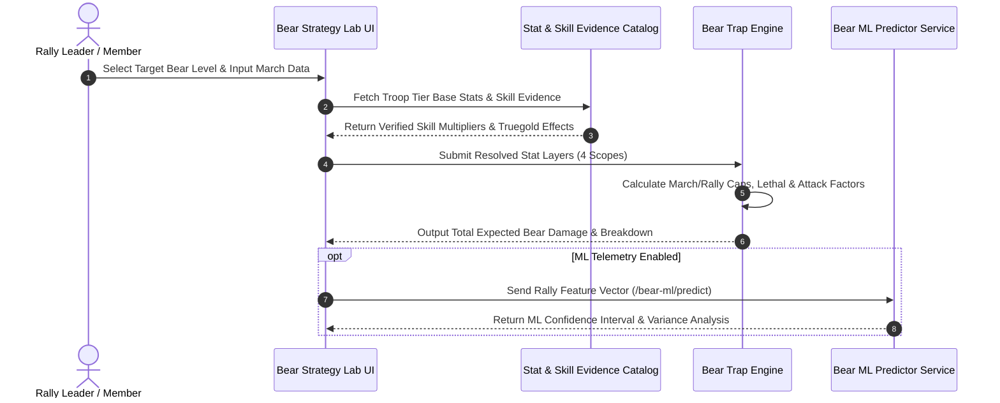
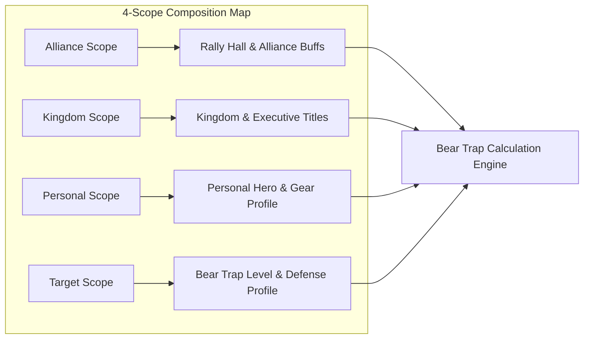
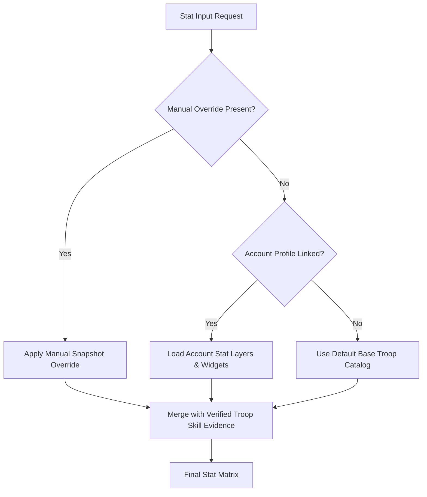

# Bear Trap Strategy Lab & Simulation Engine

The **Bear Trap Strategy Lab** is a high-precision combat simulation engine designed specifically for Kingshot alliance Bear Trap events. It replaces legacy estimations with a deterministic combat model, troop skill tier evidence catalogs, Truegold troop calculations, and machine-learning predictive modeling.

---

## Engine Architecture & Data Flow

The Bear Trap engine resolves stat layers across alliance, kingdom, personal, and target scopes before executing the core combat calculation pipeline.

---

## Core Damage Mechanics & Calculations

The Bear Trap engine evaluates combat outcomes using a multi-factor multiplier system:

### 1. Step-by-Step Damage Evaluation

The engine calculates total rally performance across four sequential evaluation steps:

1. **Troop Base Power Aggregation**: The simulator aggregates total active units in the rally according to their respective troop tiers (T1 through T11 and Truegold units) to establish baseline combat power.
2. **Lethality Scaling Step**: Evaluates your total Lethality stat percentage against the target Bear Trap defense profile to determine damage multiplier scaling.
3. **Attack Multiplier Resolution**: Combines Hero attack attributes, research bonuses, town center decorations, and rally leader title buffs.
4. **Skill & Widget Factor Application**: Applies bonus multipliers from active Hero Widgets (e.g., Amadeus with Aegis of Fate, Helga with Bands of Tyre, Marlin with Mistweaver, Thrud with Bloodfang) and verified troop skill triggers across participant marches.

### 2. March & Rally Capacity Bounds
The engine enforces strict caps during calculation:
- **Personal March Cap**: Restricts individual contribution based on active Hero skills and drill grounds level.
- **Rally Hall Capacity**: Caps overall participant troop count.
- **Leader Buff Contribution**: Applies dedicated Rally Leader Attack & Defense bonuses only to the primary rally leader slot.

---

## 4-Scope Bear Composition Map

Rally optimization in Kingshot depends on how rally participants are configured. The engine organizes rally planning around **four distinct scopes**:

### Scope Definitions

| Scope | Description | Affected Variables |
| --- | --- | --- |
| **Alliance Scope** | Defines alliance-wide rally capacity, alliance science buffs, and rally joiner distribution rules. | Rally Hall Cap, Alliance Attack % |
| **Kingdom Scope** | Accounts for kingdom-level executive titles (e.g., King, Supreme Commander) and kingdom event buffs. | Global Attack %, Kingdom Skill Bonus |
| **Personal Scope** | Represents individual player profile stats, active hero widgets, gear pieces, and troop march limits. | Personal March Cap, Hero Widget Levels |
| **Target Scope** | Configures the Bear Trap level, defense multiplier, and target combat attributes. | Bear Trap Level (1–30), Bear Defense Base |

---

## Stat Source Engine & Evidence Catalog

To prevent stat estimation errors, the engine uses a layered stat source resolution hierarchy:

### Verified Troop Skill Evidence & Truegold Effects
- **Skill Tier Catalog**: Integrates verified skill activation data for T9, T10, T11, and Truegold units.
- **Truegold Troop Effects**: Calculates specialized Truegold lethality bonuses and attack penetration metrics when Truegold units are deployed.
- **Stat Layer Isolation**: Prevents double-counting of hero skill buffs when multiple joiners bring overlapping support heroes (e.g., stacking Helga or Chenko joiner skills).

---

## Bear ML Predictor & Telemetry (`/bear-ml/predict`)

For advanced analytics, the platform integrates a Machine Learning prediction service to validate theoretical calculations against empirical rally outcomes.

### 1. ML Endpoint Specifications
- **Route**: `POST /bear-ml/predict`
- **Security**: Exempt from standard CSRF checks via security middleware to support high-throughput telemetry ingestion.
- **Payload Input**: Feature vector containing total rally troops, troop tier ratio, hero widget vector, and resolved stat matrix.
- **Output**: Predicted damage score, variance percentage, and confidence interval.

### 2. Platform Console Monitoring
Administrators can monitor ML prediction health directly within the **Platform Console** under the **Bear Data & ML** tab:
- Tracking model drift against actual reported Bear Trap event scores.
- Reviewing feature importance weights (e.g., Lethality weight vs Attack weight).
- Verifying latency and inference error rates.

---

## User Interface & Step-by-Step Workflow

### Using the Strategy Lab

1. **Select Bear Trap Level**: Choose the target Bear Trap level (e.g., Level 1 to 30) from the target scope dropdown.
2. **Configure Rally Leader**: Select your primary hero march (e.g., Amadeus / Helga / Marlin / Zoe), hero gear profile, and widget levels.
3. **Set Alliance Composition**: Input participant march sizes and hero joiner setups across the alliance scope.
4. **Run Simulation**: Click **Calculate Damage** to view:
   - Expected Total Bear Damage score.
   - Individual participant contribution percentages.
   - Specific recommendations to improve total score (e.g., swapping joiner hero positions or adjusting troop ratios).
5. **Save Snapshot**: Save your configuration to compare performance against future Bear Trap runs.
