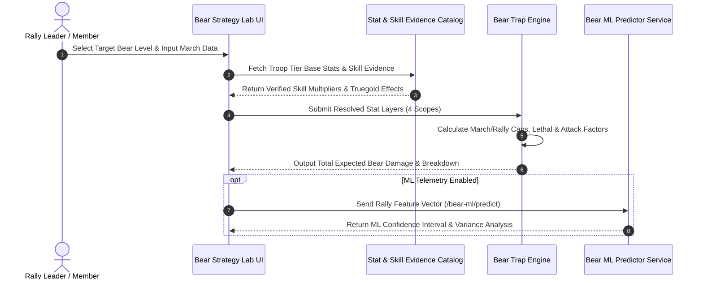
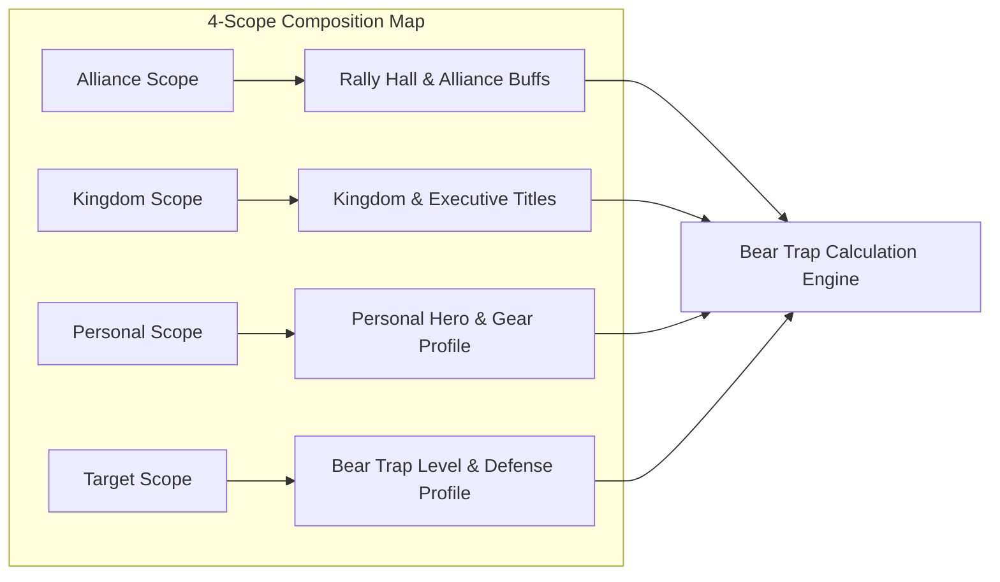
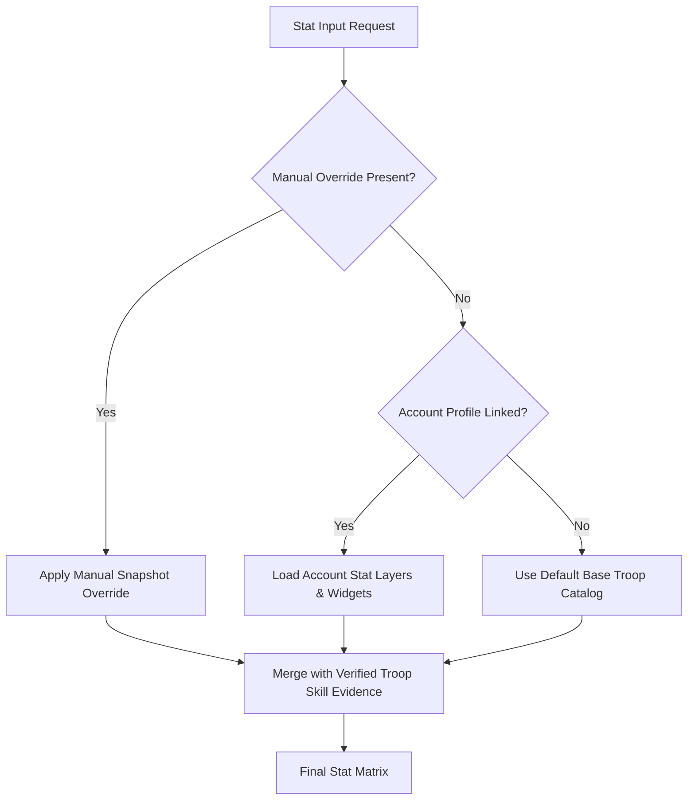

# Bear Trap Strategy Lab & Simulation Engine

The **Bear Trap Strategy Lab** is a high-precision combat simulation engine designed specifically for Kingshot alliance Bear Trap events. It replaces legacy estimations with a deterministic combat model, troop skill tier evidence catalogs, Truegold troop calculations, and machine-learning predictive modeling.

---

## Engine Architecture & Data Flow

The Bear Trap engine resolves stat layers across alliance, kingdom, personal, and target scopes before executing the core combat calculation pipeline.

```mermaid
sequenceDiagram
    autonumber
    actor User as Rally Leader / Member
    participant UI as Bear Strategy Lab UI
    participant Catalog as Stat & Skill Evidence Catalog
    participant Engine as Bear Trap Engine
    participant ML as Bear ML Predictor Service

    User->>UI: Select Target Bear Level & Input March Data
    UI->>Catalog: Fetch Troop Tier Base Stats & Skill Evidence
    Catalog-->>UI: Return Verified Skill Multipliers & Truegold Effects
    UI->>Engine: Submit Resolved Stat Layers (4 Scopes)
    Engine->>Engine: Calculate March/Rally Caps, Lethal & Attack Factors
    Engine-->>UI: Output Total Expected Bear Damage & Breakdown
    
    opt ML Telemetry Enabled
        UI->>ML: Send Rally Feature Vector (/bear-ml/predict)
        ML-->>UI: Return ML Confidence Interval & Variance Analysis
    end
```

---

## Core Damage Mechanics & Calculations

The Bear Trap engine evaluates combat outcomes using a multi-factor multiplier system:

### 1. Step-by-Step Damage Evaluation

The engine calculates total rally performance across four sequential evaluation steps:

1. **Troop Base Power Aggregation**: The simulator aggregates total active units in the rally according to their respective troop tiers (T1 through T11 and Truegold units) to establish baseline combat power.
2. **Lethality Scaling Step**: Evaluates your total Lethality stat percentage against the target Bear Trap defense profile to determine damage multiplier scaling.
3. **Attack Multiplier Resolution**: Combines Hero attack attributes, research bonuses, town center decorations, and rally leader title buffs.
4. **Skill & Widget Factor Application**: Applies bonus multipliers from active Hero Widgets (e.g., Amadeus with Aegis of Fate, Helga with Bands of Tyre, Marlin with Mistweaver, Thrud with Bloodfang) and verified troop skill triggers across participant marches.

### 2. March & Rally Capacity Bounds
The engine enforces strict caps during calculation:
- **Personal March Cap**: Restricts individual contribution based on active Hero skills and drill grounds level.
- **Rally Hall Capacity**: Caps overall participant troop count.
- **Leader Buff Contribution**: Applies dedicated Rally Leader Attack & Defense bonuses only to the primary rally leader slot.

---

## 4-Scope Bear Composition Map

Rally optimization in Kingshot depends on how rally participants are configured. The engine organizes rally planning around **four distinct scopes**:

```mermaid
graph LR
    subgraph 4-Scope Composition Map
        AS[Alliance Scope] --> RallyCap[Rally Hall & Alliance Buffs]
        KS[Kingdom Scope] --> CastleBuffs[Kingdom & Executive Titles]
        PS[Personal Scope] --> MarchCap[Personal Hero & Gear Profile]
        TS[Target Scope] --> TrapLevel[Bear Trap Level & Defense Profile]
    end

    RallyCap --> Engine[Bear Trap Calculation Engine]
    CastleBuffs --> Engine
    MarchCap --> Engine
    TrapLevel --> Engine
```

### Scope Definitions

| Scope | Description | Affected Variables |
| --- | --- | --- |
| **Alliance Scope** | Defines alliance-wide rally capacity, alliance science buffs, and rally joiner distribution rules. | Rally Hall Cap, Alliance Attack % |
| **Kingdom Scope** | Accounts for kingdom-level executive titles (e.g., King, Supreme Commander) and kingdom event buffs. | Global Attack %, Kingdom Skill Bonus |
| **Personal Scope** | Represents individual player profile stats, active hero widgets, gear pieces, and troop march limits. | Personal March Cap, Hero Widget Levels |
| **Target Scope** | Configures the Bear Trap level, defense multiplier, and target combat attributes. | Bear Trap Level (1-30), Bear Defense Base |

---

## Stat Source Engine & Evidence Catalog

To prevent stat estimation errors, the engine uses a layered stat source resolution hierarchy:

```mermaid
flowchart TD
    A[Stat Input Request] --> B{Manual Override Present?}
    B -- Yes --> C[Apply Manual Snapshot Override]
    B -- No --> D{Account Profile Linked?}
    D -- Yes --> E[Load Account Stat Layers & Widgets]
    D -- No --> F[Use Default Base Troop Catalog]
    C --> G[Merge with Verified Troop Skill Evidence]
    E --> G
    F --> G
    G --> H[Final Stat Matrix]
```

### Verified Troop Skill Evidence & Truegold Effects
- **Skill Tier Catalog**: Integrates verified skill activation data for T9, T10, T11, and Truegold units.
- **Truegold Troop Effects**: Calculates specialized Truegold lethality bonuses and attack penetration metrics when Truegold units are deployed.
- **Stat Layer Isolation**: Prevents double-counting of hero skill buffs when multiple joiners bring overlapping support heroes (e.g., stacking Helga or Chenko joiner skills).

---

## Bear ML Predictor & Telemetry (`/bear-ml/predict`)

For advanced analytics, the platform integrates a Machine Learning prediction service to validate theoretical calculations against empirical rally outcomes.

### 1. ML Endpoint Specifications
- **Route**: `POST /bear-ml/predict`
- **Security**: Exempt from standard CSRF checks via security middleware to support high-throughput telemetry ingestion.
- **Payload Input**: Feature vector containing total rally troops, troop tier ratio, hero widget vector, and resolved stat matrix.
- **Output**: Predicted damage score, variance percentage, and confidence interval.

### 2. Platform Console Monitoring
Administrators can monitor ML prediction health directly within the **Platform Console** under the **Bear Data & ML** tab:
- Tracking model drift against actual reported Bear Trap event scores.
- Reviewing feature importance weights (e.g., Lethality weight vs Attack weight).
- Verifying latency and inference error rates.

---

## Atomic scenario model

The current scenario separates every input source instead of flattening the setup into one damage multiplier.

| Area | Stored detail |
|---|---|
| Mode | workflow, calculation scope, rally role, result unit |
| Troops | owner, Infantry/Cavalry/Archer type, normal tier, True Gold level, quantity |
| Effective stats | attack, lethality, defense, and health by troop type |
| Leader | three hero slots, widget state, Expedition skills, Hero Gear |
| Joiners | captain hero, first skill, level, join order, and march composition |
| Rally | leader march, total capacity, submitted troops, accepted troops, active skill slots |
| Effects | Bear level, Master Valora/Cassia sources, alliance effects, temporary effects |
| Evidence | source type, confidence, report totals, assumptions, and detailed snapshots |

Legacy Bear presets are normalized into this schema before simulation.

## Formation and hero-lineup optimization

The optimizer evaluates troop composition and leader heroes together:

1. calculate the current scenario;
2. search valid Infantry, Cavalry, and Archer allocations at the configured resolution;
3. evaluate candidate hero swaps;
4. re-optimize formation for each candidate;
5. compare the best candidate with the original result;
6. return the damage change and resulting formation.

A hero is not recommended only because it scores well with the old formation.

The leader search respects troop-role slots and the configured hero generation. It can report the best valid trio and explain why a rejected candidate was not selected.

## Joiner captain selection

The joiner audit models the first Expedition skill of each captain.

- Only Bear-relevant offensive effects compete for active slots.
- The four strongest eligible first skills are selected.
- Join order resolves equal-ranked skills.
- Defensive or enemy-offense reduction skills do not consume a Bear slot.
- Repeated stacking families are evaluated together.
- Chance-based skills show expected value and a variability warning.
- Master Cassia is supported as a named source.

## Hero star and slice progression

Hero progression uses completed stars plus slices toward the next star.

| Value | Range and rule |
|---|---|
| Completed stars | 0 to 5 |
| Slices toward next star | 0 to 5 |
| Five-star slices | Always normalized to 0 |
| Skill levels | Stored independently from star slices |
| Upgrade cost | Verified per-slice shard table |

A slice does not invent an intermediate Expedition skill level. Upgrade recommendations compare the next full star that changes the supported skill state.

## Squad stats and report evidence

Profiles can now store squad-wide attack, defense, health, and lethality bonuses. These are added once to each troop-type line when effective stats are resolved.

Experience capture supports bonus overviews, rally-leader reports, beast reports, and manual sources. Joiner detail can be exact, estimated, or unknown.

Validation checks:

- troop types sum to march and rally totals;
- percentages allocate deterministically;
- marches do not exceed known capacities;
- exact joiner detail includes total and every troop type;
- leader and joiner Heroes exist in the supported catalog;
- Heroes stay within the declared generation;
- repeated rally rows and extreme scores are quarantined for review;
- submitted role declarations match the rally rows.

---

## User Interface - Guided Editor (2026-07-26)

The Bear Trap Simulator uses a 9-step guided workflow that mirrors the Hero Gear Optimizer layout.

### Step Rail

A sticky step rail on the left (horizontal on mobile) navigates between sections:

| Step | Section | Purpose |
|------|---------|---------|
| 1 | Setup | Rally capacity, joiner count, workflow, role |
| 2 | Troops | Leader and joiner troop stacks (type, tier, TG, quantity) |
| 3 | Stats | Effective attack/lethality/defense/health per troop type |
| 4 | Heroes | Three leader hero slots with skills, widget, and Hero Gear |
| 5 | Joiners | Four joiner cards with captain hero and skill level |
| 6 | Effects | Bear Trap level, Master Valora, alliance and temporary buffs |
| 7 | Review | Color-coded readiness summary (green = ok, amber = needs attention) |
| 8 | Simulate | **The Run button** - appears here, after Review, with an animated CTA |
| 9 | Results | Damage total, contributions, recommendations, formation surface |

### Status Bar

The Setup section shows four compact status pills that update in real time:

- **Troops** - total assigned troop count (green if > 0)
- **Joiners** - joined marches with active skill count
- **Heroes** - configured leader heroes (3/3 turns green)
- **Ready** - green when the simulation is unlocked

### Simulate Gate

The Run button is placed as a full-width gate section after Review:
- **Ready state** - violet gradient border, pulsing Zap icon, "Run Bear Simulation" button
- **Blocked state** - amber border, warning icon, blocking message

### Captain Skills Card

Displays 4 slots with large (3rem) hero portrait, skill name, and level badge. Empty slots show a dashed placeholder.

### Review Cards

Color-coded left-border cards:
- Green left border + `CircleCheck` icon = section complete
- Amber left border + `CircleX` icon = needs attention

### Results

When results appear, a slide-up animation reveals:
- Damage total tile
- Per-troop-type contribution breakdown
- Formation surface ternary plot
- Ranked recommendations with action items
- Captain skill audit table (with hero avatars in each row)

### Share Your Experience

A dedicated CTA section with:
- Animated Flame icon (encourages contribution)
- Glow + scale hover effect on the Share button
- Shows login/register buttons when unauthenticated

### Responsive Design

| Viewport | Layout |
|----------|--------|
| ≥ 60rem | 3-column hero grid, 4-column joiner grid, full rail |
| 36 to 60rem | 2-column hero/joiner grids, icon-only rail |
| < 36rem | 1-column everything, simulate gate stacks vertically |
