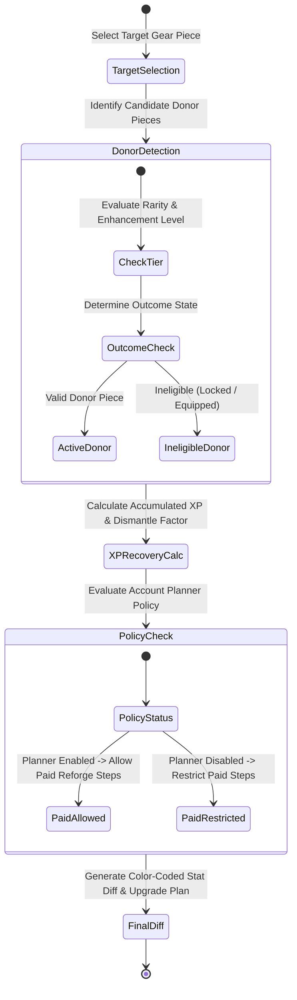
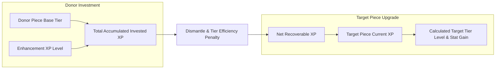
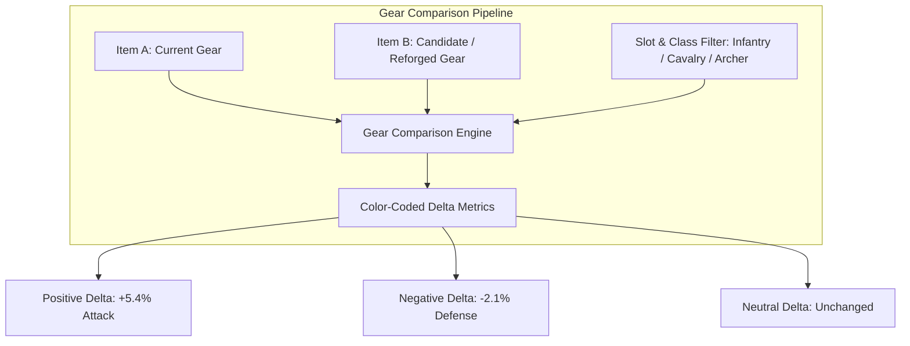
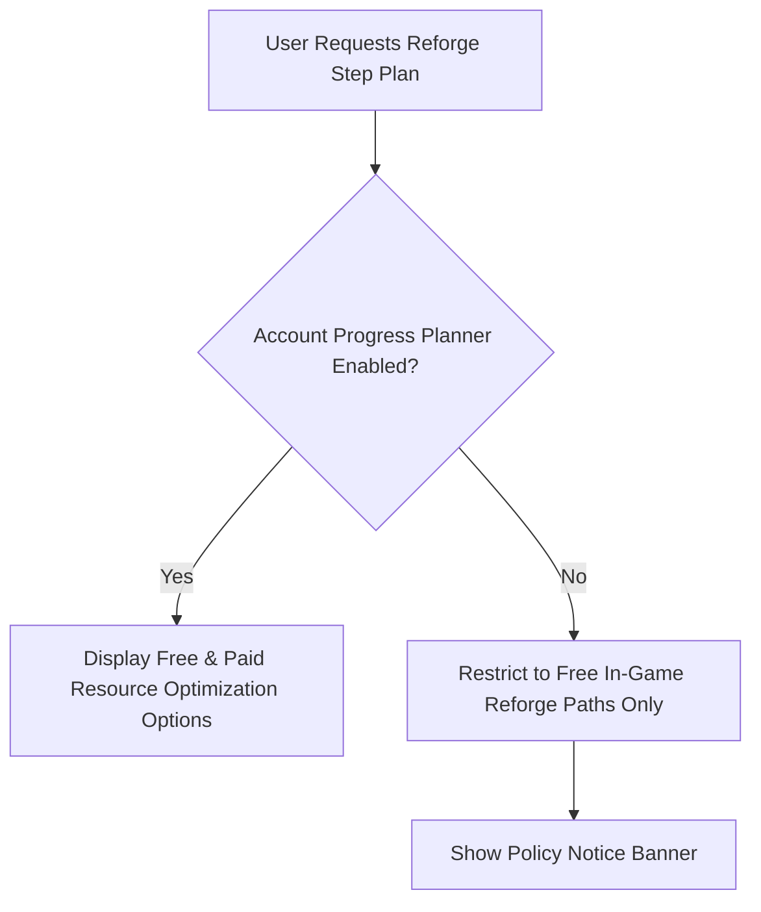

# Hero Gear & Reforge Simulator

The **Hero Gear & Reforge Simulator** empowers players to optimize gear enhancement spending, compare equipment pieces side-by-side with color-coded stat diffs, and calculate precise XP recovery when recycling or reforging donor gear pieces into primary gear assets.

---

## Reforge State Machine & Workflow

Reforging gear involves transitioning equipment from a donor piece state to an upgraded target piece while computing net resource gain or loss.

---

## Reforge XP Recovery Calculation & Math

When upgrading gear, recycling an already enhanced piece (a **donor piece**) yields a portion of its original invested experience points back to apply toward the **target piece**.

### XP Recovery Math Flow

### Recovery Process Steps

The simulator calculates gear reforge outcomes through three clear steps:

1. **Accumulated Experience Summation**: Aggregates the donor piece's base rarity XP value together with all experience points invested through previous enhancement levels.
2. **Dismantle Retention Efficiency Step**: Applies the gear item's tier retention coefficient (based on Mythic, Sunfire, or Truegold item rarity) to compute the net recoverable experience.
3. **Target Piece Level Progression**: Applies the net recovered XP directly toward your target piece enhancement level and displays the resulting tier increase and stat gains.

3. **Outcome States**:
   - **Target Upgrade Result**: Calculates exact level increase achieved on target piece.
   - **Remaining XP Carryover**: Retains fractional XP towards the next target level step.
   - **Resource Deficit Warning**: Highlights if additional gear designs or raw materials are required to complete the reforge step.

---

## Enhanced Gear Comparison Tool

The simulator includes a visual comparison engine that measures combat stat differences between any two gear configurations.

### Key Features of Gear Comparison

- **Visual Delta Indicators**:
  - Green (+5.4%): Stat increase over current baseline.
  - Red (-2.1%): Stat decrease over current baseline.
  - Gray (0.0%): Unchanged attribute.
- **Class & Slot Filtering**: Easily filter gear choices by Hero Class (Infantry, Cavalry, Archer) and Equipment Slot (Head, Chest, Belt, Boots, Weapon, Accessory).
- **Rarity & Origin Tags**: Displays clear badges for item rarity (Mythic, Sunfire, Truegold) and origin set bonuses.

---

## Account Progress Planner & Paid Reforge Policy

Administrative settings can control whether advanced paid reforge recommendations are accessible to users:

- **Planner Enabled**: Users receive comprehensive spending plans detailing both free in-game materials and paid pack options to reach target gear milestones efficiently.
- **Planner Disabled**: The system restricts output exclusively to free in-game resource paths and displays a policy notice explaining that paid pack planning is disabled for the current tenant.

---

## Step-by-Step Reforge & Optimization Guide

### Using the Reforge Simulator

1. **Select Hero Class & Slot**: Choose the target hero class (e.g., Archer) and equipment slot (e.g., Weapon).
2. **Set Target Gear Piece**: Input current gear level and target enhancement goal.
3. **Select Donor Pieces**: Pick available unused or lower-tier gear pieces to recycle as donor items.
4. **Analyze XP Recovery**: Review calculated Net Recoverable XP, target level gain, and net stat changes.
5. **Compare Stat Diffs**: Use the **Gear Comparison Tool** to verify color-coded delta metrics across Lethality, Attack, Defense, and Health attributes before confirming in-game reforge steps.
