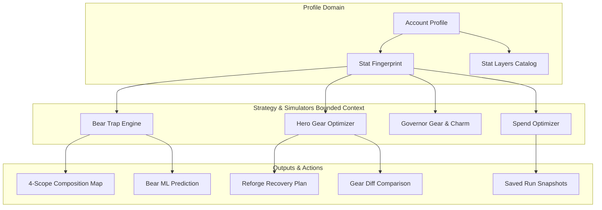

# Strategy & Simulators Overview

The **Kingshot Event Tracker Strategy & Simulators** suite provides interactive modeling, strategy labs, and resource optimizers tailored for players, alliance leaders, and rally marshals. 

Whether preparing for upcoming Bear Trap events, optimizing Hero Gear reforge steps, or planning long-term account growth, the simulator suite delivers data-driven insights and deterministic calculations.

---

## Core Simulator Suite

The strategy lab consists of four specialized modules:

| Tool | Purpose | Primary User Roles | Key Capabilities |
| --- | --- | --- | --- |
| **[Bear Trap Strategy Lab](./bear-trap-lab.md)** | Rally damage modeling & composition strategy | Rally Leaders, Alliance Marshals | 4-scope composition map, troop skill tier modeling, Truegold troop effects, ML damage prediction |
| **[Hero Gear & Reforge Simulator](./hero-gear-reforge.md)** | Gear enhancement & reforge optimization | All Players | Color-coded gear diff comparison, XP recovery math, donor piece detection, paid reforge policy |
| **Governor Gear & Charm Optimizer** | Governor equipment stat planning | All Players | Stat layer composition, milestone threshold planning, resource spend calculation |
| **Spend Optimizer & Account Progress** | Account growth & resource allocation | All Players, Admins | Account-wide stat fingerprinting, budget allocation, saved-run snapshots |

---

## High-Level Architecture

The simulator bounded context bridges user profile data with multi-scope strategy engines.

---

## Key Features & Foundations

### 1. Account Profile Integration
Instead of requiring manual stat entry on every session, simulators synchronize directly with your **Account Profile**. Your active gear levels, hero widget skill levels, and research bonuses are automatically loaded as baseline stat layers.

### 2. Stat Layer System
Stats are cataloged into structured layers:
- **Base Troop Stats**: Inherited from troop tier (T1 through T11 and Truegold).
- **Hero & Widget Skill Bonuses**: Applied dynamically based on active hero assignment.
- **Alliance & Kingdom Buffs**: Incorporated via target scope selection.
- **Snapshot Overrides**: Allows "what-if" testing by tweaking specific stat values without altering your saved account profile.

### 3. Saved-Run Models
Every simulation run can be saved as a named snapshot. This allows you to compare different gear configurations side-by-side or track your account's damage progression across multiple Bear Trap events.

---

## Access Control & Feature Toggles

Access to advanced simulation features is governed by tenant policy and subscription tiers:

- **Free Tier**: Access to standard Bear Trap damage calculation and single-piece gear comparison.
- **Alliance / Premium Plan**: Unlocks 4-Scope Bear Composition Maps, Bear ML predictive modeling, full reforge recovery step planning, and unlimited saved runs.
- **Account Progress Planner Toggle**: Administrators can control visibility of paid reforge options and advanced spend planning tools via the Platform Console.

---

## Recommended Next Steps

- **[Bear Trap Strategy Lab Guide](./bear-trap-lab.md)** — Master rally composition, stat sources, and damage calculations.
- **[Hero Gear & Reforge Guide](./hero-gear-reforge.md)** — Learn how to maximize combat power and optimize donor piece dismantling.
