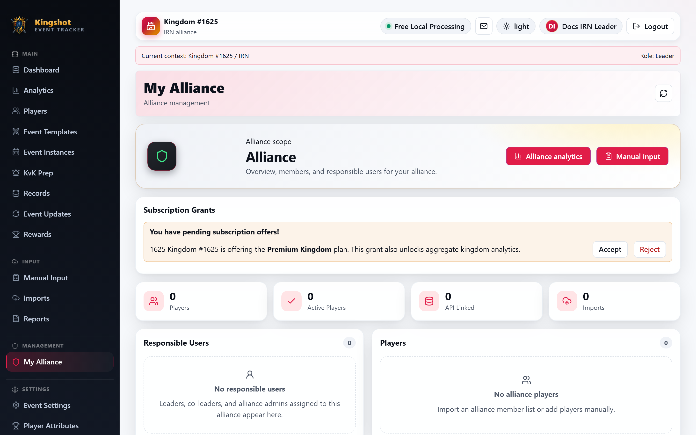

# Accept a Premium Offer (Leader)

When your King shares the kingdom's premium plan with your alliance, it arrives as a **[grant](../getting-started/glossary.md#grant)** offer that you must **accept** before it does anything. This guide is for **Alliance Leaders and Co-Leaders**.

> **Your alliance does not become premium automatically just because your kingdom is premium.** The King has to offer a grant, and you have to accept it. Until you accept, your alliance stays on whatever plan it already has (its own, or the free tier). This is the single most common point of confusion - see [Which Plan Applies to You](effective-plan.md).

## Finding your offer

Grant offers show up on your **[My Alliance](../how-to/my-alliance.md)** page. A pending offer appears with **Accept** and **Reject** options.

## Accepting

1. Open **My Alliance**.
2. Find the pending grant offer.
3. Select **Accept**.

Once accepted:

- Your [effective plan](effective-plan.md) becomes the kingdom's plan, and your usage panel's **plan source** shows **"Accepted kingdom grant"**.
- Your limits rise to what the grant provides (or to the **[allocation](allocations.md)** your King set aside for you, if they set one).
- The premium **features the grant carries** switch on.

## Rejecting

If you don't want the offer, select **Reject**. Nothing changes for your alliance, and the King can see it was declined. They can offer again later if needed.

## Which features do I actually get?

A grant passes down only the **shareable** premium features the kingdom plan carries - not necessarily everything. So a granted alliance may get a subset of what a directly-subscribed premium alliance would have. Check your Subscription & Usage panel and the [Premium Features](premium-features.md) page to see what's active for you.

One feature worth calling out: **Granted Kingdom Analytics** (the ability to see aggregate kingdom analytics) only appears if the grant you accepted specifically includes that feature. If your kingdom's plan doesn't carry it, accepting a grant won't unlock the kingdom analytics view - and that's expected, not a bug.

## Giving a grant back

If you no longer want the granted premium, your alliance can give it back (and the King can also revoke it from their side). When a grant ends:

- Your alliance returns to its own plan or the free tier.
- Any allocations tied to the grant are removed.

See the King's side of this in [Kingdom Grants](kingdom-grants.md).

## If premium didn't turn on

Check these in order:

1. **Did you accept?** A pending offer does nothing until accepted. Look on [My Alliance](../how-to/my-alliance.md).
2. **What does your plan source say?** If it still reads *Free tier* or *Direct alliance plan*, the grant isn't active. See [Which Plan Applies to You](effective-plan.md).
3. **Missing a specific feature?** Grants only carry shareable features; the one you want may not be included. See [Premium Features](premium-features.md).

## Where to go next

- [Which Plan Applies to You](effective-plan.md) - confirm the grant took effect.
- [Premium Features](premium-features.md) - what unlocked.
- [Direct Alliance Subscriptions](direct-alliance-subscription.md) - the alternative: your own plan.
