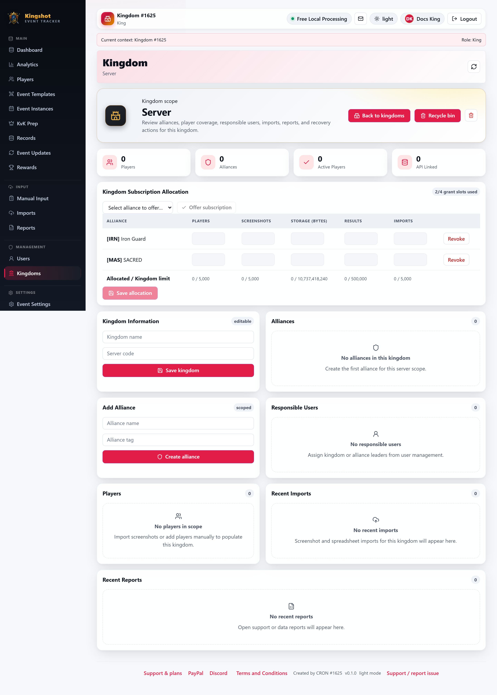

# Run a Cleanup

When you're close to a [quota](../getting-started/glossary.md#quota--limit) — or already over one — the fastest fix is often to remove things you no longer need. The tracker helps by **suggesting** what to clean up and giving you a **cleanup action** to run. This guide covers both.

**Who can run cleanup:** Supreme Admin, King, Alliance Leader, and Co-Leader (anyone with the cleanup ability for their scope). Alliance Players cannot.

## Where cleanup lives

Cleanup is part of your **Subscription & Usage panel** — the kingdom detail page (Kings), the [My Alliance](../how-to/my-alliance.md) page (Leaders and Co-Leaders), or the platform manager (Supreme Admins). When usage is high, the panel shows **cleanup suggestions** alongside the resource bars.

## Reading the suggestions

For premium scopes, the panel can recommend likely things to remove to get you back under a limit — for example, old imports or unused records taking up space. Treat these as **suggestions**, not automatic deletions: they point you at candidates, and you decide.

## Running a cleanup

1. Open your Subscription & Usage panel.
2. Review the cleanup suggestions and warnings.
3. Use the **cleanup action** to clear out what's safe to remove, or remove specific items yourself (for example, deleting old imports — see the imports and recycle-bin guides).

Because most deletes in the app are **[soft deletes](../getting-started/glossary.md#soft-delete)** (they go to the Recycle Bin, not gone forever), cleaning up is low-risk — you can usually restore something if you change your mind. Note, though, that items sitting in the Recycle Bin may still count toward some limits until they're purged; see [What "Delete" Really Does](../reference/soft-delete.md) and the [Recycle Bin](../how-to/recycle-bin.md) guide.

## Cleanup and limited mode

If a hard limit was reached and your scope dropped into **limited (cleanup) mode**, cleanup is exactly how you get out of it. Once you free up enough that usage falls back under the safe threshold, the restriction lifts. The full details of limited mode — including that it can lift automatically after you clean up — are in [Suspension & Limited Mode](suspension.md).

## Where to go next

- [Quota Warnings](quota-warnings.md) — understanding the warning levels first.
- [Suspension & Limited Mode](suspension.md) — how cleanup ends a limited-mode restriction.
- [What "Delete" Really Does](../reference/soft-delete.md) — why cleanup is reversible.
