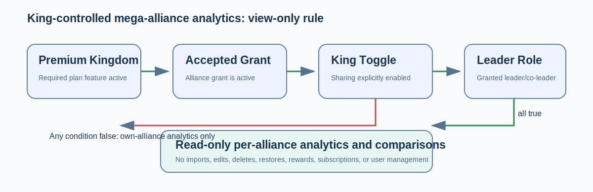
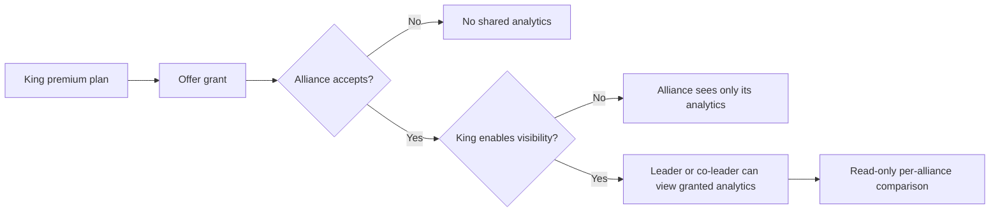

# Grant Premium to Your Alliances (King)

If your **kingdom** has a premium plan, you can share it with alliances inside your kingdom by offering them a **[grant](../getting-started/glossary.md#grant)**. A grant lets an alliance use the kingdom's premium plan (and eligible features) without buying its own. This guide is for **Kings** (and Supreme Admins acting on a kingdom).

> A grant is an **offer**. It only takes effect once the alliance **accepts** it - see [Accept a Premium Offer](accept-grant.md). Offering a grant does not, by itself, make an alliance premium.

## Before you start

- Your kingdom must be on a **premium** kingdom plan (a free kingdom can't grant).
- You manage grants from your **kingdom detail page** (open **Kingdoms**, then your kingdom).


## How many alliances can I grant to?

The number of grant "slots" you have **comes from your kingdom's plan** - it isn't a fixed universal number. A free kingdom plan has none; a premium kingdom plan includes a set number of slots.

**To see your limit, check your Subscription & Usage panel** - the grant slots appear there as one of your resources, showing how many you've used and how many you have. If you try to offer more grants than your plan allows, the app stops you with a "grant limit reached" message.

## Offering a grant

1. On your kingdom detail page, open the grant manager.
2. Choose the **alliance** to grant to.
3. Confirm the offer.

The offer is now **pending** - waiting for that alliance's leader (or co-leader) to accept. Nothing changes for the alliance until they do.

## The life of a grant

A grant moves through a clear set of states:

```
        King offers a grant
                │
                ▼
           ┌─────────┐
           │ PENDING │  ── waiting for the alliance to decide
           └─────────┘
             │      │
   alliance  │      │  alliance
   accepts   │      │  rejects
             ▼      ▼
        ┌────────┐  ┌──────────┐
        │ ACTIVE │  │ REJECTED │  ── offer declined; no effect
        └────────┘  └──────────┘
             │
   ┌─────────┴───────────┐
   │                     │
 King                 alliance
 revokes              gives it back
   │                     │
   ▼                     ▼
        ┌──────────────────────┐
        │  INACTIVE (ended)     │  ── premium removed from the alliance
        └──────────────────────┘
```

- **Pending** - offered, not yet answered.
- **Active** - the alliance accepted; the kingdom plan now counts as their [effective plan](effective-plan.md) (shown as "Accepted kingdom grant").
- **Rejected** - the alliance declined. No effect.
- **Ended** - a previously active grant was revoked, either by you (the King) or given back by the alliance. It also ends if it expires.

## Revoking a grant

You can revoke a grant you offered. The alliance can also give a grant back from their side. Either way, when a grant ends:

- The alliance **loses the granted premium** - its [effective plan](effective-plan.md) drops back to whatever it has on its own (its direct plan, or the free tier).
- Any **[allocations](allocations.md)** you set for that alliance are removed.

Revoking a grant does **not** affect your normal ability to manage the alliance as its King - it only removes the granted premium and its allocations.

## Sharing limits, not just features

A grant lets several alliances draw on your kingdom plan. If you want to control how much of the kingdom's limits each granted alliance can use, set **[allocations](allocations.md)** - per-alliance slices of your kingdom's quotas.

## Optional cross-alliance analytics

The Kingdom Subscription Allocation panel has an **Allow granted alliances to view each other's analytics** setting. It is off by default and applies only to analytics visibility.





Leaders cannot edit players or results, import screenshots, delete/restore data, change rewards, administer users, or manage subscriptions for another alliance. This setting does not merge alliances or alter ordinary tenant permissions.

## Where to go next

- [Accept a Premium Offer](accept-grant.md) - the alliance's side of this flow.
- [Share Kingdom Quotas with Allocations](allocations.md) - divide your limits among granted alliances.
- [Which Plan Applies to You](effective-plan.md) - how a grant fits the plan hierarchy.
